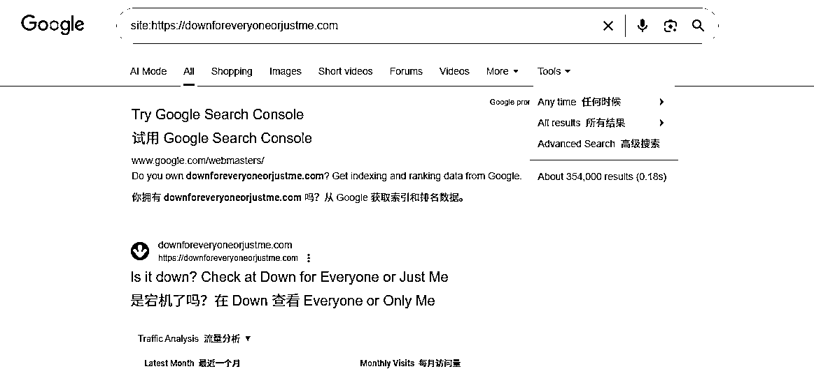

# 长域名小众工具：月访 260 万，精准解决网站打不开痛点

> 原文：[`www.yuque.com/for_lazy/wind/lrrrt5b552zwqq6b`](https://www.yuque.com/for_lazy/wind/lrrrt5b552zwqq6b)

作者： 清仔

日期：2025-09-19

点赞数：**47**

* * *

正文：

长域名小众工具： 判断网站是全挂了还是只有我打不开
一个功能非常单一的在线工具：输入任意网址，它会告诉你——是网站本身宕机了，还是只有你这边的网络问题。上月访问量接近 260 万。 这个网站的打法：
解决了用户一个极为常见但模糊的需求：当网站打不开时，到底是自己的网络出问题，还是网站挂了。 没有复杂功能，没有多余修饰，就一句话——“Is it down
for everyone or just me?”，精准击中用户焦虑点。 流量基本完全依赖自然搜索，占比超 70%。用户在 Google 搜索“is X
down”、“check if website is down”、“网站打不开”时，这个工具因为功能极度聚焦 + 域名直白，几乎天然占据心智。
它的模式就是靠关键词垄断，总共被谷歌收录了 35 万个页面 “网站打不开”是全球数十亿网民都会遇到的场景，这个网站域名是英文，可以用同样打法做非英语国家
可以做其他类似的场景，如邮件是否送达、网络是否断开、微信好友是否被删除、邮箱是否存在等等

* * *

评论区：

亦仁 : 感谢分享，已中标

万维 : 不错，我已经用这个网站好多年了，没想到还能发风向标

清仔 : 能找到里面的赚钱机会就都可以发～

搞钱萌新 : 这个可以

* * *

公众号懒人搜索，[懒人专属群分享](https://lazybook.fun/#/blog/group)