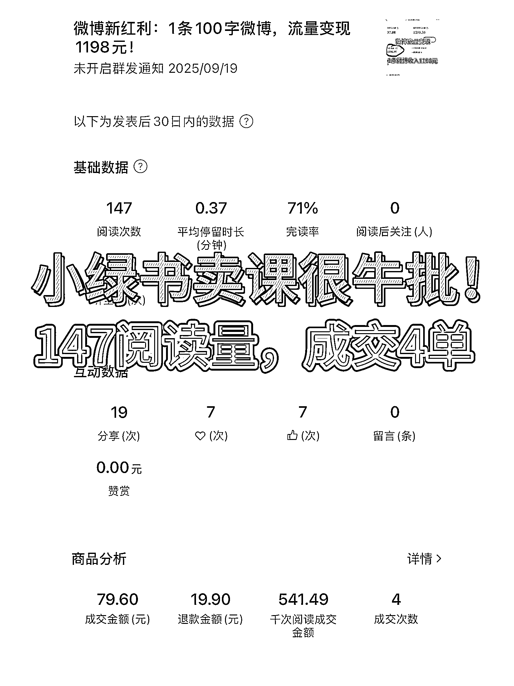

# 小绿书卖课《一人公司流量变现课》：147 阅读成交 4 单，小课售出 224 单

> 原文：[`www.yuque.com/for_lazy/wind/zdar9ag091ovsxwo`](https://www.yuque.com/for_lazy/wind/zdar9ag091ovsxwo)

作者： 哈默

日期：2025-09-25

点赞数：**32**

* * *

正文：

小绿书卖课很牛批，147 阅读量，成交 4 单！ 我们都知道小绿书有流量红利，但很多人不知道，小绿书卖课也很牛。
比如，图 1，我的小绿书：147 阅读次数，直接成交 4 单，千次阅读成交 541 元；小绿书真的可以实现，低阅读量高变现
我新开的小课《一人公司流量变现课》，已经卖出去 224 单，50%通过小绿书卖的，转化率超级高
而且，更厉害的是：小绿书创作效率高，借助 AI 工具，一天至少创作几十条。 我们用的效果好的 AI 工具是：Claude 和 Gemini，这两个强烈推荐，效果贼好！
项目实操

* * *

评论区：

Morven 雯也 : 这是来微信小店挂课吗？

哈默 : 对哒

亦仁 : 感谢分享，已中标

* * *

公众号懒人搜索，[懒人专属群分享](https://lazybook.fun/#/blog/group)