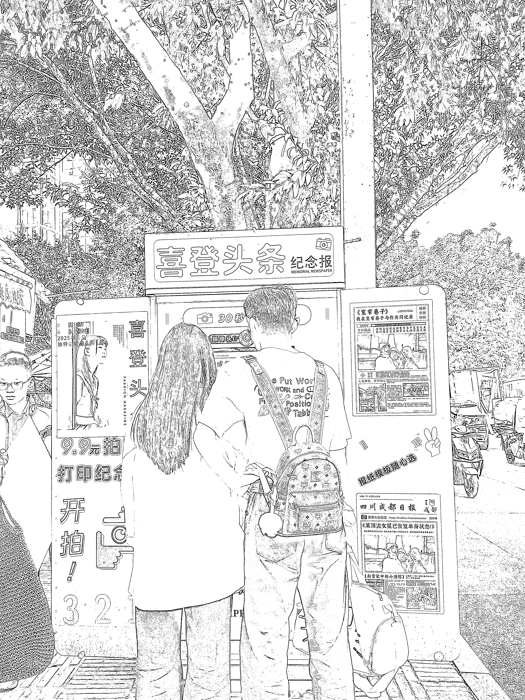

# 景区“上报纸头条”机器受欢迎，付费游客多

> 原文：[`www.yuque.com/for_lazy/wind/un04nqqg3yxsirbz`](https://www.yuque.com/for_lazy/wind/un04nqqg3yxsirbz)

作者： 爱搞钱的宋宋💰

日期：2025-09-21

点赞数：**26**

* * *

正文：

今天去逛宽窄巷子，看到在一个路口摆了个机器，收费 9.9，让你上报纸头条 这个好像还蛮火的，最主要是成本很低，还不是彩打的，就是黑白那种报纸的质感
在那边观察了一会，去付费拍的人还蛮多的，基本都是游客 适合在人流量大的景区去布局这个机器

* * *

评论区：

亦仁 : 感谢分享，已中标

云珞 YunL : 我在北京景区也看到了，比如颐和园也有

爱搞钱的宋宋💰 : 看来是全国的景区都有了[捂脸]

* * *

公众号懒人搜索，[懒人专属群分享](https://lazybook.fun/#/blog/group)