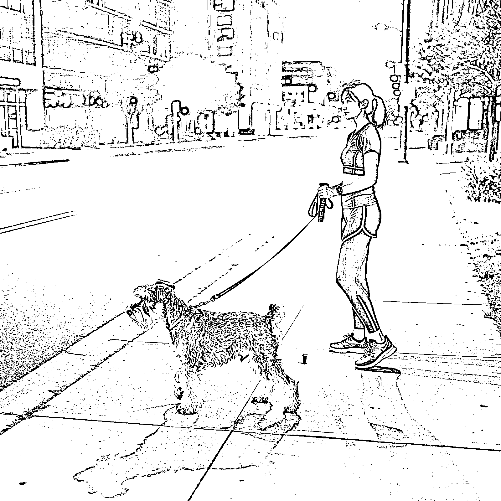
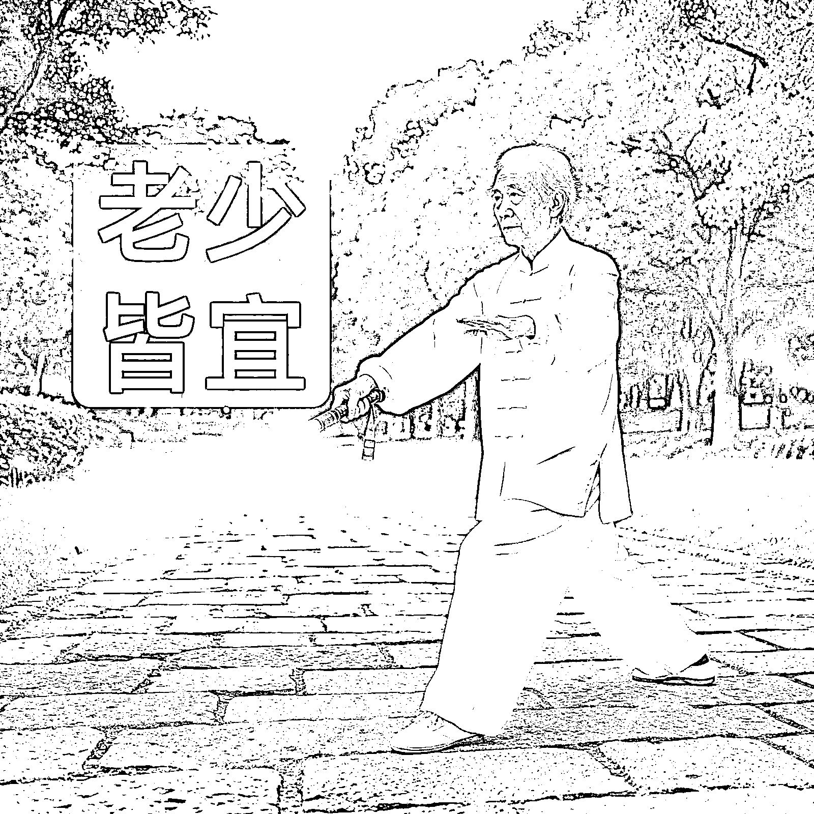
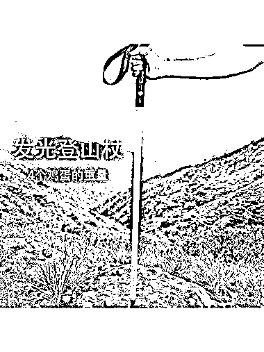

# 发光登山杖地摊营销 2 小时卖 8000 块，订单超产能，市场蓝海待挖掘

> 原文：[`www.yuque.com/for_lazy/wind/xpw5qbrplkkz72s6`](https://www.yuque.com/for_lazy/wind/xpw5qbrplkkz72s6)

作者： 纸壳

日期：2025-09-27

点赞数：**24**

* * *

正文：

去年靠车载冰箱杯架，8000 块赚 130 万的戚越，今年又出了一款发光登山杖，上周在泰山脚下做了一次地摊营销，2 个小时卖了 8000 块，后来因为地头蛇举报被迫提前结束，但是效果已经基本达到，登山杖效果炫酷，非常出片，传播性很强，摆摊视频在 B 站 30w 播放，已经小范围破圈
看了视频很有启发，首先是这个产品定位精准，普通登山杖 2-5 元，这块登山杖 99，依然畅销，不仅仅是解决夜爬人群的痛点，关键还有拍照出片的效果，以及在人群中被关注的感觉，（朋友圈里喜欢户外的一些朋友，几乎每周必出行，随便搞点装备都大几千，而且出行必拍照发圈发抖音）
人群精准，解决痛点，提供情绪价值，能够自发传播，爆款要素都集齐了，据说很多景区都在找戚越老板拿货，目前订单已超过产能极限
简单搜了一下，目前几个主流平台相关产品几乎没有，市场空白，当然义乌已经出“同款”了，预计十一期间又会有一波热度，感兴趣的可以关注一下戚越老板（我不认识戚越，最早是在航海家群看亦仁分享的杯架案例），同样做跨境的也可以关注一下这个产品，感觉海外市场也很适合
这个案例很经典，预计又是一款车载冰箱杯架的翻版，从产品定位到销售破圈，都值得学习借鉴，比如把这款产品借鉴到老年人用的拐杖？结合智能手环的功能，什么心率监测、血氧检测、定位、公交卡门禁卡、一键报警、通话功能等等，借鉴足力健的营销，给年轻人一个表达孝心的机会？

* * *

评论区：

Real : 这人这么多创意，执行力还这么强👍

纸壳 : 很牛[强]

亦仁 : 感谢分享，已中标

* * *

公众号懒人搜索，[懒人专属群分享](https://lazybook.fun/#/blog/group)