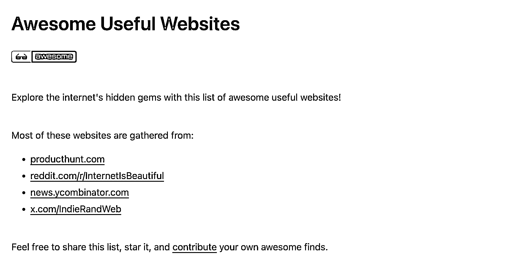
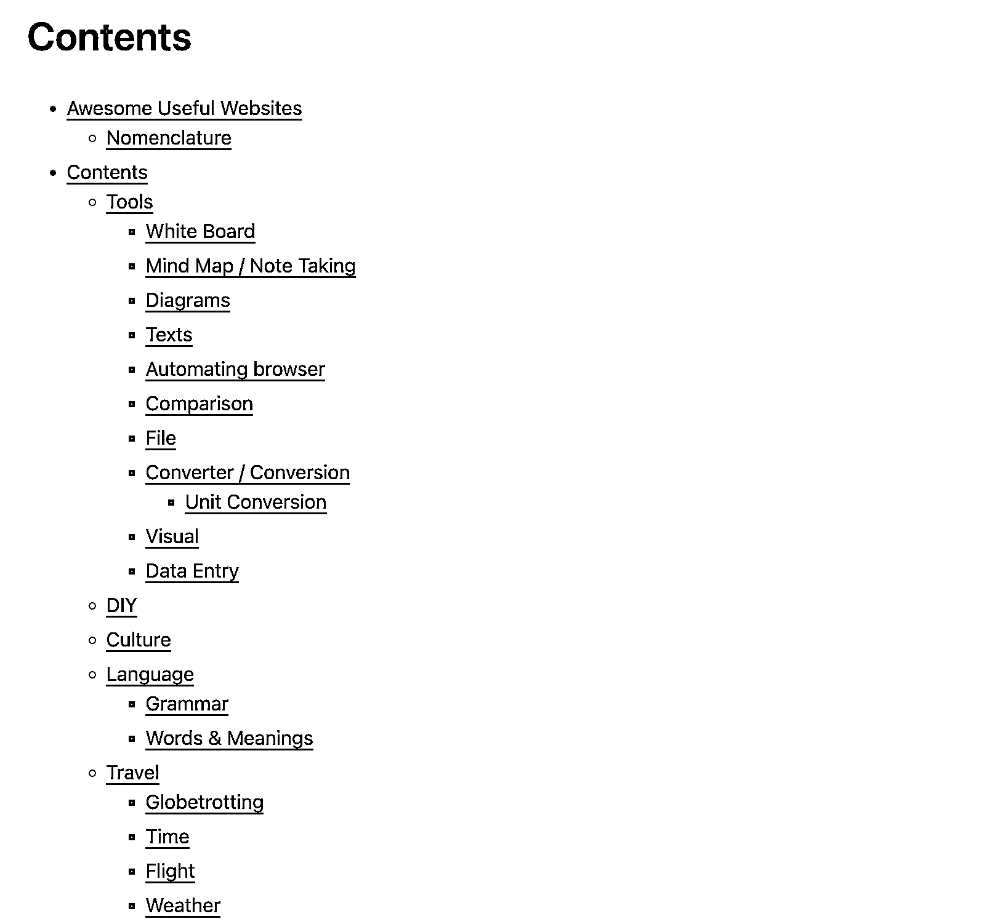
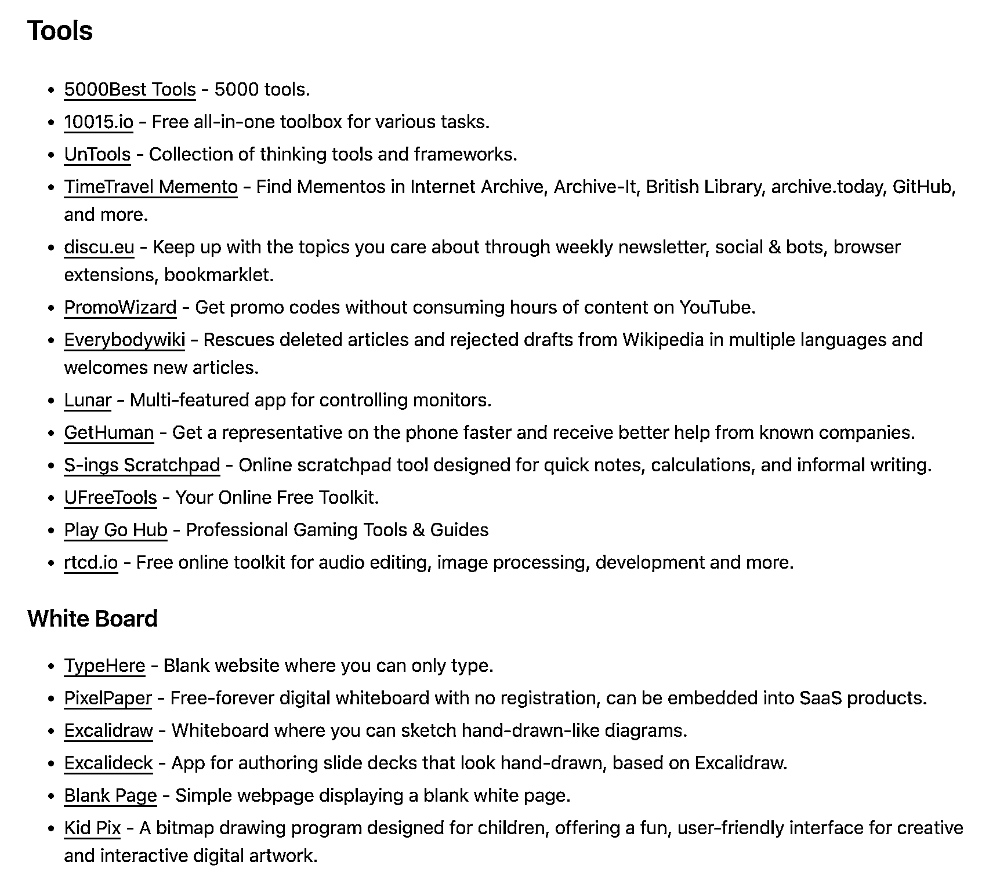
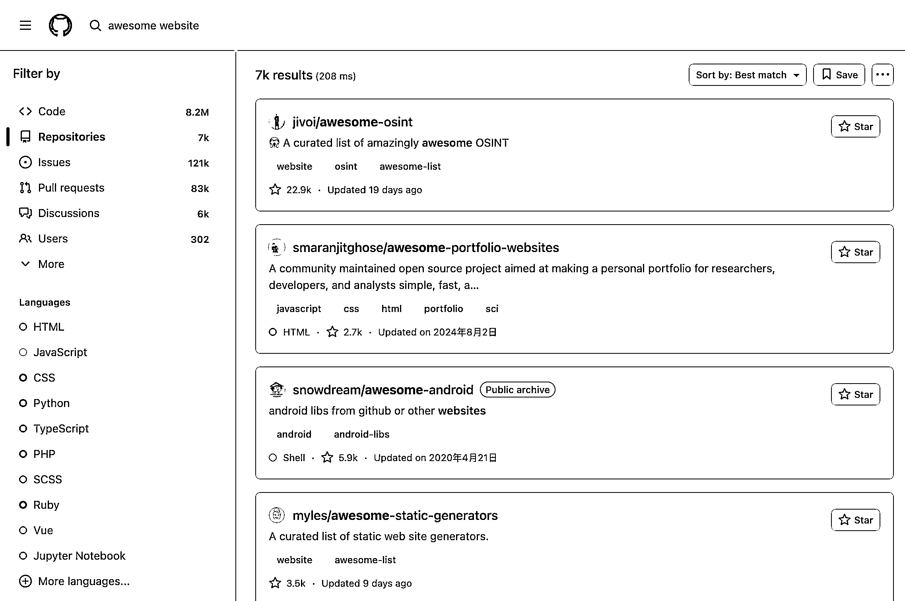

# 可参考网站的仓库及更多有趣网站搜索方法

> 原文：[`www.yuque.com/for_lazy/wind/ank63upopyastrnh`](https://www.yuque.com/for_lazy/wind/ank63upopyastrnh)

作者： 🦉

日期：2025-09-21

点赞数：**23**

* * *

正文：

这个仓库，可以逛很久，里面有的网站可以参考要不要做一个 自己做的网站符合这个仓库的需求的话，还能把它当个外链 扩展：想要看更多有趣好玩的网站，github
搜索框输入 awesome website[`github.com/atakanaltok/awesome-useful-
websites`](https://github.com/atakanaltok/awesome-useful-websites)

* * *

评论区：

亦仁 : 感谢分享，已中标

* * *

公众号懒人搜索，[懒人专属群分享](https://lazybook.fun/#/blog/group)