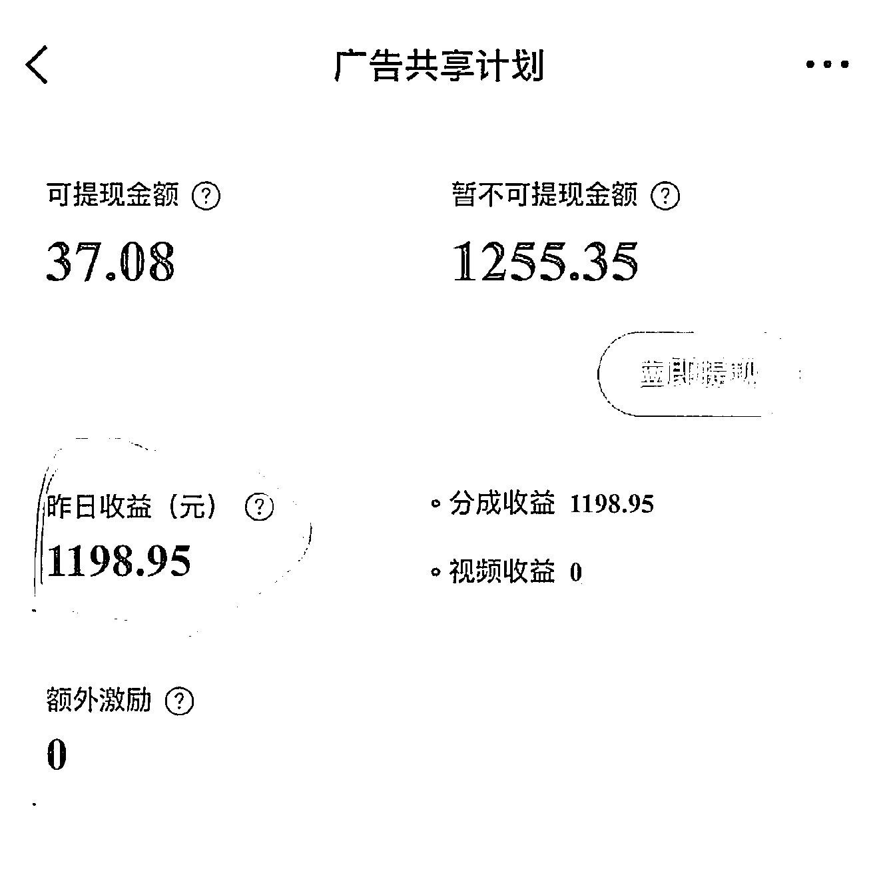

# 揭秘微博女性成长赛道变现：1 条 100 字微博流量变现 1198 元

> 原文：[`www.yuque.com/for_lazy/wind/ywsopbwbr4onfdqb`](https://www.yuque.com/for_lazy/wind/ywsopbwbr4onfdqb)

作者： 哈默

日期：2025-09-25

点赞数：**19**

* * *

正文：

揭秘微博变现：1 条 100 字微博，流量变现 1198 元！ 一、微博流量变现门槛 1. 两种变现路径（两者满足其一即可） 1）认证奖励：
成为“橙 V”（100 铁粉，月阅读量 30 万+）或“红 V”（1000 铁粉，月阅读量 1000 万+），即可获得平台广告分成。 2）付费会员：
花费 688 元/年购买“VVIP 经营会员”，也能获得相应收益。 （如果不想花钱，可以选择方法一；如果想花钱解决问题，可以考虑方法二。我们建议优先选择方法一）
二、微博内容创作法则： 1. 手打原创是王道： 微博系统能识别复制粘贴内容，会降权甚至屏蔽。必须手打，即使是改写也要有自己的句式和观点。 2. 情绪价值与共鸣： 内容要能引发用户共鸣或适度争议，增加互动。 3. 内容形式偏好：
平台对视频扶持最高，其次是图文（文字 70 字以上，图片干净匹配），纯文字次之 4. 话题精简：
勿滥用话题，一般 1-2 个相关话题即可。过多会被判定为蹭流量，导致降权 三、微博高效涨粉与互动秘籍： 1. 巧用粉丝群红包：官方支持粉丝群发红包点赞、评论、转发，可显著提升互动量和曝光。转发和点赞权重高于评论。 2. 微博红包助推：
发放手气红包是快速涨粉（如 10 元红包给 100 人可涨 10+粉）和增加互动（特别是活跃度）的有效方式。选择人流量大的时间段（晚上 7-8 点）。 3. 抱团取暖：
新人可通过与相关领域的博主互粉、互动来快速积累初始粉丝（如“财宝宝”超话是互粉圣地，一周可涨千粉） 4. 不要买粉：
购买僵尸粉不仅无用，还会影响账号权重和健康度 四、微博变现路径与赛道选择 1. 最终归宿—私域：
微博是工具，最终目的是将用户引流到自己的私域，实现深度服务与高转化。 微博对引流非常宽松，可以直接放二维码、店铺链接等 2. 推荐赛道—女性成长：
该领域用户群体庞大、消费力强，变现方式多样（情感咨询、女性用品、知识付费等） 3. 跨领域发展： 微博鼓励跨领域内容创作，不必严格垂直 4. 高客单产品： 微博用户群体质量高，粘性强，消费力高，非常适合定制化、高客单价产品。 5. 学习与借鉴： 新人可对标成功账号，模仿其内容和运营方式 项目实操

* * *

评论区：

亦仁 : 感谢分享，已中标

* * *

公众号懒人搜索，[懒人专属群分享](https://lazybook.fun/#/blog/group)