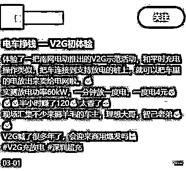
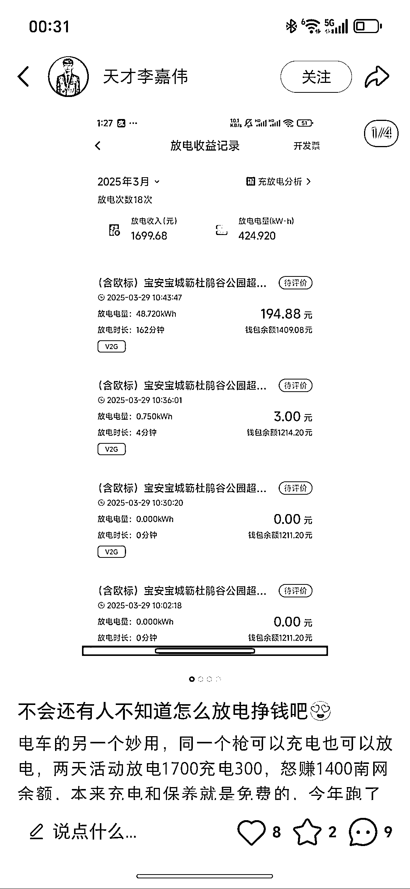

# 小红书博主分享新能源车主“车网互动”新收入：半小时赚 120、两天赚 1400

> 原文：[`www.yuque.com/for_lazy/wind/vizn2vqq7ezzekdc`](https://www.yuque.com/for_lazy/wind/vizn2vqq7ezzekdc)

作者： 子晨🍁

日期：2025-09-26

点赞数：**15**

* * *

正文：

新能源车主的新收入。 本月，天津宣布将在 9 月 和 10 月启动一个 “ 车网互动示范月 ”，说是要探索 V2G 的新形式。两天之后，广州也发了个 《
广州市建设国家车网互动规模化应用试点城市工作方案 》，说要推进 V2G 的规模化应用。 也就是是新能源车反向给电网送电的功能。
有红薯博主表示半小时就可以赚到 120 的差价（图一），也有人两天怒赚 1400（图二） 至于充电放电对电池的损耗，目前网上相关言论不统一。

* * *

评论区：

亦仁 : 感谢分享，已中标

* * *

公众号懒人搜索，[懒人专属群分享](https://lazybook.fun/#/blog/group)