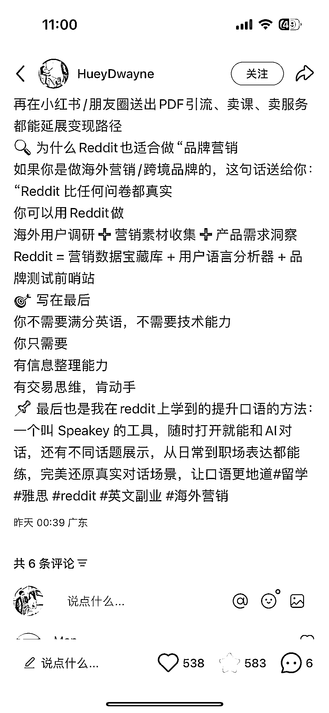
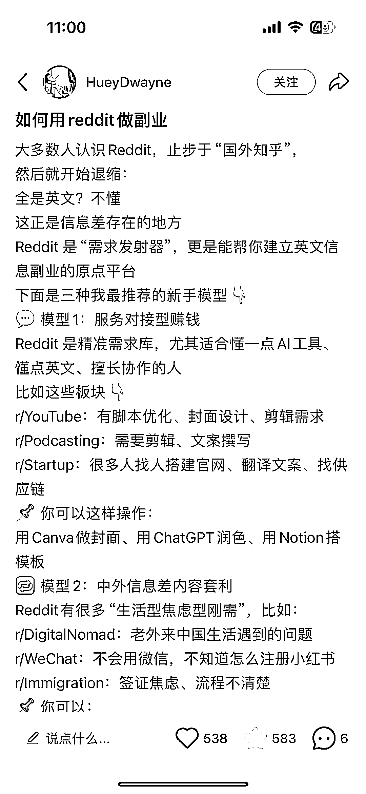
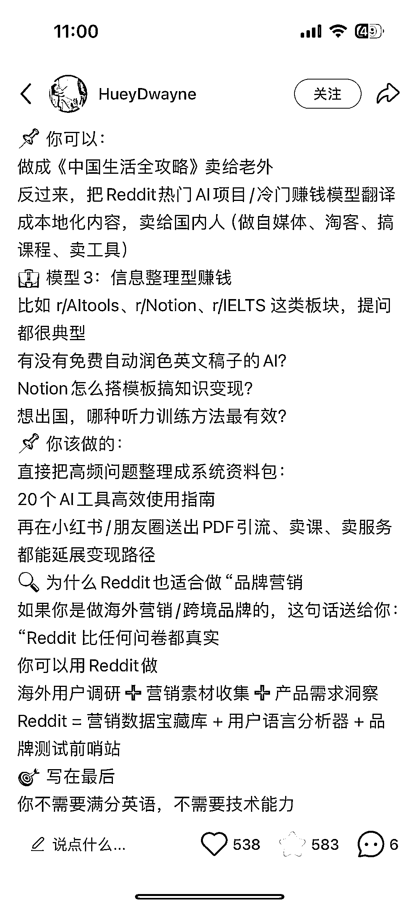

# Reddit 英文信息副业搭建指南

> 原文：[`www.yuque.com/for_lazy/wind/spoynw6gri5l9bgh`](https://www.yuque.com/for_lazy/wind/spoynw6gri5l9bgh)

作者： 书签

日期：2025-09-27

点赞数：**20**

* * *

正文：

如何用 reddit 做副业？ 转自小红书一位博主的帖子，分享出来 Reddit 信息差 ————— 大多数人认识 Reddit，止步于“国外知乎”，
然后就开始退缩： 全是英文？不懂 这正是信息差存在的地方 Reddit 是“需求发射器”，更是能帮你建立英文信息副业的原点平台….

* * *

评论区：

书签 : 也有 reddit 保姆级教程在卖了

书签 : Reddit 内容在小红书是有需求的，目前同质化内容不多，有待挖掘

书签 : 闲鱼同款保姆级教程，倒卖 39.9，小红书卖 9.9 一般小红书价格会比闲鱼卖的高，这里有反差

亦仁 : 感谢分享，已中标

书签 : 感谢～第一次写风向标[愉快]

* * *

公众号懒人搜索，[懒人专属群分享](https://lazybook.fun/#/blog/group)