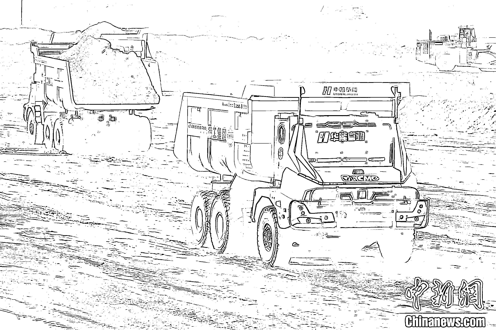
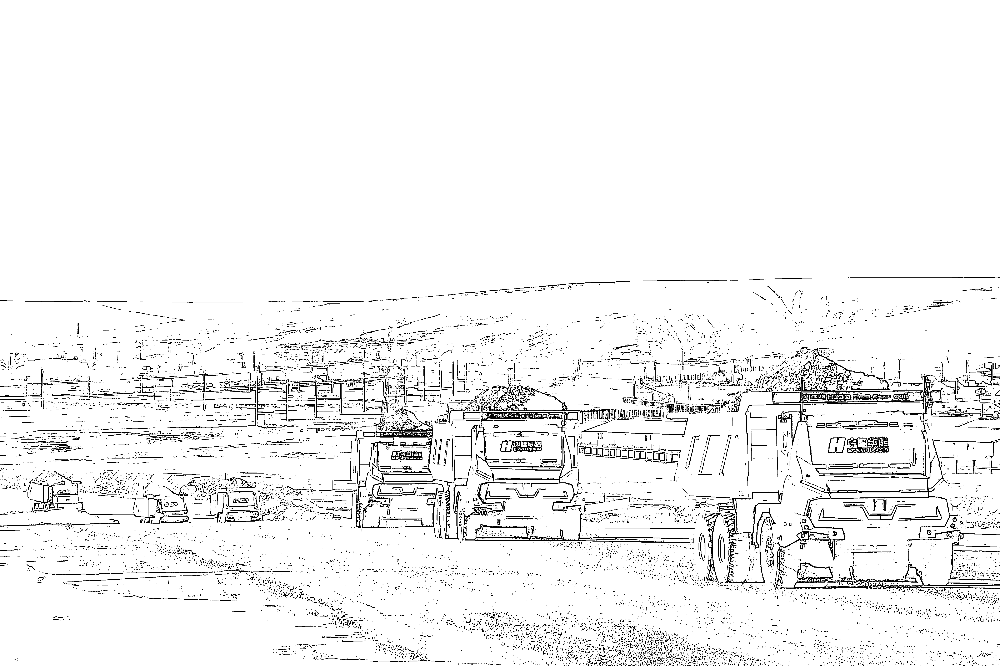
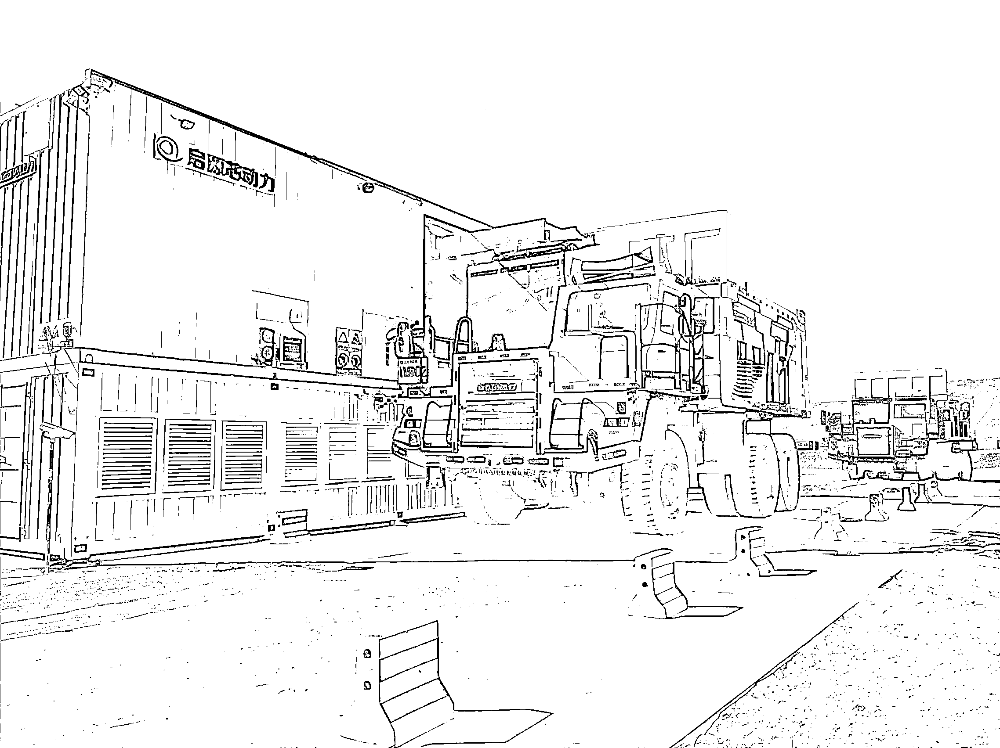

# 露天矿无人驾驶技术：人员缩减至 7 人，年省 1.5 万吨燃油

> 原文：[`www.yuque.com/for_lazy/wind/hu2d0qtc4xk9sru3`](https://www.yuque.com/for_lazy/wind/hu2d0qtc4xk9sru3)

作者： 纸壳

日期：2025-09-27

点赞数：**14**

* * *

正文：

新技术正在看不见的角落快速渗透
华为和中国移动、国家电网等机构联合，在呼伦贝尔一座大型露天矿，部署了 100 台无人驾驶矿山车，这些矿车可实现 24 小时连续作业，全程自动完成规划路线，自动完成装载、避障、卸载、换电，无需人工干预
新的矿山车没有驾驶室，取而代之的是一块可拆卸的超大容量电池，单次换电仅需 6 分钟，全车配备多个激光雷达、毫米波雷达、视觉摄像头和 5G 天线，支撑 L4 级别的无人驾驶，实现厘米级精准停靠，自动避障与最优路线规划，恶劣天气下感知能力远优于人类驾驶员
以前 100 台矿卡至少需要配备 300 名司机，才能实现 24 小时 3 班倒，现在只需要 7 个人，在控制室远程管控就能实现全自动化作业，效率得到几十倍的提升，而且不会出错，一年还能省 1.5w 吨燃油，
技术在看不见的角落，已经替代人工优化成本，成为最优解

* * *

评论区：

馒头 PaPa : 怎么图片想是 AI 出来的一样[撇嘴]

亦仁 : 感谢分享，已中标

* * *

公众号懒人搜索，[懒人专属群分享](https://lazybook.fun/#/blog/group)