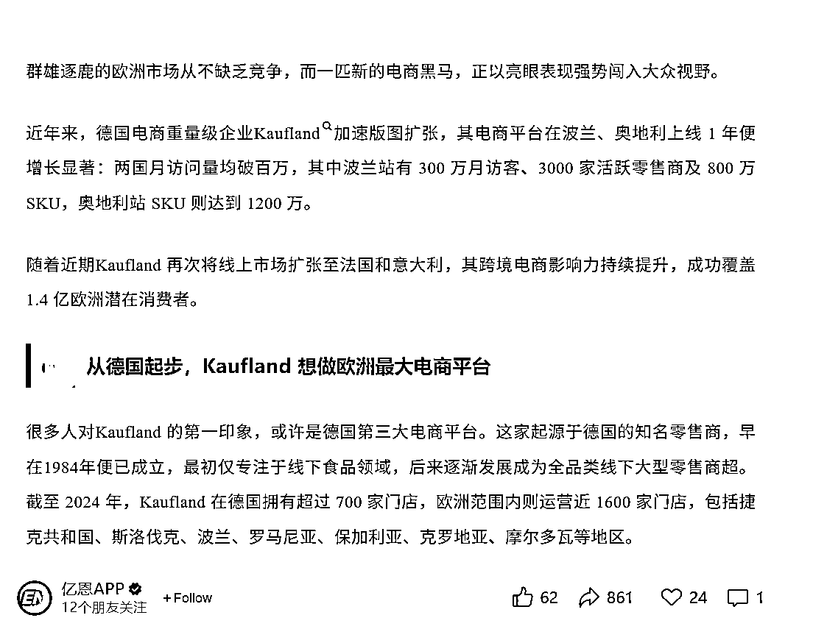

# 跨境电商：老牌百货转型电商 GMV 增长约 7.85%，值得研究入驻

> 原文：[`www.yuque.com/for_lazy/wind/tr87lhuwr53n75p3`](https://www.yuque.com/for_lazy/wind/tr87lhuwr53n75p3)

作者： 小吴姐

日期：2025-09-28

点赞数：**17**

* * *

正文：

做跨境电商的圈友们可以点进来看一下。
刚偶然读到一篇文章，截图见下方，说的是德国传统老牌百货连锁品牌 Kaufland 现在转型做电商做的很好。我就找 GPT 去德、英双语的网页去搜了以下，GPT 的反馈总结是：
从德／英资料来看，这篇公众号文章中很多“趋势性”“目标性”“扩张国家”等内容是被证实的，比如 Kaufland 的 Marketplace
扩展至法国与意大利；GMV 增长约 7.85%──这些与公开消息高度重合。 但一些具体数字（如波兰／奥地利的 SKU
数量，或某些国家月访客／活跃卖家数，中国卖家占比这些）在公开国际媒体、年报或 ECDB 等数据库中尚未找到完全对应的数据来确认它们的精确性。 我个人观点是：
1、 Kaufland
的确是德国悠久历史、且覆盖面很广的百货连锁。10 多年前在德国短住半年，kaufland，lidl，aldi 是我们日常必去的三个连锁超市品牌。
2、德国本土品牌转型做电商，天然有用户的信任基础。 因此，如果你在做面向德国、以及西欧地区的跨境电商，可以去研究下，入驻这个电商平台。
申明：我个人没有直接利益相关。纯粹是因为对德国的了解，欧洲人传统的品牌选择倾向的一些了解。[得意][得意]而且我现在做国际的货运空运业务，对电商平台、跨境物流的一些趋势，有所了解。[机智][机智]

* * *

评论区：

亦仁 : 感谢分享，已中标

小吴姐 : 哇，开心～～很乐于分享

* * *

公众号懒人搜索，[懒人专属群分享](https://lazybook.fun/#/blog/group)