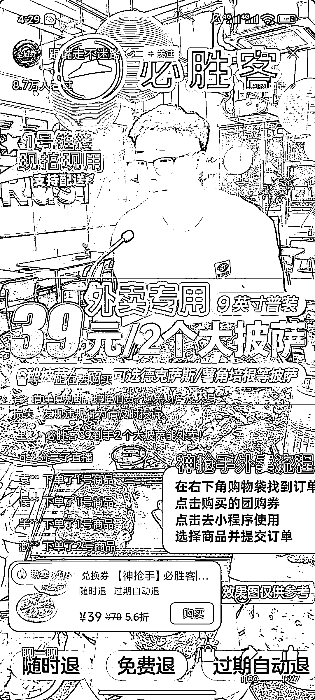

# 美团联盟直播间分销赛道：一单佣金 5 8 块，未投流直播间也有几百单销量

> 原文：[`www.yuque.com/for_lazy/wind/gdi306nzeoq3mlh4`](https://www.yuque.com/for_lazy/wind/gdi306nzeoq3mlh4)

作者： 万青

日期：2025-09-20

点赞数：**15**

* * *

正文：

美团联盟增加直播间大品牌分销力度，
肯德基，麦当劳，必胜客等多个餐饮品牌都参与直播间分销，一点开抖音和视频号最近有大量再做分校的，一单佣金在 5-8 块之间，看活动力度，大品牌知名度，套餐非常优惠，转化率非常高。
下图这个直播间是做投流，没做投流的直播间也有几百单的销量。

* * *

评论区：

亦仁 : 感谢分享，已中标

* * *

公众号懒人搜索，[懒人专属群分享](https://lazybook.fun/#/blog/group)