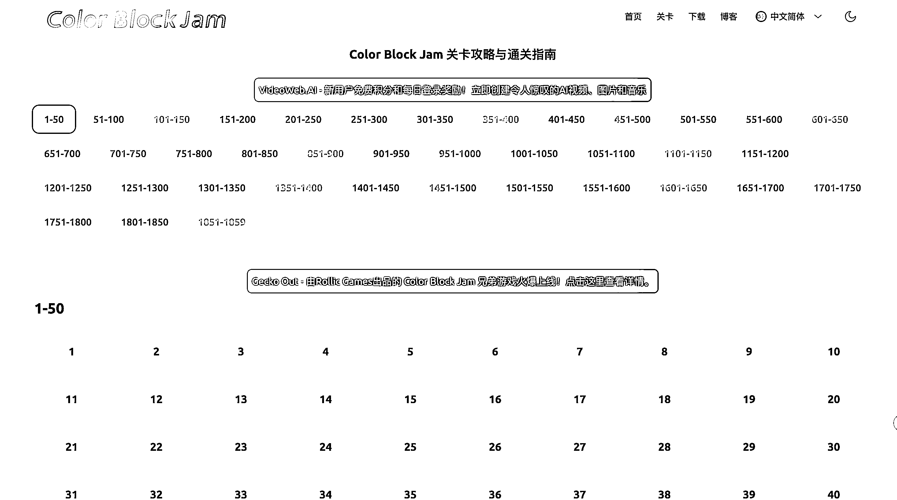

# 游戏资讯站与集合站月访问量对比及拓展思路

> 原文：[`www.yuque.com/for_lazy/wind/ieo9zk0grcryon9w`](https://www.yuque.com/for_lazy/wind/ieo9zk0grcryon9w)

作者： 🦉

日期：2025-09-20

点赞数：**14**

* * *

正文：

这个游戏词，排名第一的网站月访问量远远大于排名第二的，看了下，第一个网站是做游戏资讯站，第二个网站是做游戏集合站
第一名的游戏资讯站，关卡界面很有意思，应该是把这个游戏的所有关数都列出来了，点进去查看具体的，则是 iframe 的 YouTube 视频，再往下滑动则是
iframe 的其他网站做好的游戏，剩下的就是一些说明性文案 这个游戏的关卡界面，有一个外链： Gecko Out - 由 Rollic Games 出品的
Color Block Jam 兄弟游戏，点进去看了下，六月份的域名，月访问量 3.7k，看了下布局，和 color block jam 很像
扩展：Rollic Games 还有哪些游戏，可以做成这样的资讯站； 这样的资讯站，相当于把每个关数的攻略、视频集合起来了，放的是 YouTube
上的游戏视频链接，也可以关注 YouTube 上成系列游戏的视频，看看能不能做一个集合网站 反过来，YouTube
视频也可以根据游戏站上的哪些新游戏，去做攻略、解说等等

* * *

评论区：

木子金比白 : 认领一下

🦉 : 想了很久，奈何没文化，只能说一句：牛 🐂🍺

亦仁 : 感谢分享，已中标

爱搞钱的宋宋💰 : 这个游戏微信小程序有个类似的

🦉 : 还真没关注过嘞

* * *

公众号懒人搜索，[懒人专属群分享](https://lazybook.fun/#/blog/group)