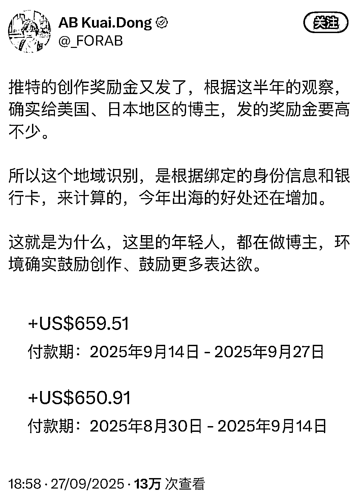
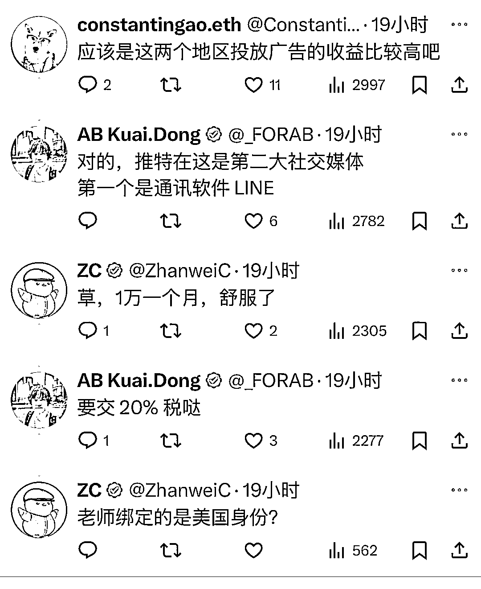

# X 平台发推：美日博主收益更高，中推博主可“日化”“英化”内容避内卷

> 原文：[`www.yuque.com/for_lazy/wind/olee8gnpgksgu9y1`](https://www.yuque.com/for_lazy/wind/olee8gnpgksgu9y1)

作者： L!N/林林/小林

日期：2025-09-28

点赞数：**11**

* * *

正文：

同样是在 X 发推赚钱，美日两国博主的收益也要比中推来得高，这其实也是得益于 X 平台在当地庞大的用户基础。对于精通英语、日语的中推博主来说，这很可能是个利好，直接避开中推圈子内卷，把简中平台火过的内容“日化”“英化”也是个很好的办法。
自媒体

* * *

评论区：

亦仁 : 感谢分享，已中标

* * *

公众号懒人搜索，[懒人专属群分享](https://lazybook.fun/#/blog/group)