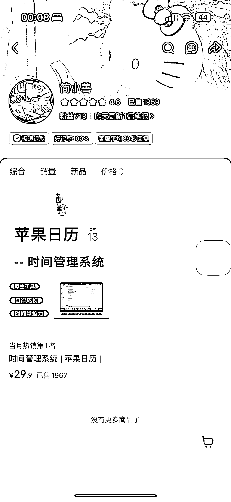
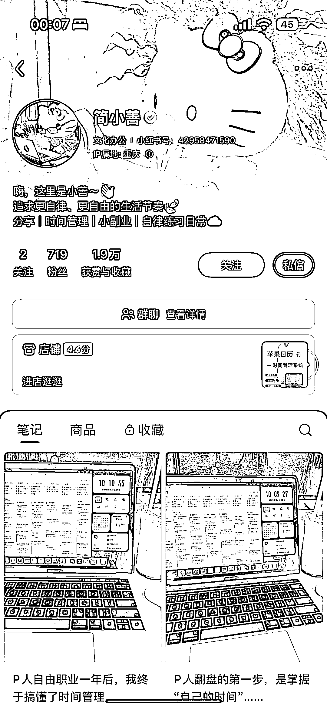
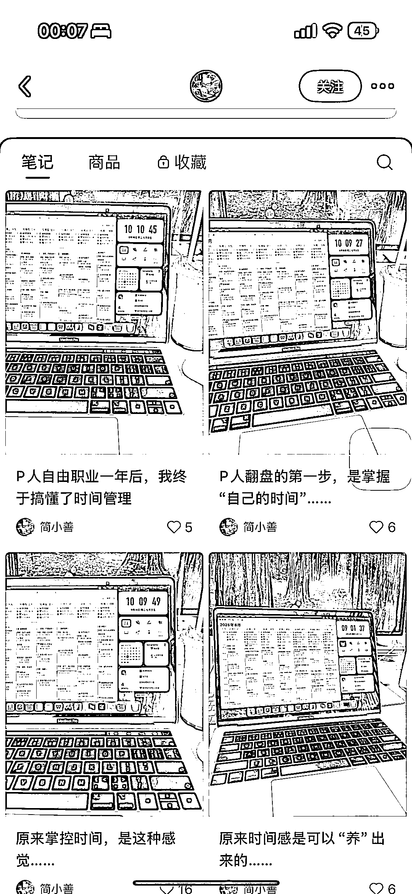
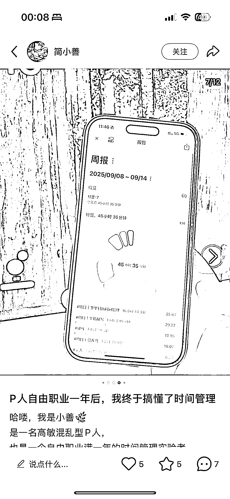
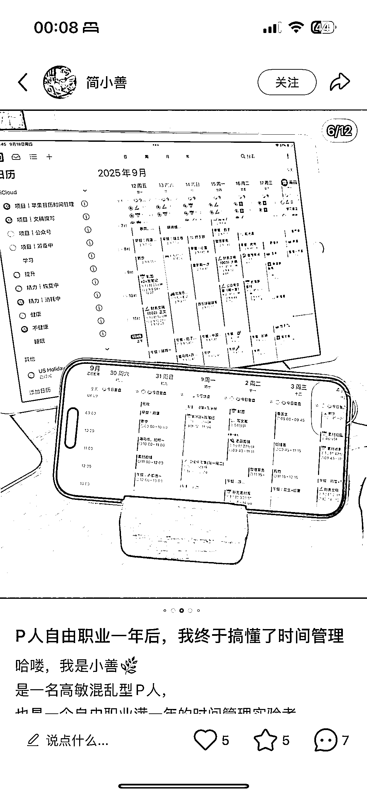
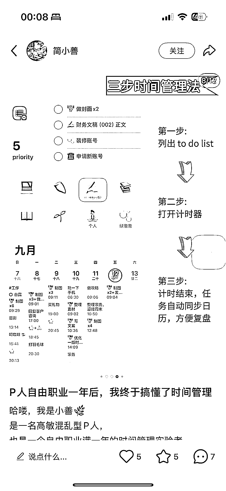

# 虚拟资料之苹果手机时间管理系统：自带日历打造可复用方案

> 原文：[`www.yuque.com/for_lazy/wind/brwfsrvou2qb5izr`](https://www.yuque.com/for_lazy/wind/brwfsrvou2qb5izr)

作者： 🌟Lisa🌟

日期：2025-09-22

点赞数：**13**

* * *

正文：

【虚拟资料】苹果手机时间管理系统 【赛道/细分方向】 虚拟资料 x 苹果手机时间管理系统（自带）xJ 人狂喜 【案例描述】
苹果日历使用教程，不用自己开发应用，实际上用苹果自带日历+快捷方式即可整合成一套有效的时间管理系统，并且可以无限复用 图片：每条基本上都是重复的界面图示
文字：描述时间管理方法 产品，可以直接购买后复用 【数据/截图/来源】 小红书简小善 【为什么是机会】
时间管理需求是 J 人的刚需，确实秩序感会带来可控感，有可控感生成幸福感 有很多时间管理 app 如嘀嗒清单等需要付年费，用系统软件有成本优势 虚拟产品可直接复用

* * *

评论区：

亦仁 : 感谢分享，已中标

* * *

公众号懒人搜索，[懒人专属群分享](https://lazybook.fun/#/blog/group)