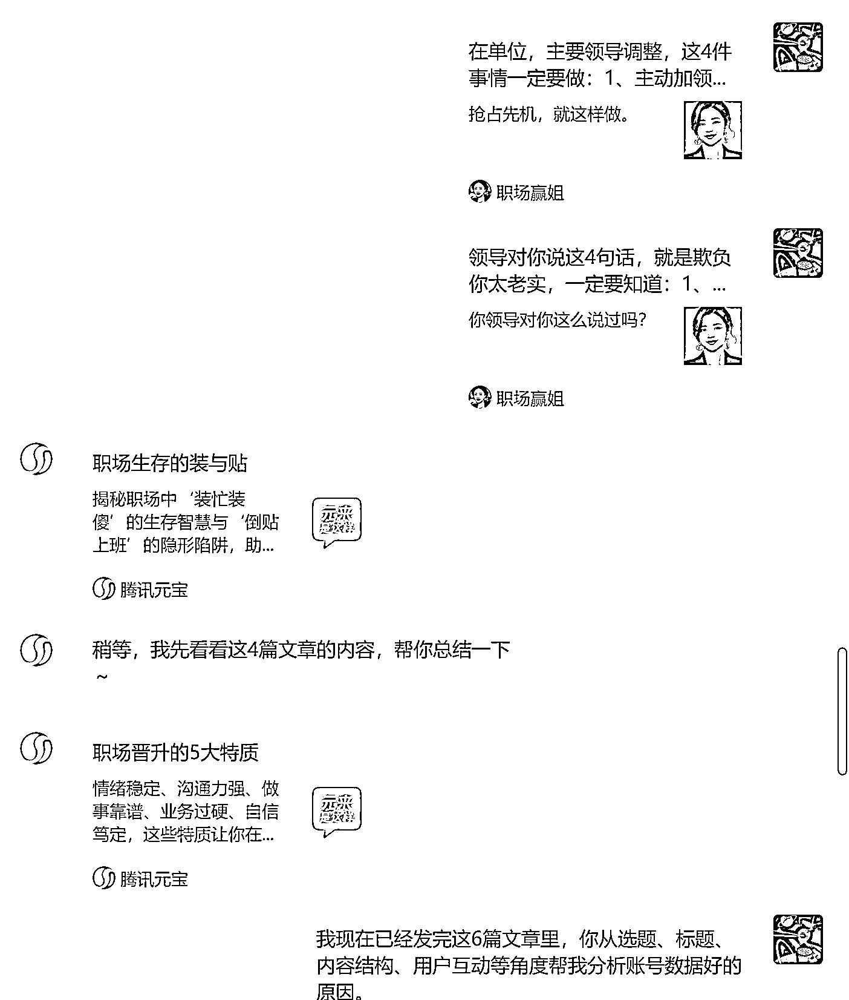

# 微信调研公众号账号及文章方法分享

> 原文：[`www.yuque.com/for_lazy/wind/zhdeekgtw3gnydt2`](https://www.yuque.com/for_lazy/wind/zhdeekgtw3gnydt2)

作者： 枫晓陌 超强执行力

日期：2025-09-24

点赞数：**29**

* * *

正文：

微信聊天窗口留言呼叫元宝帮你调研账号 1、在微信检索框，搜索元宝，把它添加为你的微信好友。图一。 2、发公众号账号，或者发公众号文章给它分析。
3、我们从图五、图六可以看到，元宝给出来的回答还是可以的，后面也可以直接转发或者复制给朋友、群聊。跟大家一起互动，解决问题。

* * *

评论区：

早茶月光 : 试了试挺好玩

枫晓陌 超强执行力 : [握手][握手]

亦仁 : 感谢分享，已中标

* * *

公众号懒人搜索，[懒人专属群分享](https://lazybook.fun/#/blog/group)