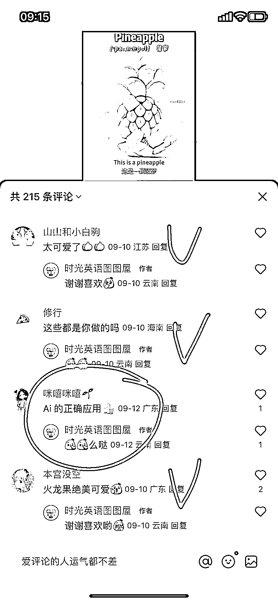

# 10 个 AI 英语单词学习视频涨粉 1.3 万，快速跑通变现闭环！

> 原文：[`www.yuque.com/for_lazy/wind/efs08w2rbgft5iho`](https://www.yuque.com/for_lazy/wind/efs08w2rbgft5iho)

作者： 飞掌柜

日期：2025-09-22

点赞数：**40**

* * *

正文：

一、案例描述 该账号主要做 AI 英语单词学习视频，仅仅发了 10 个作品，涨粉就有 1.3 万，获赞与收藏 2.7 万。起号很快，并且开通商品带货，快速跑通变现闭环！
二、数据表现 1、利用即梦 AI、可灵 AI 生成视频片段，然后剪映 AI 配音，脚本文案也能用 AI 大模型生成，包括英文句子和对应翻译。
2、点赞日常一两百，最多有 1.5 万，播放量 150 多万了。内容是 AI 让各种水果变身好看的萌物，评论区一片好评。
3、已经开通商品带货，售卖 16.9 的英语启蒙动画，针对宝妈群体，学校老师，教培机构。 三、机会剖析
1、用 AI 制作英语视频，这类玩法可复制性强，水果变身、蔬菜变身、动物变身、植物变身等多种玩法，吸引用户眼球，持续爆过的还可以继续玩，熟练之后可降低成本。
2、选品带货的产品体系可以再完善下，包括引流品、利润品、锚定品等。通过评论区引流、建群引流、低客单价引流等多种玩法。沉淀私域后卖英语辅导等高客单产品。
3、也可尝试蒲公英接单，给其他教培机构合作，拓展变现方式～

* * *

评论区：

亦仁 : 感谢分享，已中标

九歌 : 确实很有创意

飞掌柜 : 是的，每次刷小红书都长见识

飞掌柜 : 感谢老大，继续努力💪

Nicky_ji : 背景歌曲音怎么配？

* * *

公众号懒人搜索，[懒人专属群分享](https://lazybook.fun/#/blog/group)