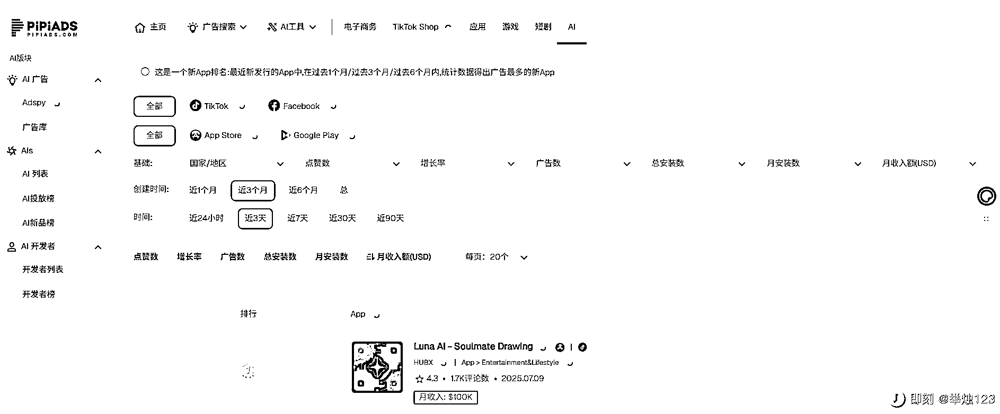
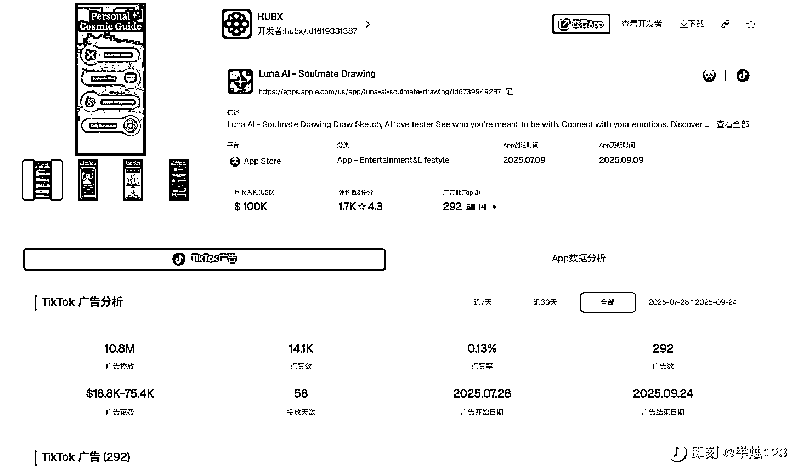
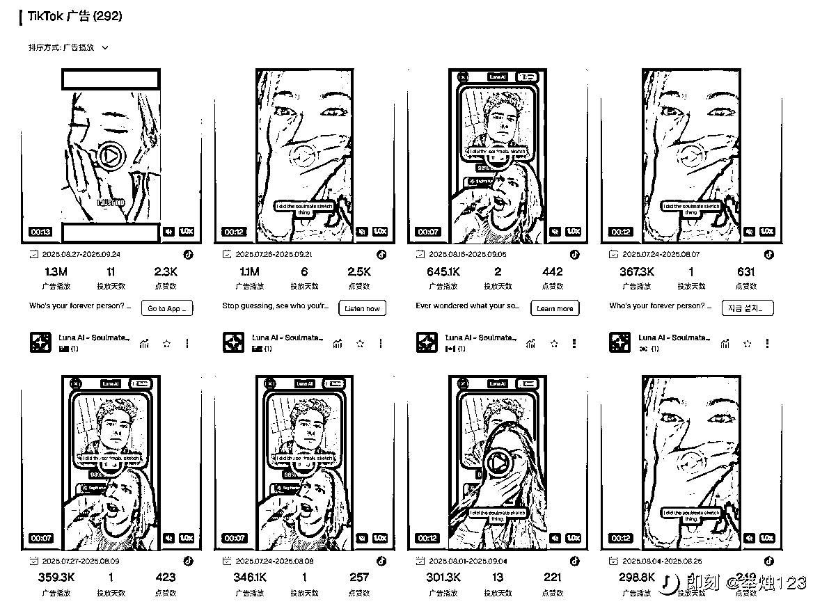

# 出海 AI 情感画像 App 上线 3 个月，月入$100K！

> 原文：[`www.yuque.com/for_lazy/wind/iha1inscgr0qoek8`](https://www.yuque.com/for_lazy/wind/iha1inscgr0qoek8)

作者： 梁小伟

日期：2025-09-26

点赞数：**38**

* * *

正文：

发现一个出海 AI App 爆款，上线 3 个月月入$100K！ 今天在 Pipiads 上刷到一个有趣的 AI 应用，增长势头很猛，分享一下。 应用背景 名称: Luna
AI - Soulmate Drawing 功能:
主打一个核心概念——用 AI 帮你绘制出你“灵魂伴侣”的素描画像。精准抓住了用户对情感、神秘主义和好奇心的需求。 营收情况
这款 App 是今年 7 月才上线的，短短 3 个月时间，在 App Store 上的月收入就达到了 10 万美金。 广告策略：主投 TikTok 素材玩法:
它的 TikTok 广告素材非常统一，几乎全是 UGC（用户原创内容）风格的真人短视频。 创意核心:
找年轻女性，用手机镜头记录下她们看到 AI 生成的“灵魂伴侣”画像时，那种惊讶、好奇、害羞的真实反应。这种“开箱式”的视频代入感极强，很容易激发观众的下载欲望。
一句话总结： 情感需求 + AI 概念 + 神秘感 + UGC 广告 = 吸金利器。

* * *

评论区：

亦仁 : 感谢分享，已中标

* * *

公众号懒人搜索，[懒人专属群分享](https://lazybook.fun/#/blog/group)