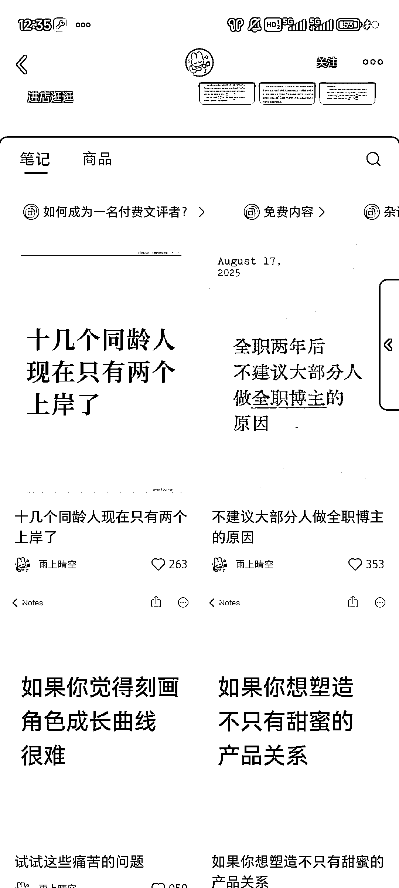
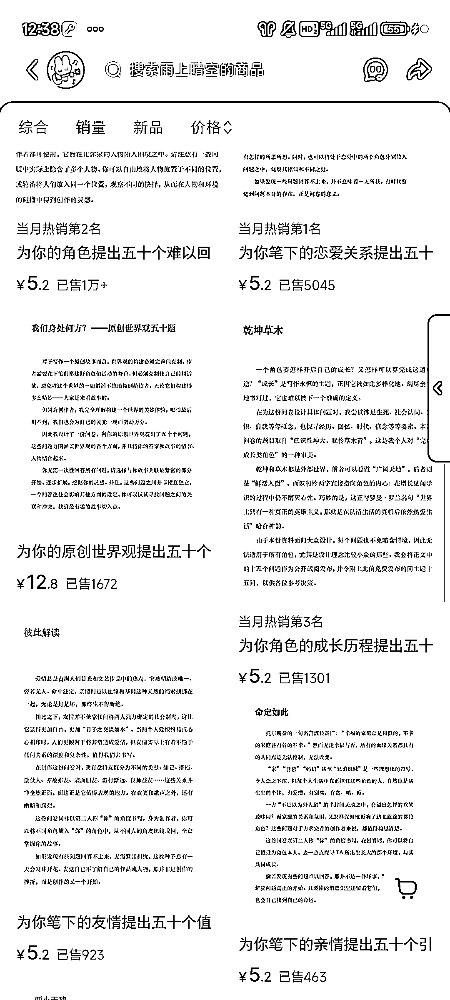
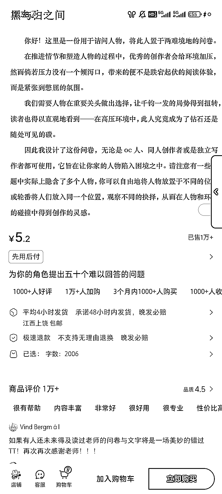
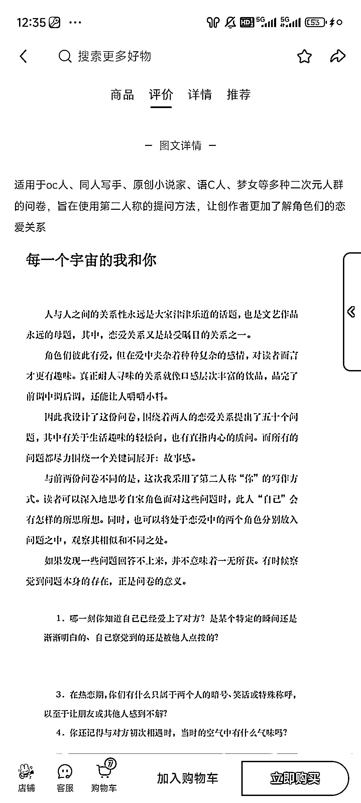

# 小红书虚拟产品：为写手提供思路，销量 8w+

> 原文：[`www.yuque.com/for_lazy/wind/rog4g37p1g15b7k5`](https://www.yuque.com/for_lazy/wind/rog4g37p1g15b7k5)

作者： 乌托邦

日期：2025-09-24

点赞数：**35**

* * *

正文：

为写手提供思路的虚拟产品，挺有意思的，给问答试卷，相当于帮你理清思路的。单价可以，销量也不低。 我感觉完全可以 ai 生成，赛道非常小众，卖了得有 8w+打底了

* * *

评论区：

亦仁 : 感谢分享，已中标

* * *

公众号懒人搜索，[懒人专属群分享](https://lazybook.fun/#/blog/group)