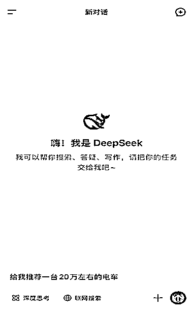

# 未来 2 3 年 GEO 成数字营销标配，传统 SEO 流量年降 30%

> 原文：[`www.yuque.com/for_lazy/wind/iplze8vsmv0sqe1y`](https://www.yuque.com/for_lazy/wind/iplze8vsmv0sqe1y)

作者： Miles

日期：2025-09-25

点赞数：**21**

* * *

正文：

未来 2-3 年，GEO 会成为数字营销的标配。尤其在高决策成本行业（如教育、金融、医疗）将率先全面接入。 分享专业报告观点：
搜索引擎流量逐年下滑、社交种草红利逐渐见顶时，用户的决策习惯正在迈入一个全新的阶段——AI 决策时代。越来越多的消费者直接向
DeepSeek、豆包、Kimi 等生成式 AI 提问，并将 AI 推荐作为决策依据。GEO 正成为品牌在 AI 浪潮中抢占先机的关键抓手。
GEO，即针对生成式 AI 引擎（如 DeepSeek、腾讯元宝、Kimi
等）的优化技术。通过自然语言语义优化、结构化数据适配、权威知识库构建，使企业内容成为 AI 生成答案的「首选信源」。 SEO
主要聚焦于搜索引擎结果页的关键词排名； GEO 则以「让品牌成为 AI 生成答案中的优先推荐对象」为核心目标。
随着用户行为的演变，从「搜索依赖时代」（百度、谷歌），到「社交种草时代」（抖音、小红书），再到如今的「AI 决策时代」（用户直接通过
DeepSeek、豆包、Kimi 等 AI 工具提问并采纳答案），信息获取路径发生了根本变化。 在这一趋势下，GEO
通过自然语言语义优化、结构化数据适配与权威知识库构建，使企业内容能够被 AI 精准抓取与引用，从而在 AI 推荐中获得优先曝光。 用户搜索行为向 AI
倾斜，AI 搜索流量增长明显，当入场的品牌越来越多，竞价就会越来越激烈，前期布局是有非常大先发优势的。 传统 SEO 流量年降 30%，用户行为向 AI
决策迁移，GEO 是未来趋势；新品牌可通过 GEO 快速建立 AI 认知，抢占新兴流量入口。 GEO 将推动教育营销从「买流量」转向「被 AI 推荐」。传统
SEM/SEO 策略不会完全失效，但效果减弱。 考虑国际化，GEO 策略在海外市场同样有效，但需适配本地平台算法。 建议尽早布局
GEO，从小范围关键词起步，优先抢占 AI 推荐位，积累认知红利，先占关键入口，逐步优化。

* * *

评论区：

早茶月光 : 确实挺重要的

厦门凝聚 MCN 阿星 : 怎么布局呢？请教！

亦仁 : 感谢分享，已中标

* * *

公众号懒人搜索，[懒人专属群分享](https://lazybook.fun/#/blog/group)