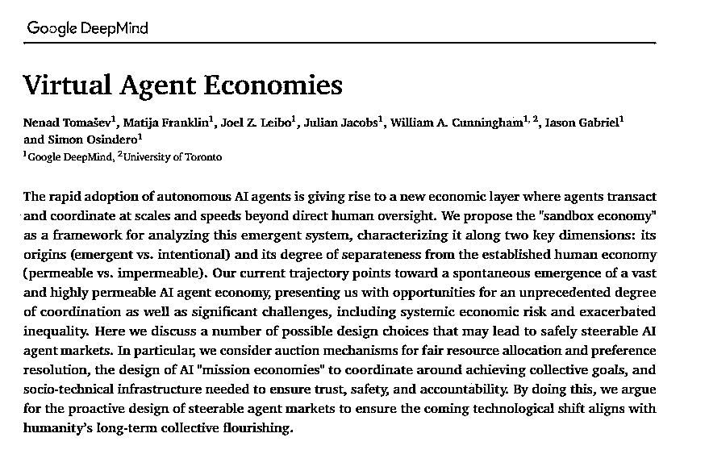
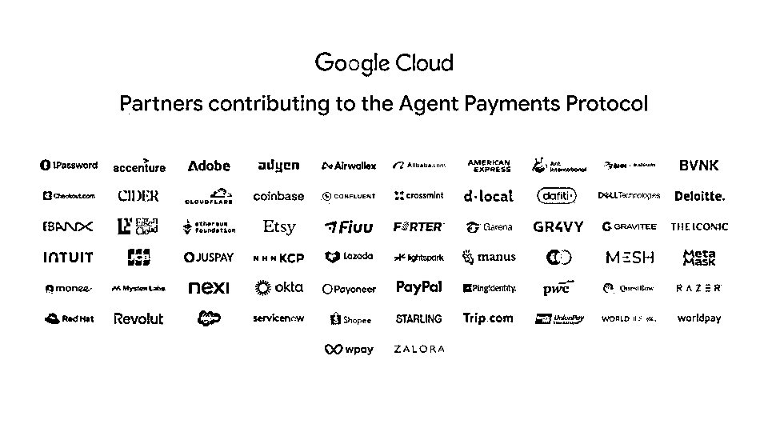
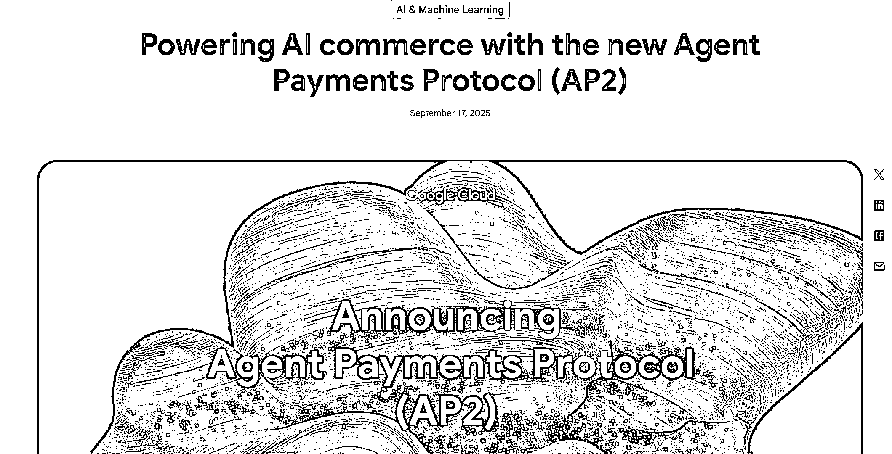

# AP2 协议落地对生活的影响及区块链技术解决信任问题

> 原文：[`www.yuque.com/for_lazy/wind/fxtlh4ytmoad723i`](https://www.yuque.com/for_lazy/wind/fxtlh4ytmoad723i)

作者： 阳阳实验室

日期：2025-09-20

点赞数：**28**

* * *

正文：

前几天 Google 发布了 AP2 协议，我第一时间转发到朋友圈，但发现好像没几个人关注。 我举的职业买办的例子好像不够形象，重新举几个更贴近生活的例子，来说明
AP2 协议如果能落地，对我们的生活的影响： 1. 帮你排队抢票：比如你想看 Taylor Swift
的演唱会，今晚八点抢票，但这个时候你在开会，怎么办呢？ 给 AI 授权，它就可以帮你抢。 2. 货比三家：买东西的时候，不同电商网站的价格不同，比来比去花费大量时间，眼都看花了，没关系，授权给 AI
，AI 帮你货比三家，最后直接给你一份简明的报告，你来确认买不买，买哪个。 3. 日用品定期购买：卫生纸，食用油，肉类，调料等等消耗品，经常忘记定期购买，等到用完再购买往往来不及，或者因为归纳不好，用的时候找不到而重复购买。AI
可以根据的生活习惯，提醒你，自动帮你补货。 延伸一下，超市的供应链当然也可以用。 4. 研究优惠政策：双十一的各种活动，研究了确实能省钱，但是浪费时间。还有什么航空公司里程，信用卡积分活动，乱七八糟。 AI
可以自动帮你研究这些优惠活动，帮你找到最优路径。 5. 规划行程：现在 AI 也能规划行程，但是是初级版的，因为不能考虑预算。但有了 AP2 协议， AI
就可以帮你处理预算的问题，它可以根据你不同的预算设计不同的交通方式和住宿条件等等。最后甚至可以一键购买交通票据和酒店，甚至可以做到原子化，即，这多个消费，其中一个不成功，就回退。避免中间某个行程出问题导致这个行程衔接不上的问题。
想象一下，这些跟钱有关的麻烦事都是谁在做，要么是自己，要么是最亲密的家人。在公司里，也要处处提防这些花钱的人吃回扣等等问题，更何况，这些需求很多都是个人隐私，是很难外包给别人的，就算是管家、保姆也不能轻易透露。既然如此，我们怎么能把这些信息交给
AI 呢？它黑盒，不透明，甚至有可能被美国操纵[旺柴] 答案就是区块链技术，区块链的不仅能更好地解决支付问题，还能解决隐私问题，以及 AI
模型的信任问题。举个例子，在 Web3 的世界里，你自己拥有数据主权，就不会被大数据杀熟。 Google 的 AP2
并不是简单地去帮你省了一些麻烦，这并不是什么很重要的革新，大不了麻烦一些呗！日子又不是不能过！ 但是，如果它能解决人和人协作，人和 AI 协作，AI 和 AI
协作之间的信任摩擦。那人类和 AI 的生产力水平必将进入一个新时代。
只不过路漫漫其修远兮，要打通各个关节，触动各方利益肯定也是困难重重，只不过从技术角度看，各个拼图🧩已经完整。拭目以待吧。

* * *

评论区：

阳阳实验室 :

亦仁 : 感谢分享，已中标

搞钱萌新 : 这个好

* * *

公众号懒人搜索，[懒人专属群分享](https://lazybook.fun/#/blog/group)