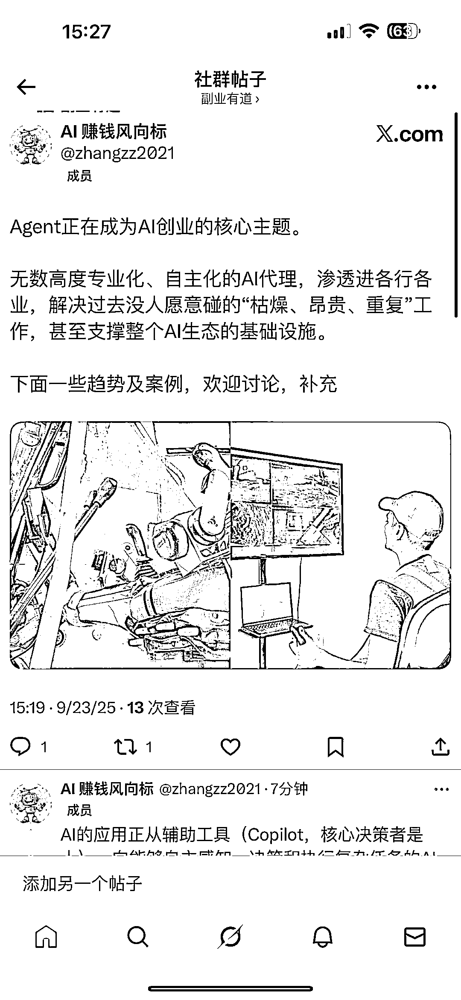
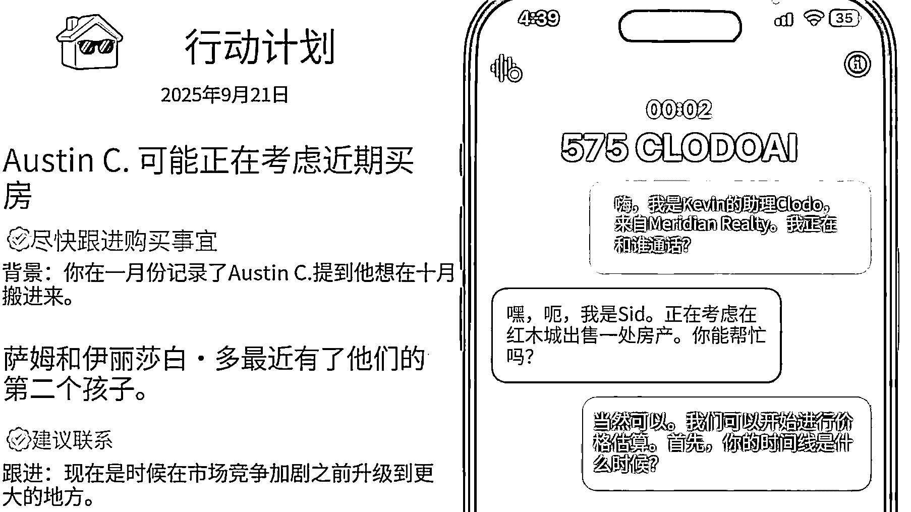
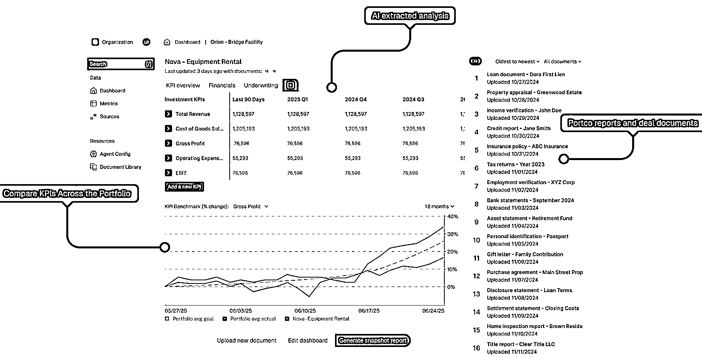
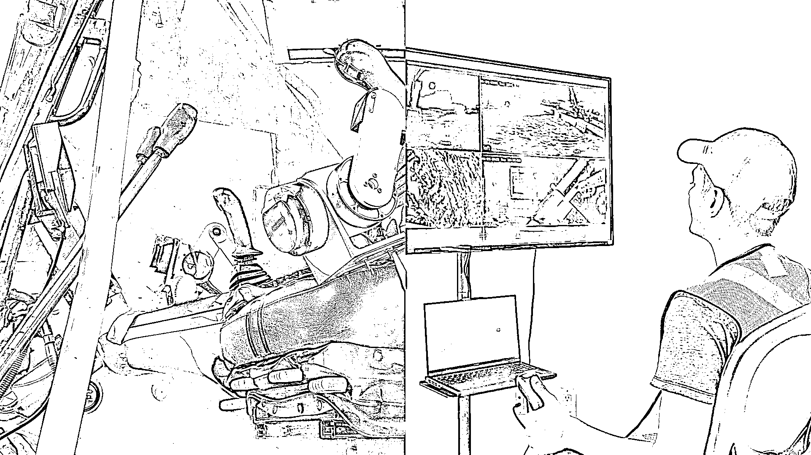

# 2025 夏季 AI 创业趋势：Agent 成核心，垂直细分赛道崛起

> 原文：[`www.yuque.com/for_lazy/wind/ks8uoin3vfwsc9lf`](https://www.yuque.com/for_lazy/wind/ks8uoin3vfwsc9lf)

作者： Miles

日期：2025-09-23

点赞数：**22**

* * *

正文：

ai 创业的一些趋势和案例 看到一篇报告，这可能是一个超级标中的超级标😎 今年夏季全球创投圈的“风向标”YC，它的 2025 夏季演示日，169 家初创公司，总结的 AI 创业的一些趋势
Agent 正在成为 AI 创业的核心主题。无数高度专业化、自主化的 AI 代理，渗透进各行各业，解决过去没人愿意碰的“枯燥、昂贵、重复”工作，甚至支撑整个 AI 生态的基础设施。
趋势一： 超过一半的项目都在描述中提到了 AI 代理、自主、自动化或 autopilot 等关键词。
AI 的应用正从辅助工具（Copilot，核心决策者是人），向能够自主感知、决策和执行复杂任务的 AI Agent 转移。
这不是单纯的技术变化，更是商业模式的变化。B2B 企业愿意为“能直接帮我省钱或赚钱”的 AI 代理付费，而且付费意愿比 ToC 高得多。
AI 代理都在盯住那些“人不愿意做、做不好、还特别贵”的工作。
商业模式简化成：要么替客户省钱，要么替客户赚钱。前者按节省的成本或追回的金额分成，后者通过 AI 直接促成交易，按成交额抽佣。
比如，Solva 用 AI 自动化保险理赔，上线 10 周就做到年化收入（ARR）24.5 万美元；
再比如被称作“AI 版 Stripe”的 Autumn，专门帮 AI 公司处理复杂的计费问题，现在已经被数百个 AI 应用和 40 家 YC 初创使用。
例如，Frizzle 通过 AI 批改作业，将教师从重复性劳动中解放出来；
F4 和 ContextFort 则专注于工程图纸的合规检查，能发现人工难以识别的错误，避免了因设计失误导致的经济损失和项目延期风险； Risely
AI 致力于高校行政工作自动化，这类工作流程繁琐且容错率低。 趋势二： 几乎没有人再做“通用大平台”，大家都在拼命往垂直里钻。
AI 不再只是一个酷炫的工具，而是开始化身为各行各业的新型“劳动力”和“专家系统”。
通用模型已经成了红海，创业公司选择直接切入行业痛点，哪怕是超级细分的场景。
比如，AI 催收、工程蓝图的碰撞检查，这些在过去听起来很小众的事，现在反而成了切入万亿级行业的新突破口。
在医疗里，有公司做自动生成救护车报告，也有公司专门搞诊所转诊，还有 AI 药房技术员。 最有意思的是 Perspectives
Health，它能监听医生和病人的对话，实时生成病历和表单，帮医生直接省掉一半的文书时间。试点阶段就保持每周 25%的增长，已经接入 9 家诊所，还计划到 9 月覆盖 180 名医生。
在房地产行业，也有公司盯上了经纪人的痛点。
Clodo 就是个典型，它做的是“语言交互免手动”的 CRM，能自动记录线索、跟进客户，还能帮你搜房源。现在已经有 60 个美国房产经纪人用上了，直接用来省时间、签更多单。
AI 在金融和法律领域同样跑得飞快。比如，Magnetic 是会计事务所的 AI 报税员，Kalinda 给律所做集体诉讼研究，还有专门跑贷款业务的 AI 电话代理 Qualify.bot。
甚至 PE 圈里甚至出现了 Palace 这种“投后闹钟”，能自动抓取和汇总被投公司的报告，把原来 20 小时的工作缩成一键导出，还能实时做风险预警。目前，其已服务管理几十亿美元资产的基金。
在更硬核的制造业，AI 的身影也开始出现。Flywheel 被叫做“挖掘机版 Waymo”，它给挖掘机装上智能盒子，让工人能远程操控。
更关键的是，设备在干活的同时还能采集数据，AI 模型能不断学习挖沟、平地等技能，最后做到一个人能管多台机器、甚至多个工地。 最后：
投资人开始把筛选标准拉回到商业本质。他们不再只看技术的新颖性，而是更关注用户留存、单位经济效益（UE）、数据和算力成本，以及潜在的监管风险。
大家不再热衷做大而泛的通用平台，而是盯紧具体行业里的真实痛点。尤其是那些传统、高价值、但还没有被软件彻底改造的行业，比如制造业、保险、市政管理、国防等。
可以说，AI 正在进入一个新阶段，开始更深入地嵌入到业务流程里，成为驱动效率提升和自动化落地的核心引擎。

* * *

评论区：

亦仁 : 感谢分享，已中标

* * *

公众号懒人搜索，[懒人专属群分享](https://lazybook.fun/#/blog/group)