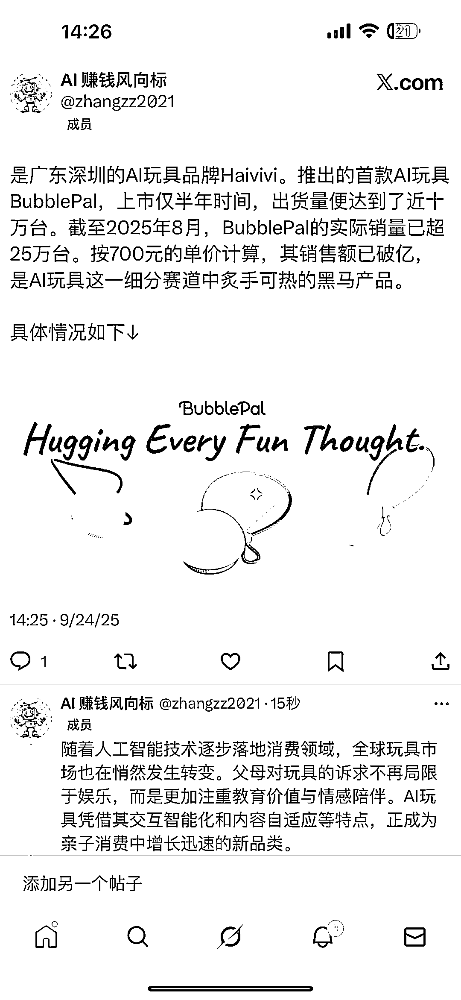
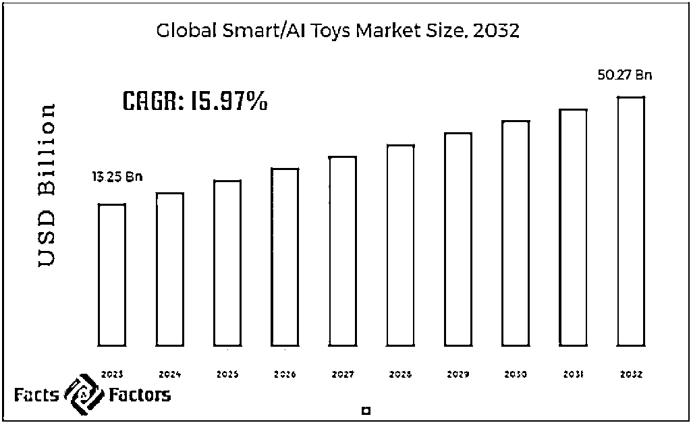
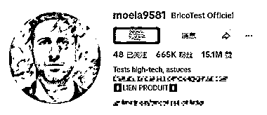
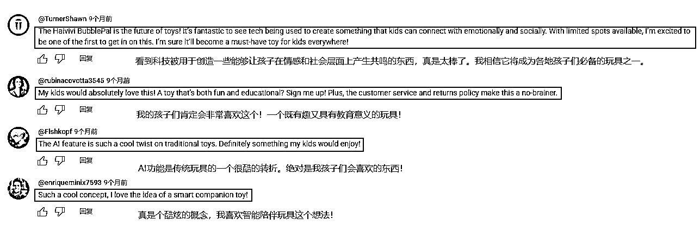
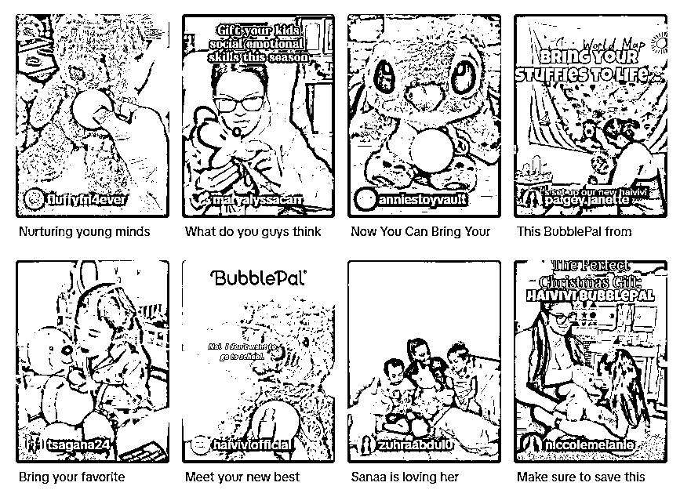
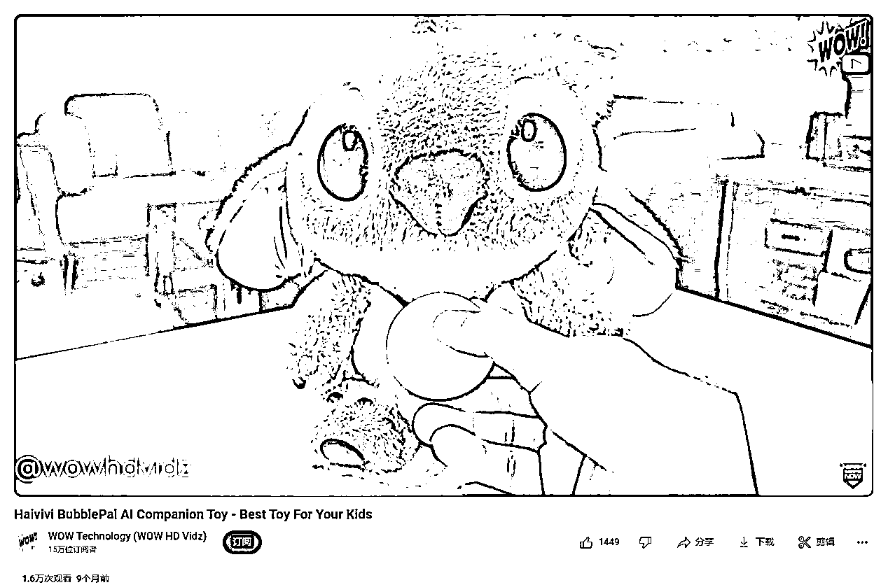
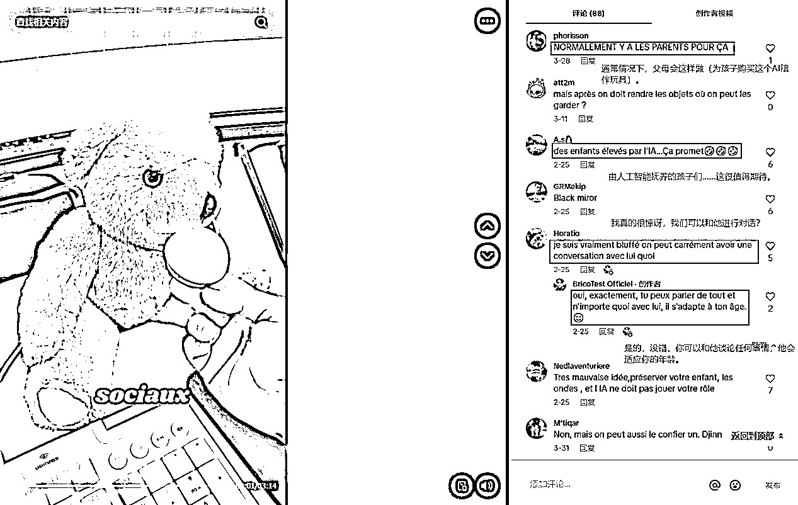

# 挂件 AI 玩具半年出货近十万台，2025 年 8 月销量超 25 万销售额破亿

> 原文：[`www.yuque.com/for_lazy/wind/xpxefcptlfmc3z0q`](https://www.yuque.com/for_lazy/wind/xpxefcptlfmc3z0q)

作者： Miles

日期：2025-09-24

点赞数：**18**

* * *

正文：

全球首款基于 AIGC 技术的对话交互式挂件 AI 玩具 BubblePal，上市仅半年时间，出货量便达到了近十万台。
截至 2025 年 8 月，BubblePal 的实际销量已超 25 万台。按 700 元的单价计算，其销售额已破亿，是 AI 玩具这一细分赛道中炙手可热的黑马产品。
随着人工智能技术逐步落地消费领域，全球玩具市场也在悄然发生转变。父母对玩具的诉求不再局限于娱乐，而是更加注重教育价值与情感陪伴。
AI 玩具凭借其交互智能化和内容自适应等特点，正成为亲子消费中增长迅速的新品类。
据 fnfresearch 数据显示，2023 年全球 AI 智能玩具的市场规模估值为 132.5 亿美元，预计在 2024 年至 2032 年间，年均复合增长率约为 15.97%。到 2032 年，全球 AI 智能玩具的市场规模将有望超过 502.7 亿美元。
在如今这个社媒时代，品牌想让产品卖给更多的消费者，只靠技术力和 IP 吸引力还不够。还需要借助社交媒体的力量，让更多的潜在用户知晓品牌、购买产品。
通过 TikTok、Youtube 等主流的社媒平台进行了营销宣传，另外就是独立站，让产品被更多有需求的潜在用户发现、认识。

* * *

评论区：

江大虾 : 我买了，产品很一般。

cherry : 说他全球首款有点过了^_，我去年年底拿到的豆包的显眼包

亦仁 : 感谢分享，已中标

* * *

公众号懒人搜索，[懒人专属群分享](https://lazybook.fun/#/blog/group)