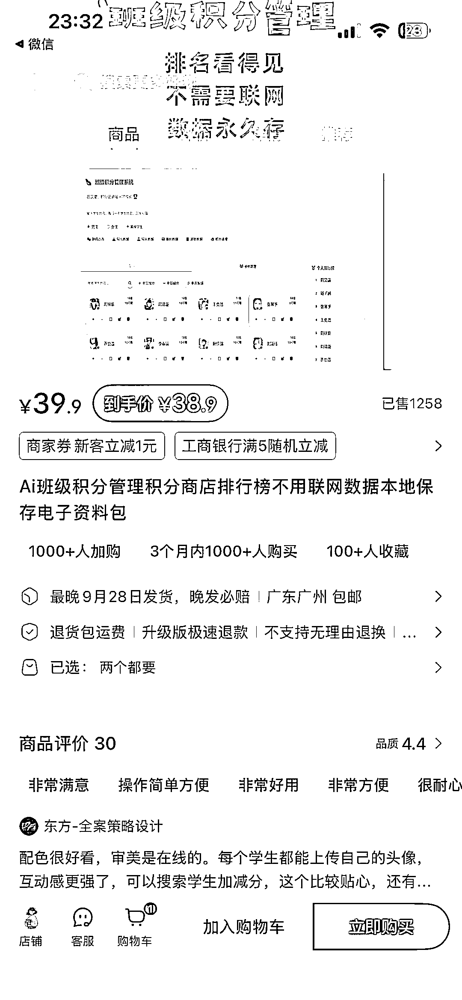
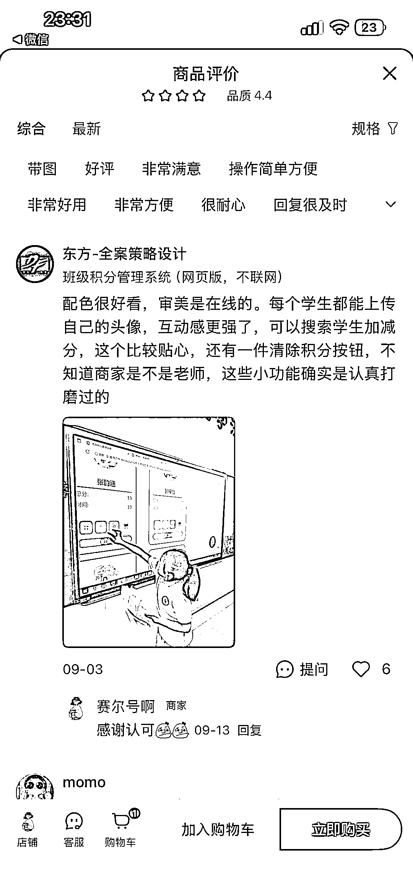
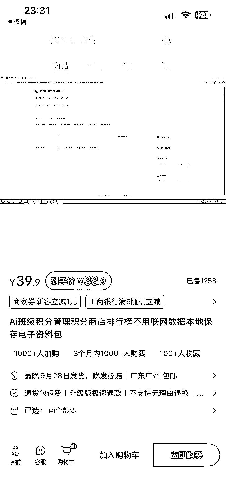
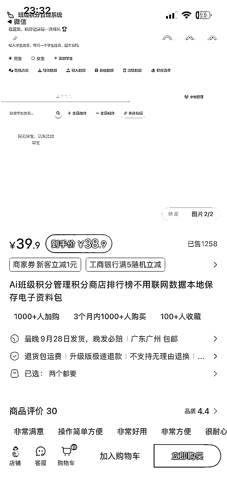
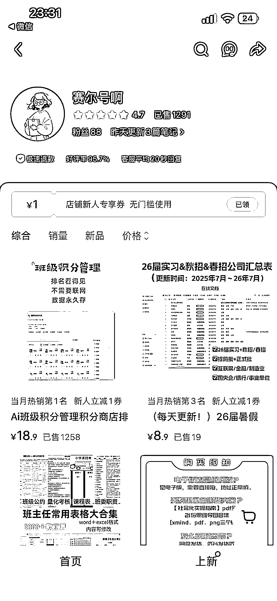
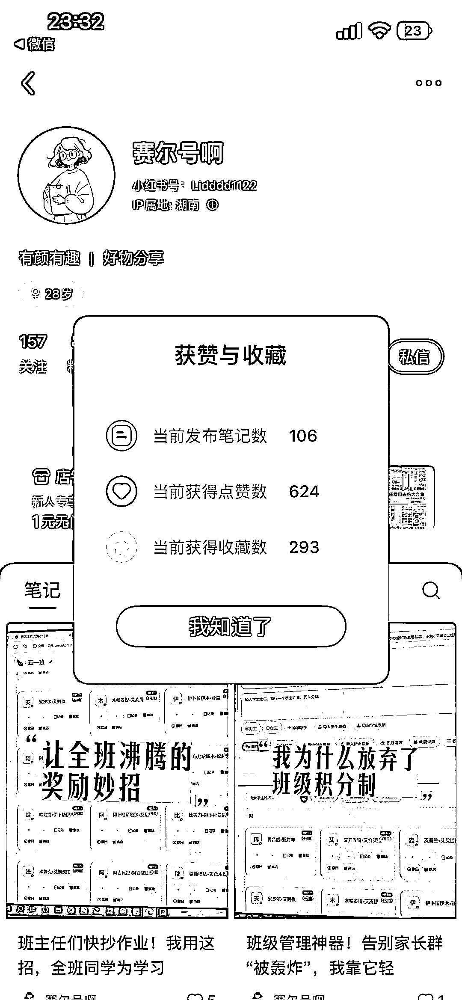

# 小红书 AI 教育：班级积分管理系统店铺 114 天 GMV2.3w

> 原文：[`www.yuque.com/for_lazy/wind/kh0pgggcnyi9nv3i`](https://www.yuque.com/for_lazy/wind/kh0pgggcnyi9nv3i)

作者： 阿牛

日期：2025-09-24

点赞数：**20**

* * *

正文：

AI 班级积分管理系统 赛道/细分方向 小红书/ai 教育 案例描述： 通过构建 ai 班级积分管理商店，采用本地化不联网数据，本地保存电子资料包 数据：
店铺开店 114 天，爆款商品客单价 18.9，已售 1259 件，GMV2.3w 为什么是机会：
通过 AI 很快可以复刻一个，通过本地运行的方式，不用管服务器，数据库这些复杂的内容，交付轻量级

* * *

评论区：

亦仁 : 感谢分享，已中标

* * *

公众号懒人搜索，[懒人专属群分享](https://lazybook.fun/#/blog/group)