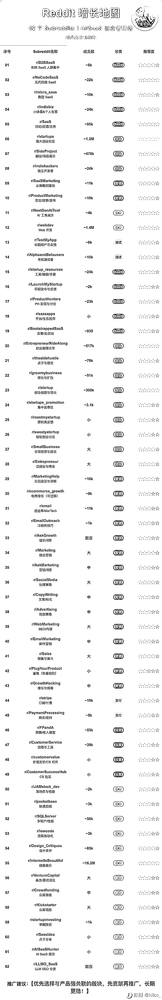

# 62 个 Reddit Subreddits：AI-SaaS 创业者低风险发帖增长地图

> 原文：[`www.yuque.com/for_lazy/wind/qn60xebx9zgciena`](https://www.yuque.com/for_lazy/wind/qn60xebx9zgciena)

作者： 阿牛

日期：2025-09-23

点赞数：**16**

* * *

正文：

Reddit 增长地图 62 个 Subreddits | AI/SaaS 创业者精选 低风险发帖指南 序号 | Subreddit 名称 | 成员数 | 分类 | 推荐度 01 | r/B2BSaaS B2B SaaS 人群集中 | ~8k | SaaS | ★★★★★☆ 02 | r/NoCodeSaaS 无代码做 SaaS | ~22k | SaaS | ★★★★★☆ 03 | r/micro_saas 微型 SaaS | ~10k | SaaS | ★★★★★☆ 04 | r/indiebiz 小体量&个人生意 | ~24k | SaaS | ★★★★★☆ 05 | r/SaaS 讨论/反馈/支持 | ~95k | SaaS | ★★★★★☆ 06 | r/startups 最大创业社区 | ~1.2M | 创业 | ★★★★★☆ 07 | r/SideProject 副业/项目展示 | ~478k | 创业 | ★★★★★☆ 08 | r/indiehackers 独立开发者 | ~24k | 创业 | ★★★★★☆ 09 | r/SaaSMarketing 从策略到落地 | ~11k | 营销 | ★★★★★☆ 10 | r/ProductMarketing 定位/叙事/发布 | ~18k | 营销 | ★★★★★☆ 11 | r/NextGenAITool AI 工具展示 | ~4k | 技术 | ★★★★☆☆ 12 | r/webdev Web 开发 | ~1.4M | 技术 | ★★★★★☆ 13 | r/TestMyApp 早期用户与反馈 | ~6k | 测试 | ★★★★★☆ 14 | r/AlphaandBetausers 寻找测试者 | ~10k | 测试 | ★★★★★☆ 15 | r/startup_resources 工具/模板/手册 | ~24k | SaaS | ★★★★★☆ 16 | r/LaunchMyStartup 早期发布与反馈 | ~2k | SaaS | ★★★★★☆ 17 | r/ProductHunters PH 发现与讨论 | ~23k | SaaS | ★★★★★☆ 18 | r/saasapps 平台/生态应用 | 小 | SaaS | ★★★★★☆ 19 | r/BootstrappedSaaS | ~935 | SaaS | ★★★★★☆ 20 | r/EntrepreneurRideAlong 目寿/目启动 | ~517k | 创业 | ★★★★★☆ 21 | r/thesidehustle 点子与建议 | ~79k | 创业 | ★★★★★☆ 22 | r/growmybusiness 增长与扩张 | ~51k | 创业 | ★★★★★☆ 23 | r/startup 创业创建与增长 | ~300k | 创业 | ★★★★★☆ 24 | r/startups_promotion 集中自荐区 | ~3.1k | 创业 | ★★★★★☆ 25 | r/roastmystartup 犀利真反馈 | 小 | 创业 | ★★★★★☆ 26 | r/sweatystartup 轻松创业讨论 | 小 | 创业 | ★★★★★☆ 27 | r/SmallBusiness 日常经营与建议 | 大 | 创业 | ★★★★★☆ 28 | r/Entrepreneur 泛创业与商业 | 大 | 创业 | ★★★★★☆ 29 | r/MarketingHelp 众包建议与诊断 | ~16k | 营销 | ★★★★★☆ 30 | r/ecommerce_growth 电商增长（可迁移） | ~9k | 营销 | ★★★★★☆ 31 | r/email 送达率/MarTech | ~11k | 营销 | ★★★★★☆ 32 | r/EmailOutreach 冷邮件技巧 | ~1k | 营销 | ★★★★★☆ 33 | r/AskGrowth 增长问答 | 数百 | 营销 | ★★★★★☆ 34 | r/Marketing 综合营销 | 大 | 营销 | ★★★★★☆ 35 | r/AskMarketing 营销问答 | 中 | 营销 | ★★★★★☆ 36 | r/SocialMedia 社媒策略 | 大 | 营销 | ★★★★★☆ 37 | r/CopyWriting 文案/转化 | 中 | 营销 | ★★★★★☆ 38 | r/Advertising 投放策略 | 中 | 营销 | ★★★★★☆ 39 | r/WebMarketing SEO/内容 | 大 | 营销 | ★★★★★☆ 40 | r/EmailMarketing 邮件营销 | 中 | 营销 | ★★★★★☆ 41 | r/Sales 销售与漏斗 | 大 | 营销 | ★★★★★☆ 42 | r/PlugYourProduct 直推（先看规则） | 小 | 营销 | ★★★★★☆ 43 | r/GrowthHacking 增长与病毒 | 中 | 营销 | ★★★★★☆ 44 | r/stripe 订阅/计费 | ~19k | 支付 | ★★★★★☆ 45 | r/PaymentProcessing 网关/拒付 | ~5k | 支付 | ★★★★★☆ 46 | r/FPanda 预算/收入模型 | ~53k | 运营 | ★★★★★☆ 47 | r/CustomerService 流程与工具 | ~39k | 运营 | ★★★★★☆ 48 | r/customervalue 价值定价/CS 对齐 | 小 | 运营 | ★★★★★☆ 49 | r/CustomerSuccessHub CS 社区 | 小 | 运营 | ★★★★★☆ 50 | r/JAMstack_dev 落地页与性能 | ~2k | 技术 | ★★★★★☆ 51 | r/pocketbase 快速后端 | ~3k | 技术 | ★★★★★☆ 52 | r/SQLServer 多租户/性能 | ~58k | 技术 | ★★★★★☆ 53 | r/lowcode 流程自动化 | ~3k | 技术 | ★★★★★☆ 54 | r/Design_Critiques 设计求评 | ~85k | 技术 | ★★★★★☆ 55 | r/InternetIsBeautiful 创意展示 | ~16.2M | 技术 | ★★★★★☆ 56 | r/VentureCapital 基金/募资洞见 | 大 | 融资 | ★★★★★☆ 57 | r/Crowdfunding 众筹策略 | 中 | 融资 | ★★★★★☆ 58 | r/Kickstarter 众筹项目 | 大 | 融资 | ★★★★★☆ 59 | r/startupinvesting 早期投资 | ~1k | 融资 | ★★★★★☆ 60 | r/SaasIdea 点子分享 | 小 | 融资 | ★★★★★☆ 61 | r/AISaaSHunter AI SaaS 展示 | 小 | SaaS | ★★★★★☆ 62 | r/LLMO_SaaS LLM SEO 分发 | 数百 | 融资 | ★★★★★☆

* * *

评论区：

亦仁 : 感谢分享，已中标

* * *

公众号懒人搜索，[懒人专属群分享](https://lazybook.fun/#/blog/group)