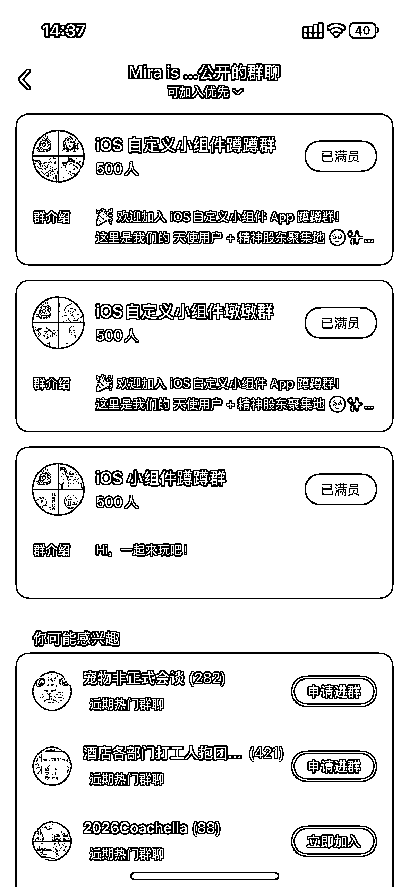
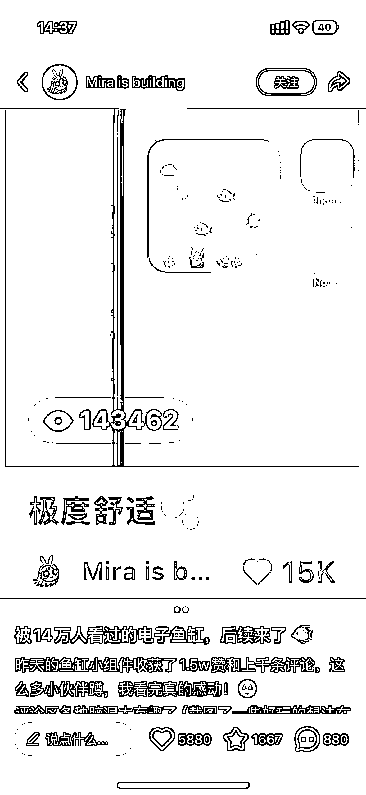
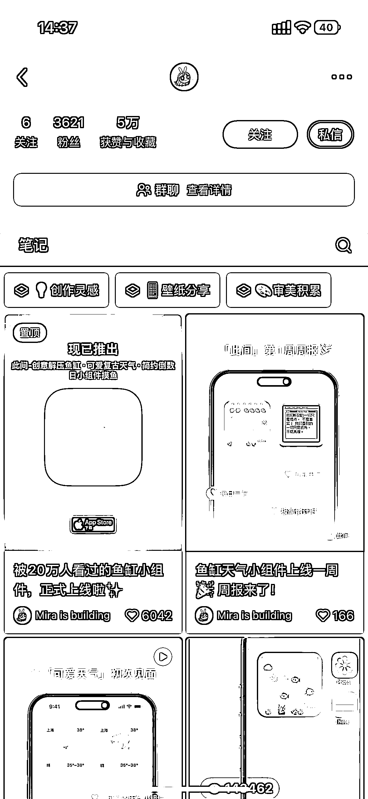

# IOS 小组件新玩法：AI 养鱼小组件 9.5 号发布获 2 万多点赞

> 原文：[`www.yuque.com/for_lazy/wind/avozoyy48c3fgg8b`](https://www.yuque.com/for_lazy/wind/avozoyy48c3fgg8b)

作者： yh

日期：2025-09-25

点赞数：**19**

* * *

正文：

ios 小组件这个方向也可以做延伸，比如这个 ai 养鱼小组件，很有创意，最近也比较火爆，它可以根据不同天气变化从而改变不同海洋生物的状态，也可以改变鱼种类，9.5 号发布，2 万多点赞，内测社群全满。

* * *

评论区：

亦仁 : 感谢分享，已中标

* * *

公众号懒人搜索，[懒人专属群分享](https://lazybook.fun/#/blog/group)