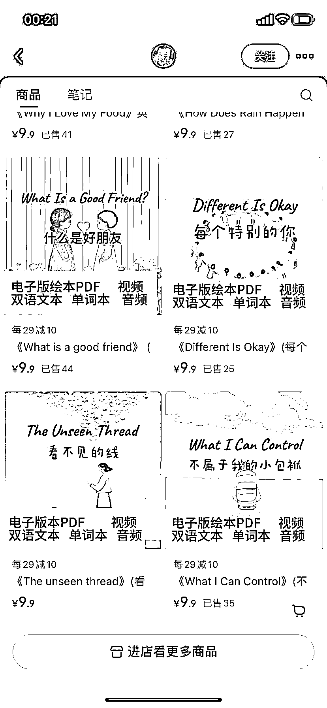
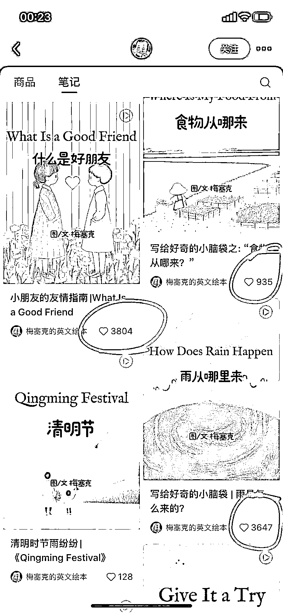

# AI 英语绘本短视频：70 作品涨粉 3.4 万，GMV 达 5000

> 原文：[`www.yuque.com/for_lazy/wind/zurf0zgl0vpzrywe`](https://www.yuque.com/for_lazy/wind/zurf0zgl0vpzrywe)

作者： 飞掌柜

日期：2025-09-23

点赞数：**20**

* * *

正文：

一、案例描述（账号/项目/打法/现象） 1、该账号利用 AI 做英语绘本，利用 AI 绘画工具可以产出图片，利用剪辑配上关键英文句子和英美风格的轻音乐。
2、70 多个作品涨粉 3.4 万，获赞与收藏 10.9 万，整体数据非常不错！ 二、数据表现
1、作品日常点赞两位数，播放量在几千，每发 2-4 个品就有爆款，点赞在 3000 多，点赞最多是 2.3 万，播放量有 230 万了！
2、已经开通商品带货，主要卖自己的英语电子版绘本，客单价 9.9 元，各类绘本累计卖出 500 册，GMV 是 5000 左右！（见图） 三、机会剖析
1、利用 AI 做绘本，已经不是新项目了，但是持续做成英文短视频引流涨粉，说明长期可变现，要么人工熟练后降低成本，要么用 AI 工作流降低成本。
2、一个账号跑通，可以多复制几个账号，由于都是卖自己的产品，因此主要是公转私后，推出高客单价产品，以提升 ROI～

* * *

评论区：

亦仁 : 感谢分享，已中标

飞掌柜 : 感谢老大，继续挖掘[奋斗]

* * *

公众号懒人搜索，[懒人专属群分享](https://lazybook.fun/#/blog/group)