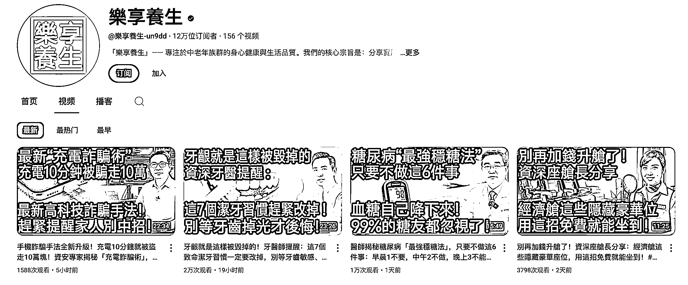
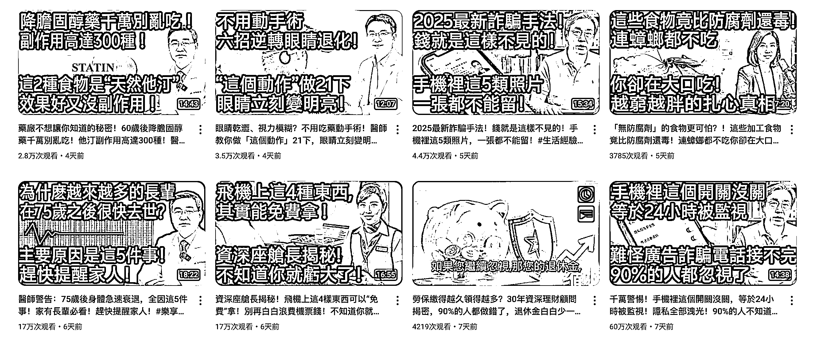
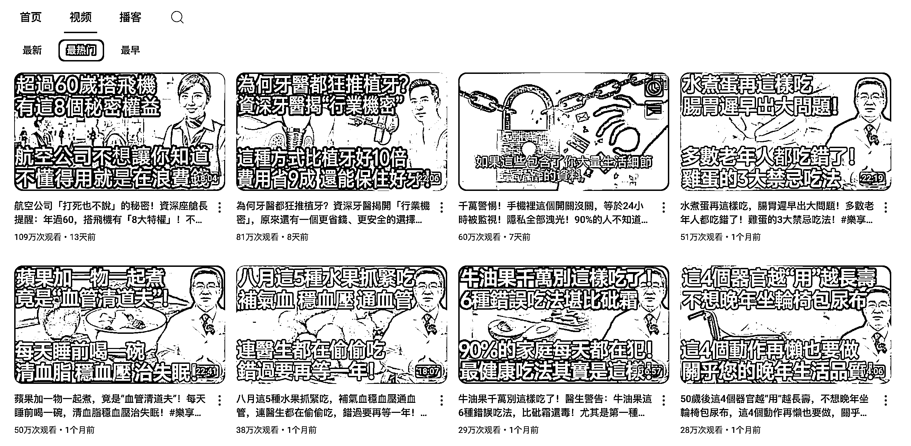

# YouTube AI 中老年内容频道：播放量 10 万+，变现靠广告和会员订阅

> 原文：[`www.yuque.com/for_lazy/wind/kc2g7r3fsvayzq5u`](https://www.yuque.com/for_lazy/wind/kc2g7r3fsvayzq5u)

作者： 嗡嗡鱼

日期：2025-09-23

点赞数：**26**

* * *

正文：

谁说 AI 视频只能吸引年轻人？你可能没想到，中老年人也能撑起 YouTube 的大流量。 最近我刷到一个频道，内容几乎都是： ：糖尿病饮食、膝盖退化、肠胃问题。
：最新诈骗手法、长辈必看的防骗指南。 ：房产继承、资产保全、节税、生活妙招。
形式很简单：配音是 AI 生成的，画面是 AI 或素材拼接，甚至有点“假”。但视频一发，。 因为切的全是中老年群体最在意、最焦虑的点。
更有意思的是，频道主不仅靠广告吃饭，很多人还直接加入了。 这说明什么？ ：不用露脸、不用拍摄，AI 就能搞定。
：老人们关心健康、养老、钱财安全，比娱乐内容更刚需。 ：做的人少，但群体规模庞大，粘性还高。
所以，你要是还在想“我做 YouTube 能做什么”，这个案例告诉你： 👉 AI 自媒体 [`www.youtube.com/@%E6%A8%82%E4%BA%AB%E9%A4%8A%E7%94%9F-un9dd`](https://www.youtube.com/@%E6%A8%82%E4%BA%AB%E9%A4%8A%E7%94%9F-un9dd)

* * *

评论区：

搞钱萌新 : 谢谢

嗡嗡鱼 : 客气啦，希望能帮到圈友们

亦仁 : 感谢分享，已中标

* * *

公众号懒人搜索，[懒人专属群分享](https://lazybook.fun/#/blog/group)