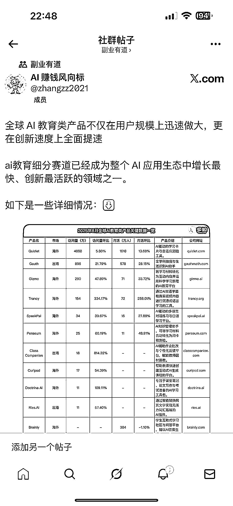
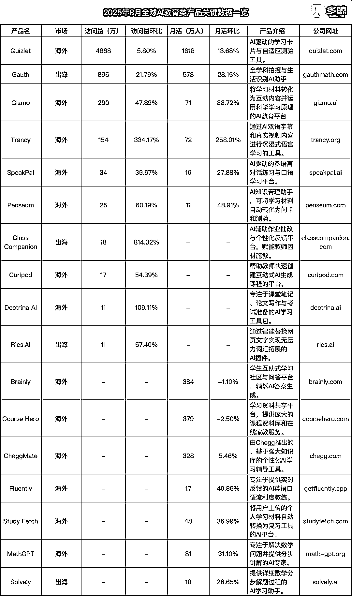

# AI 教育细分赛道：增长快创新多，将迎深度个性化时代

> 原文：[`www.yuque.com/for_lazy/wind/ncdy6ngvgluxvpc4`](https://www.yuque.com/for_lazy/wind/ncdy6ngvgluxvpc4)

作者： Miles

日期：2025-09-19

点赞数：**14**

* * *

正文：

ai 教育细分赛道已经成为整个 AI 应用生态中增长最快、创新最活跃的领域之一。 Quizlet 这样的「常青巨头」，凭借 1618 万月活和 4888
万访问量稳居头部；另一端则是 Class Companion 这类「黑马新星」，以 814.32% 的惊人增速横空出世。
一是海外市场成熟度最高，产品类型丰富多元； 二是出海产品增速惊人，主要瞄准北美、东南亚等教育科技新兴市场；
三是细分领域虽然规模相对较小，但创新不断。这种多元化格局也反映了全球 AI 教育发展的不均衡性和巨大潜力。
已经从早期的单一功能向全场景覆盖演进。Quizlet 和 Brainly 代表的学习与记忆辅助类；Gauth、Course Hero 专注的作业解题与
STEM 教育；Trancy 和 SpeakPal 引领的语言学习革新；以及 Penseum 推动的知识管理效率提升。这种这种全面开花的局面标志 AI
教育正在从单点突破向生态化发展。 AI 教育产品的下一站，将是「深度个性化」的全面落地。当前以 Quizlet、Gauth
为代表的产品已初步实现「因材施教」的雏形，但未来的 AI 不再仅是给出答案或生成内容，而是真正成为理解学生知识结构、学习习惯甚至情绪状态的「私人导师」。

* * *

评论区：

亦仁 : 感谢分享，已中标

* * *

公众号懒人搜索，[懒人专属群分享](https://lazybook.fun/#/blog/group)