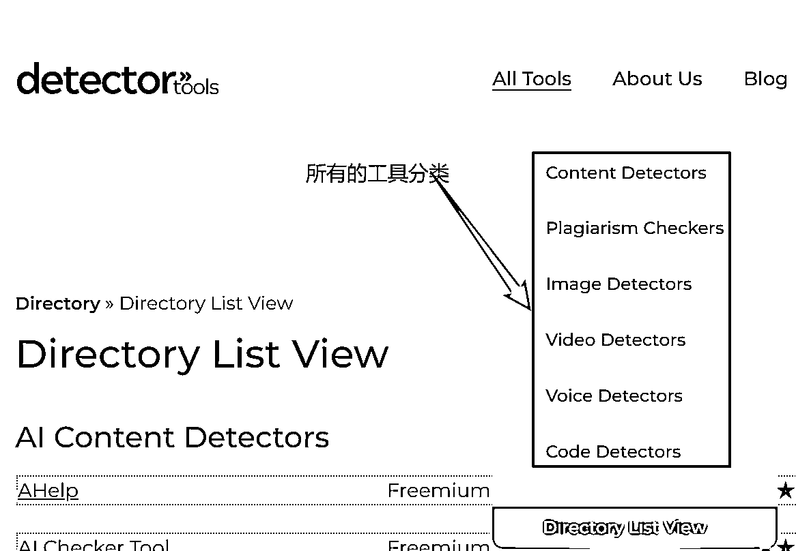
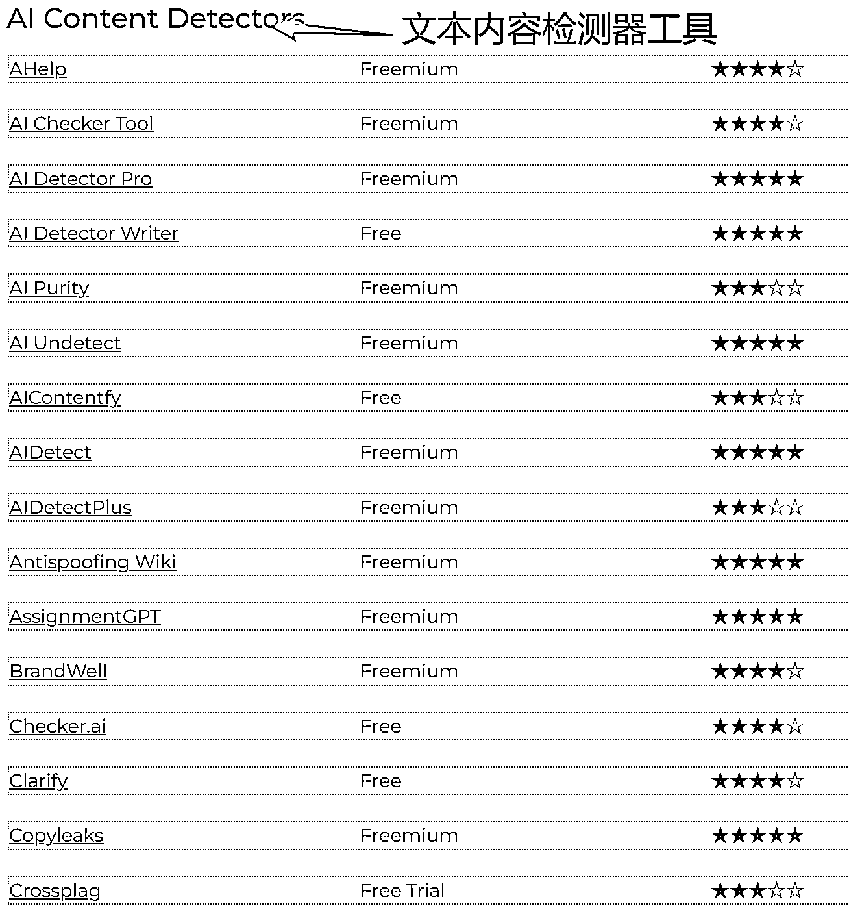
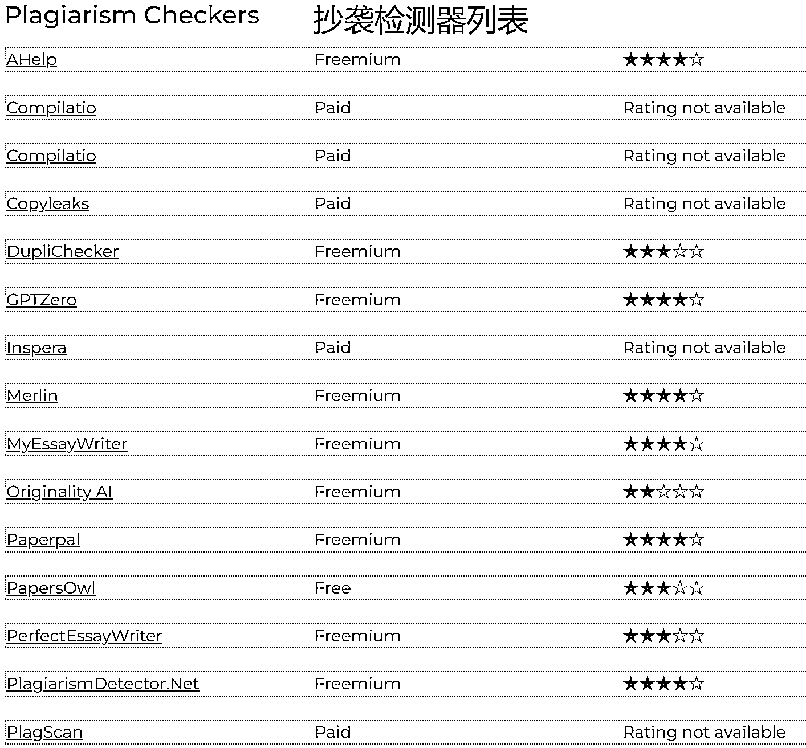
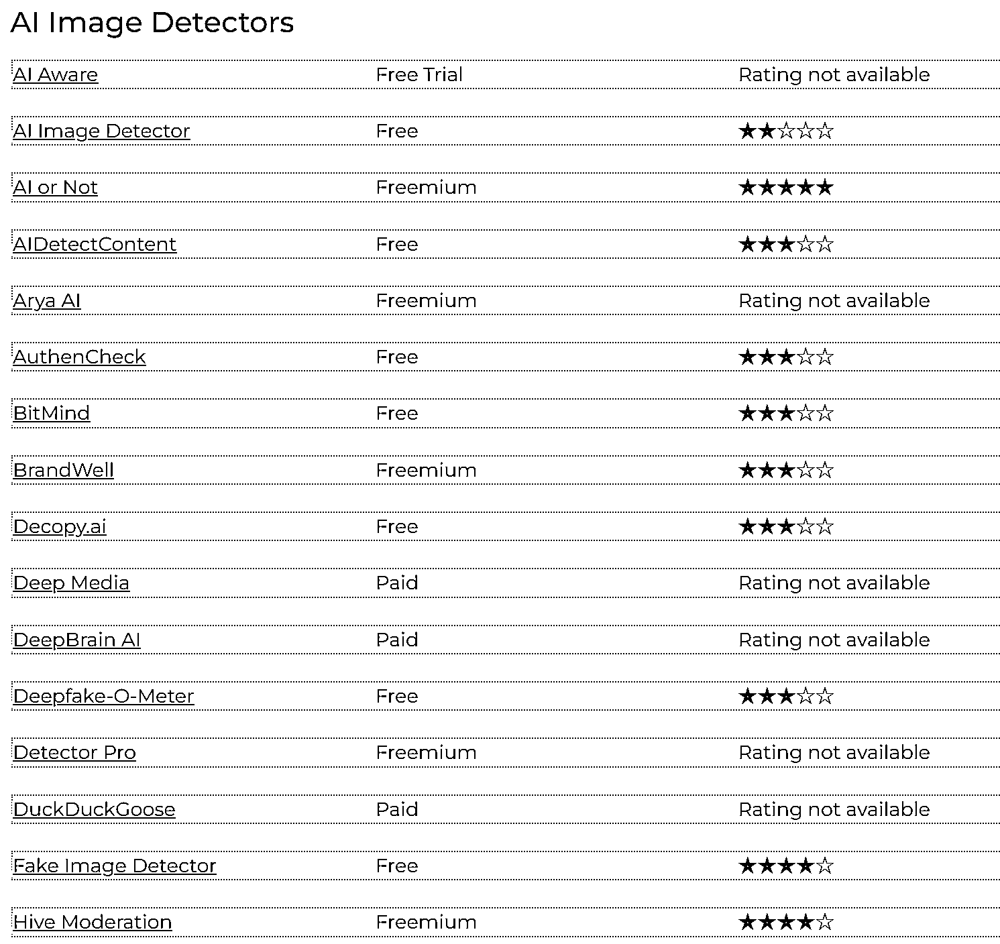
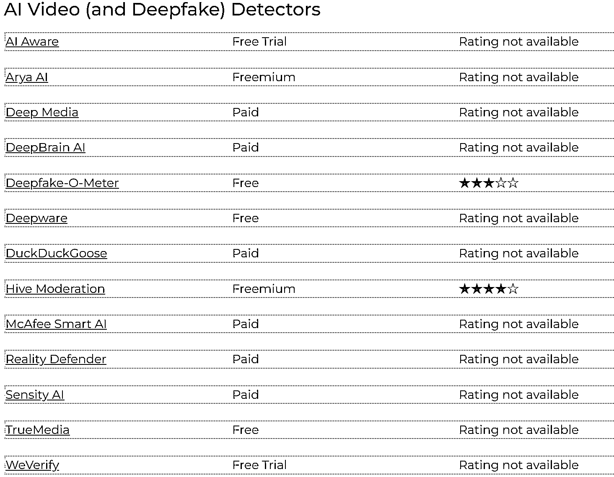
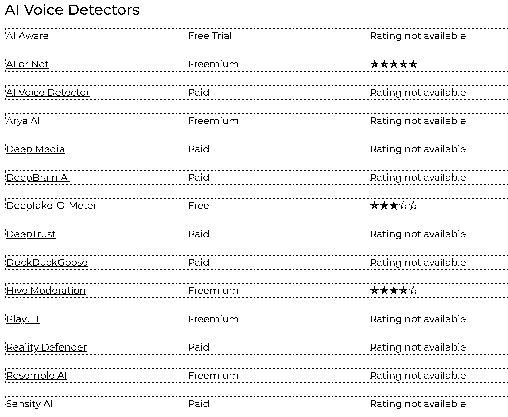
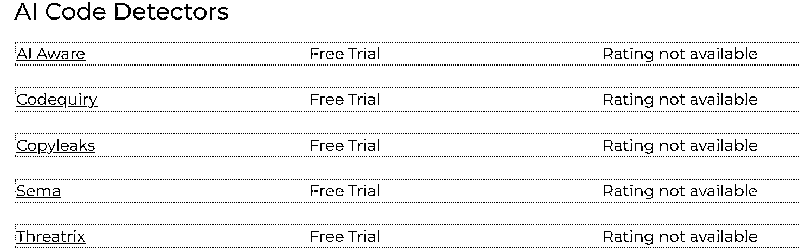

# AI 检测工具导航网站：聚焦细分领域，把握市场增长机会

> 原文：[`www.yuque.com/for_lazy/wind/osws4pam2y896s9g`](https://www.yuque.com/for_lazy/wind/osws4pam2y896s9g)

作者： 老鹰

日期：2025-09-27

点赞数：**12**

* * *

正文：

AI Detector Tools 的聚合网站。 是一个聚合 AI 检测技术的工具导航网站。主要提供了现在 AI 应用比较多的领域。包括：
：这些工具用于识别 AI 生成的文本，对于区分原创内容和 AI 撰写的文章、论文或其他书面材料至关重要。
：经常与内容检测器重叠，但这些工具专门侧重于识别抄袭内容，无论是人类还是 AI 生成的。 ：这些工具旨在识别 AI 生成或处理过的图像，有助于验证视觉媒体的真实性。
：这些工具专门检测 AI 生成的视频，包括深度伪造（deepfakes）和其他形式的视频篡改。 ：这些工具旨在识别合成生成的声音，将其与真实的人类声音区分开来。
：这些工具用于判断代码是否由 AI 生成或辅助生成。 1. 由于 AI 生成内容的日益普及和复杂性，AI 检测工具的市场价值会显著迅速增长。 2. 其他的 AI
导航站或者 AI 工具站都是通用的。但这种类型的网站没有深入的介绍这些工具的具体使用场景、优缺点、检测准确率等信息供用户参考。 3. 这个网站没有收录国内的检测工具，比如朱雀 AI 文本检测等。[`detectortools.ai/`](https://detectortools.ai/)

* * *

评论区：

亦仁 : 感谢分享，已中标

老鹰 : 感谢，已开始开发 aidetectortools.top 的 landing page.

* * *

公众号懒人搜索，[懒人专属群分享](https://lazybook.fun/#/blog/group)