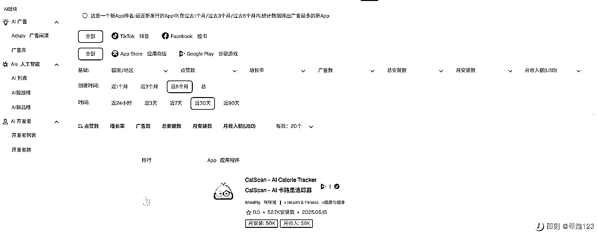
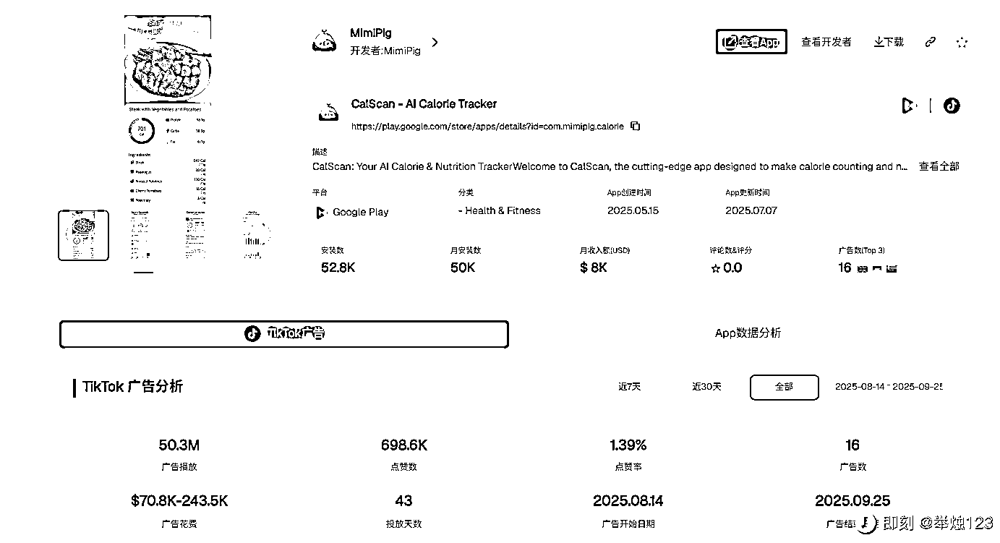
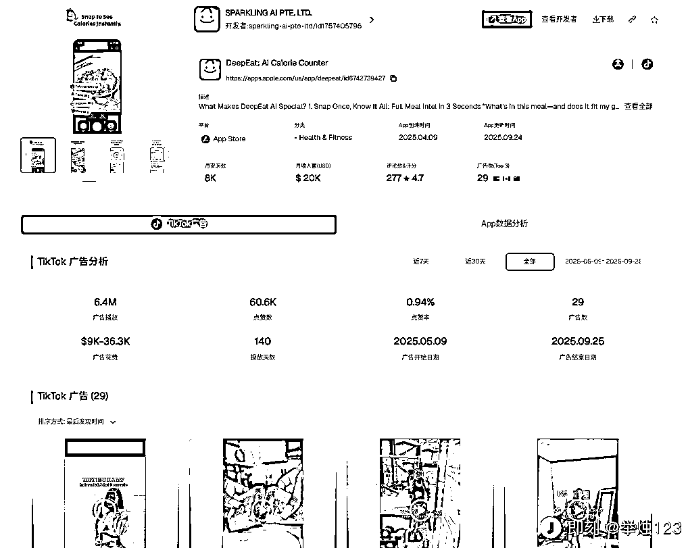
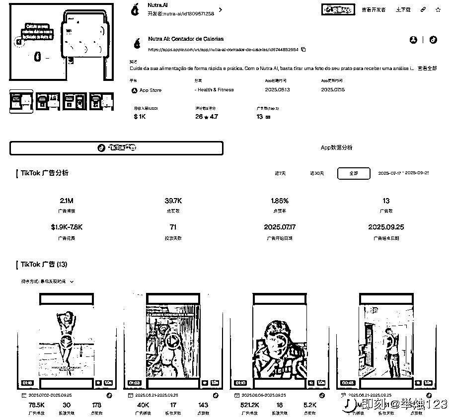

# AI 卡路里计算器赛道：多款 App 冲进新品榜，月收入最高达$20K

> 原文：[`www.yuque.com/for_lazy/wind/sknwygts7a9zhrp2`](https://www.yuque.com/for_lazy/wind/sknwygts7a9zhrp2)

作者： 梁小伟

日期：2025-09-26

点赞数：**12**

* * *

正文：

AI 小工具：拍照计算卡路里 App，正在批量吸金 其实去年我就看到这类需求了， 今天在 Pipiads AI 新品榜（近 6 个月点赞排行）的 Top
20 里，一下就冲进来了 3 个功能高度相似的 App，都属于 “AI 卡路里计算器” 这个赛道。 它们分别是： CalScan - AI 卡路里追踪器
DeepEat: AI Calorie Counter Nutra AI: Contador de Calorias 商业模式洞察： 核心功能：
非常统一，就是解决健身减肥人群的核心痛点——通过手机拍照，AI 自动识别食物，并计算出卡路里和营养成分。告别了手动查询和输入的繁琐。 营销打法：
策略惊人地一致，全部主攻 TikTok 广告。通过大量贴近生活的 UGC 风格视频（如健身博主测评、用户一日三餐记录）进行病毒式传播。其中 CalScan 的广告播放量高达
5000 万。 变现情况： 虽然功能相似，但这几家的变现效率和规模各不相同。 CalScan 月安装量 50K，月收入<card type="inline" name="math" value="data:%7B%22code%22%3A%228K%E3%80%82%20DeepEat%5Cn%E6%9C%88%E5%AE%89%E8%A3%85%E9%87%8F%E4%BB%858K%EF%BC%8C%E4%BD%86%E6%9C%88%E6%94%B6%E5%85%A5%E8%BE%BE%E5%88%B0%E4%BA%86%20%22%2C%22id%22%3A%22dZpCg%22%7D">20K，变现效率更高。 趋势总结： AI 技术 + 垂直刚需（健康健身）+
TikTok 流量打法，看来已经成为近期一个可以快速验证并跑通的增长公式。这个赛道值得关注。</card>

* * *

评论区：

钱哥老矣 : 这个靠什么变现呀？每张照片计算一次收一次费吗？

阿伟 : 盲猜会员吧

亦仁 : 感谢分享，已中标

* * *

公众号懒人搜索，[懒人专属群分享](https://lazybook.fun/#/blog/group)