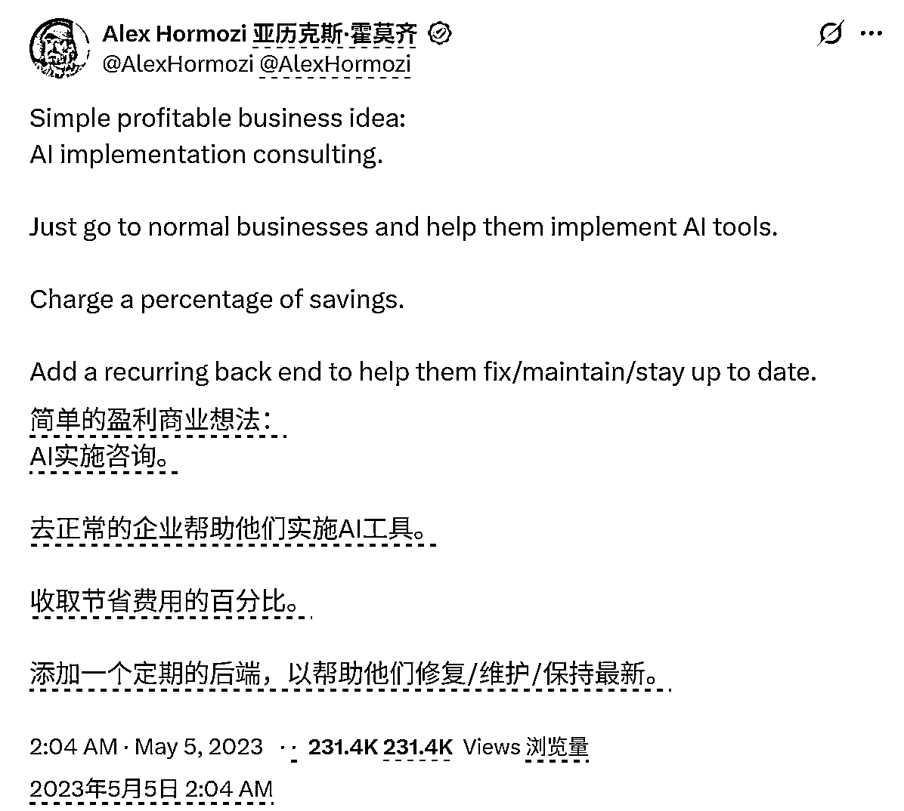
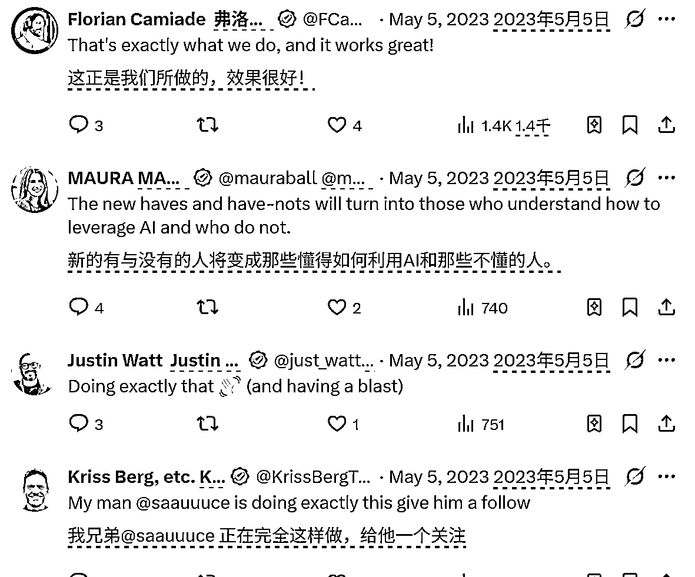

# AI 落地咨询：为企业应用 AI 工具，按成本节省提成并提供后端递延服务

> 原文：[`www.yuque.com/for_lazy/wind/wgozgymv2kg6o9ef`](https://www.yuque.com/for_lazy/wind/wgozgymv2kg6o9ef)

作者： Echo

日期：2025-09-26

点赞数：**8**

* * *

正文：

在 twitter 上看到的， 一个简单但能赚钱的生意想法 去普通企业，帮他们把 AI 工具真正用起来。 ：按企业节省下来的成本提成。
：做持续服务，帮他们维护、优化、更新 AI 工具。 评论区有人说正在做，效果很好。

* * *

评论区：

亦仁 : 感谢分享，已中标

* * *

公众号懒人搜索，[懒人专属群分享](https://lazybook.fun/#/blog/group)