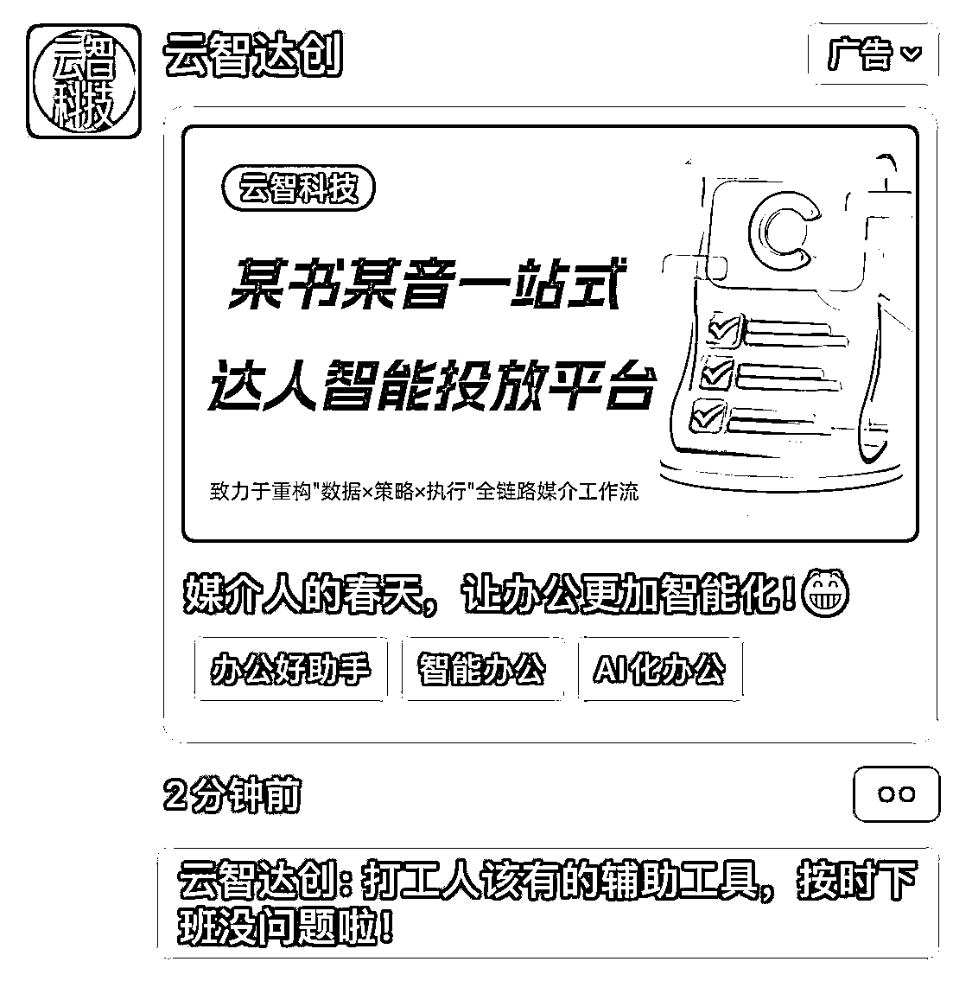

# AI 朋友圈广告智能投放平台：覆盖细分人群场景，引流私域转化

> 原文：[`www.yuque.com/for_lazy/wind/cxp1rdite47wz2e0`](https://www.yuque.com/for_lazy/wind/cxp1rdite47wz2e0)

作者： 🌸花小芳

日期：2025-09-26

点赞数：**7**

* * *

正文：

最近学习 Ai 工具，刷到了朋友圈大数据推送，这种朋友圈广告 AI 智能投放平台 痛点需求：覆盖具体人群和使用场景细分领域，作为 Ai 提效的工具 值得研究
这种结合大趋势的朋友圈广告依然有覆盖，直接可以引流到私域转化。

* * *

评论区：

向阳向上 : 烤

亦仁 : 感谢分享，已中标

🌸花小芳 : 谢谢亦仁大大的看见[爱心]

* * *

公众号懒人搜索，[懒人专属群分享](https://lazybook.fun/#/blog/group)