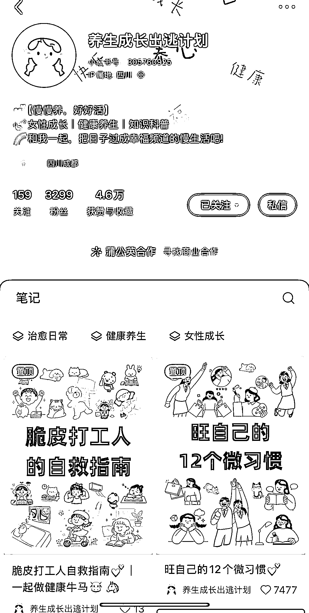
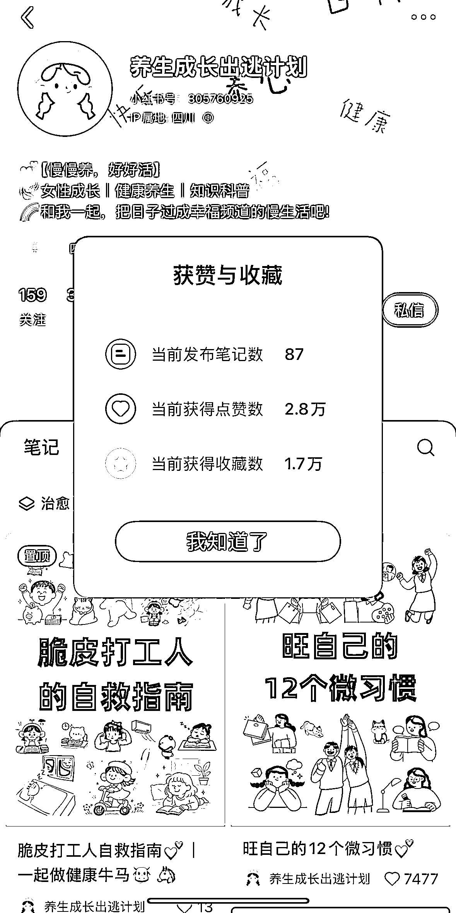
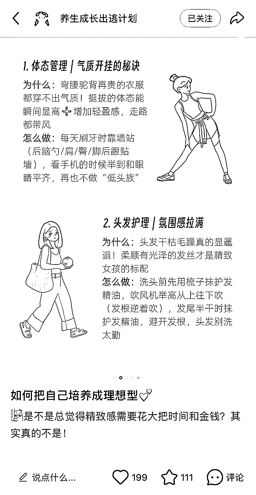

# 小红书女性养生成长赛道账号分析及二创思路

> 原文：[`www.yuque.com/for_lazy/wind/hx7fnnbfb7xnwg5u`](https://www.yuque.com/for_lazy/wind/hx7fnnbfb7xnwg5u)

作者： 馆主

日期：2025-09-24

点赞数：**22**

* * *

正文：

流量｜异常值 在小红书看到一位博主，是做女性养生成长赛道 账号分析：以接商单为主，笔记持续更新而且点赞收藏的数据还不错
1/她这种赛道在小红书很受欢迎，特别是她的笔记封面图，很有审美观（动漫人物+黑色文字）
2/笔记内容也是使用漫画的形式表达方式，让人看起来很有感觉，不是那种冷冰冰的文字
3/我们完全可以使用 AI 把这个账号的内容进行二创，也可能比她做的更好，也可以批量生产笔记

* * *

评论区：

亦仁 : 感谢分享，已中标

* * *

公众号懒人搜索，[懒人专属群分享](https://lazybook.fun/#/blog/group)