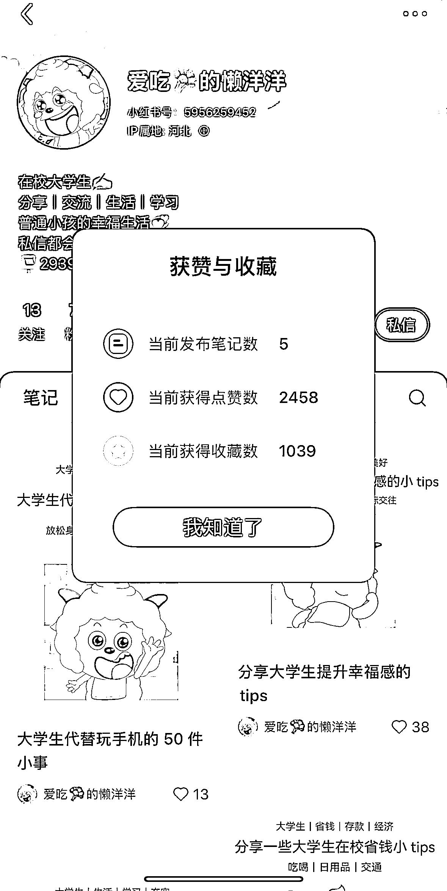
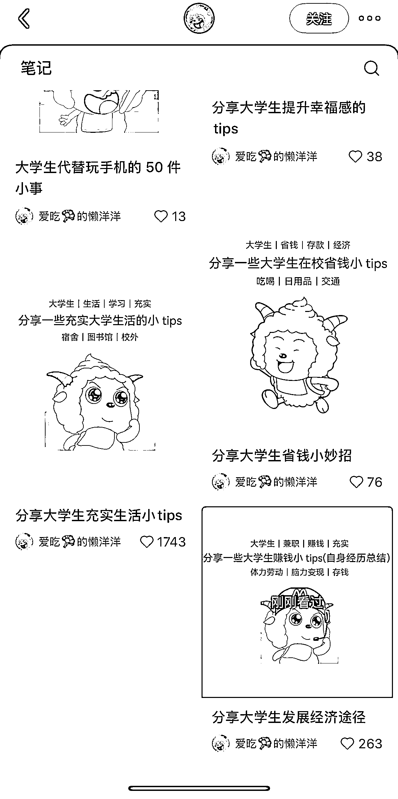
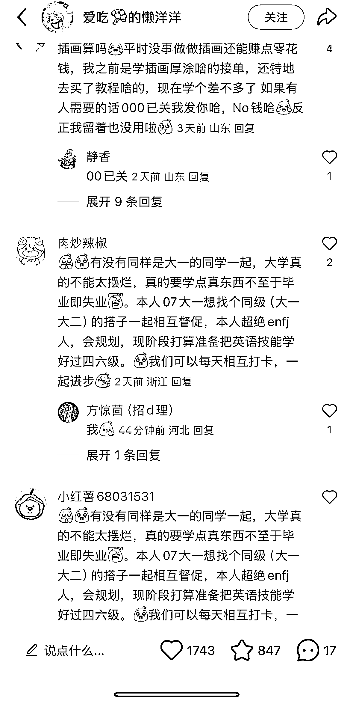

# 小红书大学生兼职选题笔记流量火爆，可切入兼职与知识付费赛道

> 原文：[`www.yuque.com/for_lazy/wind/eaaivpqyb141v0a4`](https://www.yuque.com/for_lazy/wind/eaaivpqyb141v0a4)

作者： 馆主

日期：2025-09-22

点赞数：**24**

* * *

正文：

流量｜异常值 在小红书上看到一位博主发在校大学生一天能干嘛的选题笔记流量非常的火爆
然后评论区里面会有很多人在讨论，比如说有一位鼠友：我会插画，但是我在空余时间去找什么接单之类的，赚点小钱，然后一堆人在下面回复怎么做的（大量需求评论｜异常值）
我们是不是可以从这个点切入，假如我们的用户群是大学生群体，需要他们做点兼职，或者说做知识付费教她们赚点零花钱等…..

* * *

评论区：

亦仁 : 感谢分享，已中标

* * *

公众号懒人搜索，[懒人专属群分享](https://lazybook.fun/#/blog/group)