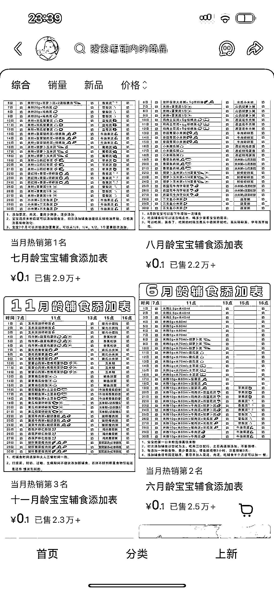

# 小红书虚拟电商：宝宝辅食资料表销量 2w+，私域变现潜力大

> 原文：[`www.yuque.com/for_lazy/wind/yigbmtwv5mhhmaz7`](https://www.yuque.com/for_lazy/wind/yigbmtwv5mhhmaz7)

作者： 大瑞

日期：2025-09-26

点赞数：**21**

* * *

正文：

小红书虚拟电商-宝宝辅食资料添加表
产品就是不同阶段的宝宝辅食表，销量都是 2w+，我猜测有很多复购，因为这个月是 10 月龄，下个月就是 11 月龄，就又要购买一次。
而且这个博主发的笔记并不多，应该大部分是搜索流量过来的。其实购买的都是非常精准的人群，如果引到私域，再用其他产品变现，会有更多想象空间。

* * *

评论区：

亦仁 : 感谢分享，已中标

* * *

公众号懒人搜索，[懒人专属群分享](https://lazybook.fun/#/blog/group)