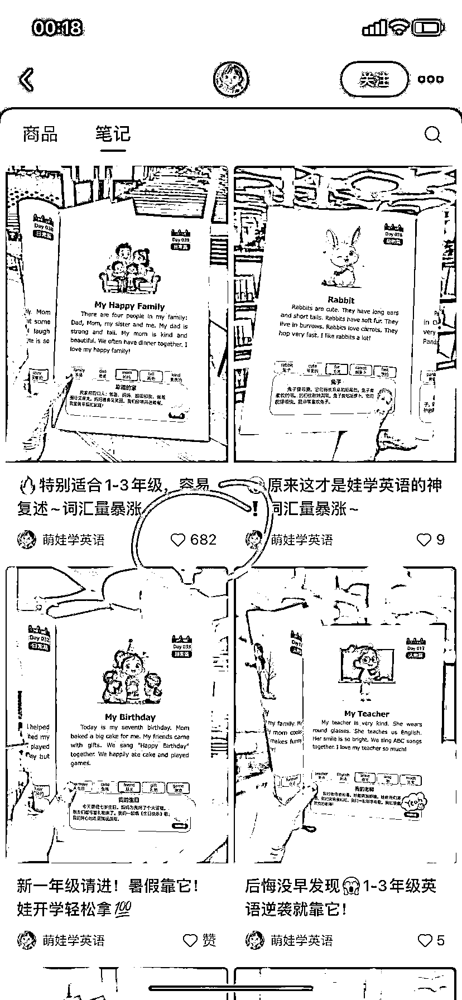
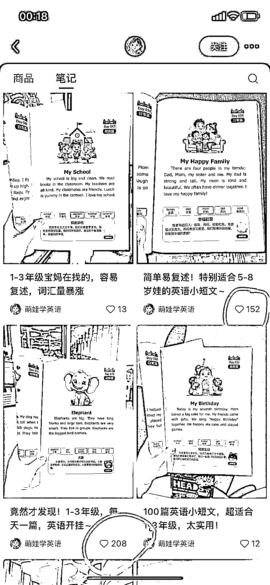
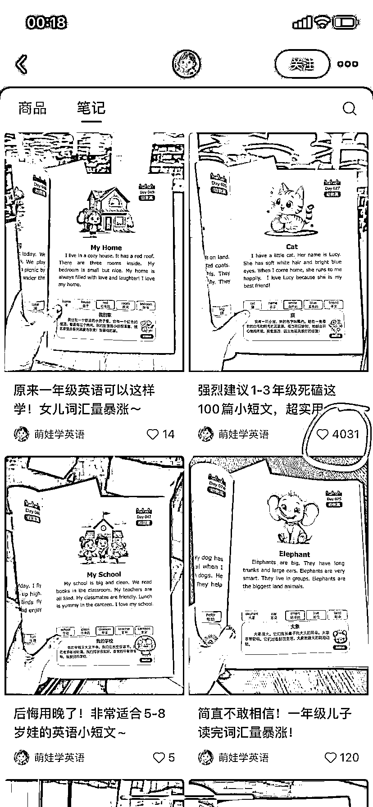
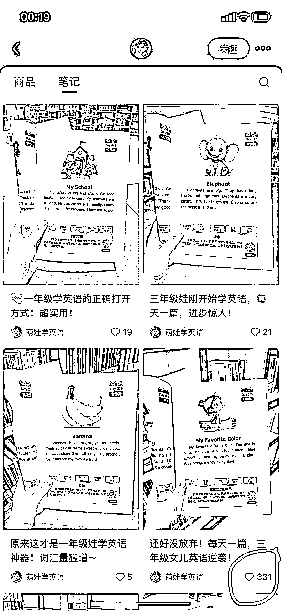
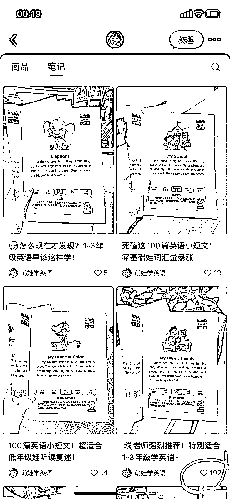
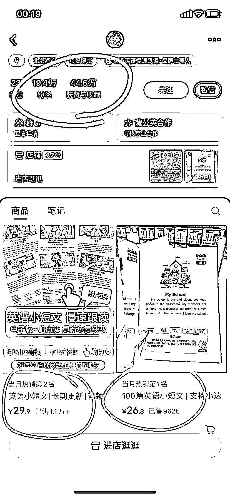
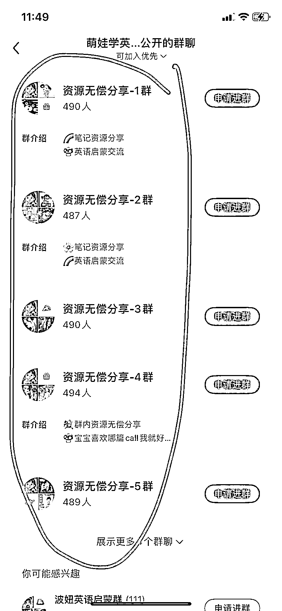

# 用 AI 生成故事或儿歌教小孩学英语账号涨粉近 20 万，变现 GMV 近 60 万！

> 原文：[`www.yuque.com/for_lazy/wind/cblcit46keh3098z`](https://www.yuque.com/for_lazy/wind/cblcit46keh3098z)

作者： 飞掌柜

日期：2025-09-23

点赞数：**23**

* * *

正文：

一、案例描述 1、该账号主要教小孩学英语，要么拍照书籍发作品，要么用 AI 生成故事或者儿歌发作品。
2、粉丝 19.4 万，获赞与收藏 44.6 万，关键是变现 GMV 将近 60 万！ 二、数据表现
1、作品是图文和视频搭配着发，内容就是自己出版的英语单词书，日常点赞个位数、两位数，但是每发 4-5 个作品，就有小爆款，比如点赞在 200 多、600 多、4000 多，最多点赞 1.8 万，播放量有 180 多万了，数据很不错！
2、已经开通商品带货，只有两个品，客单价 29.9 的英语小短文电子资料，卖出 1.1 万单；客单价 26.8 的《100 篇英语小短文》纸质书，卖出 9600 多单。GMV 将近 60 万！
3、开通社群服务，已经有 8、9 个群，每个群都是接近 500 人，沉淀粉丝 4000 多人。引流私域肯定也不少。这是真厉害！ 三、机会剖析
1、图片作品就是自己卖的书，拍照即可，成本很低；视频需要用即梦 AI、可灵 AI 生成后剪辑一下，脚本文案来自书籍，用 AI 大模型讲解下故事即可。
2、带货橱窗我看了，就是自己开的店，所以出单也都是自己账号出的，教小孩学英语的账号跑通，可以用矩阵化玩法放大，带货会更多！
3、除了客单价在 30 以下的资料和书籍，引流私域后还可以用英语培训、一对一辅导等产品，进行高客单变现。

* * *

评论区：

亦仁 : 感谢分享，已中标

飞掌柜 : 感谢老大，继续加油！

* * *

公众号懒人搜索，[懒人专属群分享](https://lazybook.fun/#/blog/group)