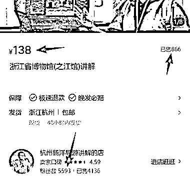
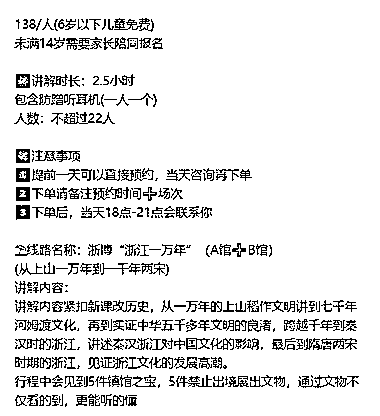

# 小红书博物馆讲解产品：单价 138，已售 866 份盈利超 11 万

> 原文：[`www.yuque.com/for_lazy/wind/lrpymmhdp0oywyg2`](https://www.yuque.com/for_lazy/wind/lrpymmhdp0oywyg2)

作者： 林不林

日期：2025-09-20

点赞数：**21**

* * *

正文：

小红书产品-【浙江省博物馆(之江馆)讲解】 去博物馆的用户，可能对博物馆内的文物不太了解， 这个商家相当于导游，给用户介绍相关文物，
对玩家来说付点小钱，能让自己的博物馆之旅质量更高。 所有的博物馆，都可以参考一下这个操作方式。 单价 138，已出售 866 份，盈利超过 11 万 每日思考

* * *

评论区：

大进 : 发布风向标的时候，不用带每日思考的标签

亦仁 : 感谢分享，已中标

* * *

公众号懒人搜索，[懒人专属群分享](https://lazybook.fun/#/blog/group)