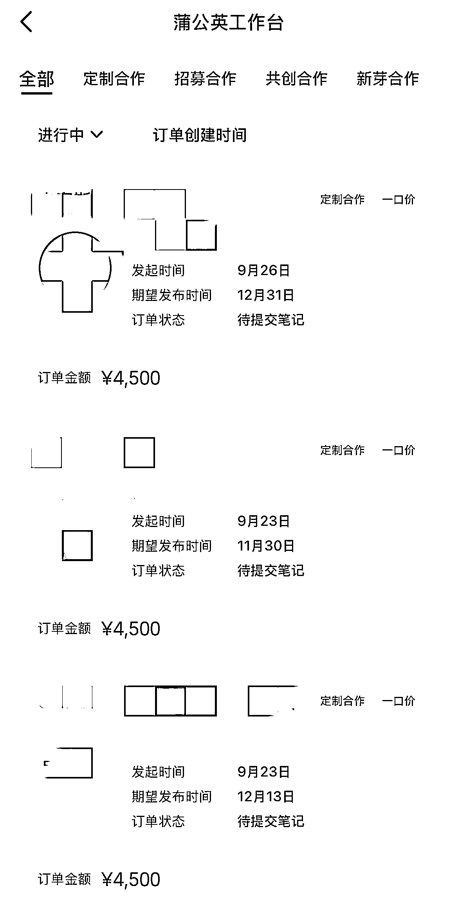

# 小红书图文接广 3 天收入 13500 元，选前 5 赛道数码家电闭眼入

> 原文：[`www.yuque.com/for_lazy/wind/iqgv4flrw2rwops5`](https://www.yuque.com/for_lazy/wind/iqgv4flrw2rwops5)

作者： 哈默

日期：2025-09-27

点赞数：**18**

* * *

正文：

小红书图文笔记，接广变现真香，3 天收入 13500 元！
最近有不少朋友问我：到底是做图文还是做视频更容易接到广告？我的答案很明确：图文笔记，绝对是接广变现的王者！
不信给大家展示我们自己的某个账号：单条图文报价 4500 元，3 天接了 3 条广告，收入 13500 元，图 2 为什么图文笔记这么香？ 1️⃣ 稳定性强，品牌方更放心
说真的，做过视频的朋友都懂那种痛 你辛辛苦苦拍了一条视频，结果品牌方各种不满意： "这个背景音乐能换吗？" "表情能再自然一点吗？" "能重新录一遍吗？"
改来改去，改到你怀疑人生 但图文不一样！ 一旦你的图文风格定下来，后面的内容基本都是这个调性 品牌方看到你的作品集，就知道合作后会是什么效果 稳定的风格 =
稳定的合作 = 稳定的收入 2️⃣信息密度高，种草效果杠杠滴 咱们换位思考一下，作为用户你更愿意： 看一个 3 分钟的产品介绍视频？
还是快速浏览 9 张图+简洁文案？ 答案很明显吧！ 特别是那些明显的广告视频，除非特别有趣（比如搞笑剧情、萌宠出镜、生活 vlog 自然植入），否则谁有耐心看完？
图文笔记就不一样了： ✅ 阅读效率高：用户可以快速获取关键信息 ✅ 视觉冲击强：精美图片比视频截图更有吸引力 ✅ 决策周期短：看完就能决定要不要买 3️⃣可批量化矩阵，变现天花板高 这一点是图文笔记最大的杀手锏！ 视频博主的痛点： 一个人一天最多拍 2-3 条视频 需要真人出镜，很难批量复制
精力有限，账号数量受限 图文笔记的爽点： 一套模板可以重复使用 可以同时运营多个细分领域账号 团队化运作，1 个人管理 10 个账号都不是梦 想象一下这个场景：
你有 5 个图文账号，分别专注美妆、穿搭、家居、美食、母婴。 每个账号月变现 2 万，你的月收入就是 10 万+！ ‼️给图文接广变现的宝子们一些建议：赛道决定一切
选择图 3，前 5 名的赛道，数码家电闭眼入 写在最后 对于小红书接广告来说，"稳"真的比"快"更重要
图文笔记，虽然可能不会给你带来爆款的瞬间快感，但它能给你带来更稳定、更可持续、更有规模化潜力的变现收入！ 项目实操

* * *

评论区：

看好你 : 还望前辈可以推荐小白可以入场的赛道

哈默 : 看图 3，前 5 名赛道。如果啥也不懂，就闭眼入【数码家电】

看好你 : 这种笔记可以用 AI 来生成吗？

哈默 : 当然不是，你的广告是品牌方审核，品牌方难道看不出是 AI 写的嘛？

看好你 : 好的 谢谢 我清楚了

小花 : 请问图 3 数据来源是什么，有没有全部的数据分析可看，谢谢大佬。

亦仁 : 感谢分享，已中标

孙大圣 : 好香

* * *

公众号懒人搜索，[懒人专属群分享](https://lazybook.fun/#/blog/group)