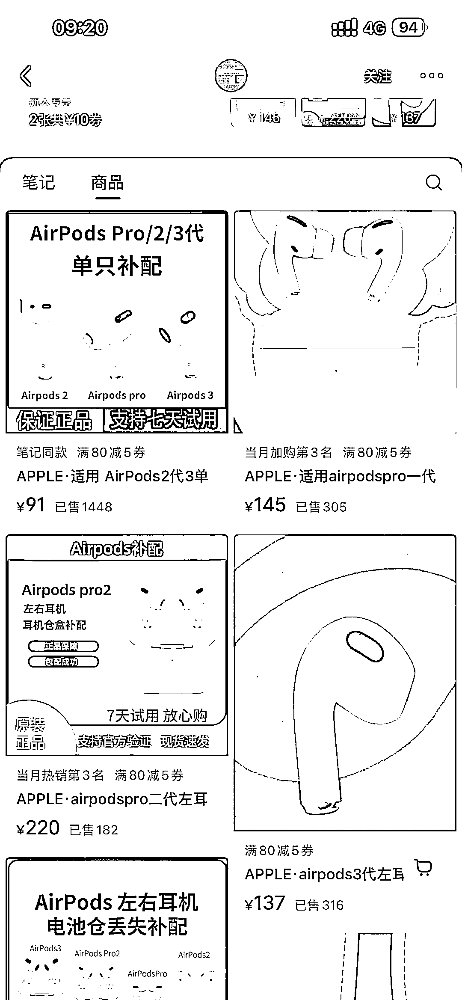
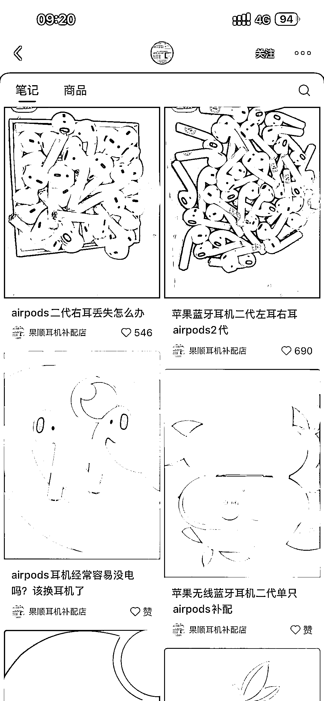
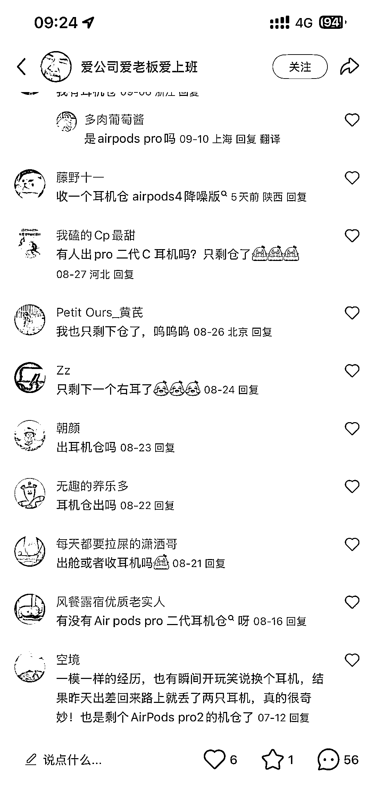

# 小红书精准搜索流量：单个耳机配件需求大，销量达 1400+

> 原文：[`www.yuque.com/for_lazy/wind/wx1mshvferegtvqn`](https://www.yuque.com/for_lazy/wind/wx1mshvferegtvqn)

作者： 折腾 boy 程泽

日期：2025-09-25

点赞数：**12**

* * *

正文：

很精准的搜索流量 （我自己的耳机仓掉了[流泪] 苹果耳机丢失一个 怎么办 这个需求存在很久了 小红书作为常用搜索的软件机会更大

* * *

评论区：

亦仁 : 感谢分享，已中标

阿伟 : 这个太便宜了吧，看着不像真的

* * *

公众号懒人搜索，[懒人专属群分享](https://lazybook.fun/#/blog/group)