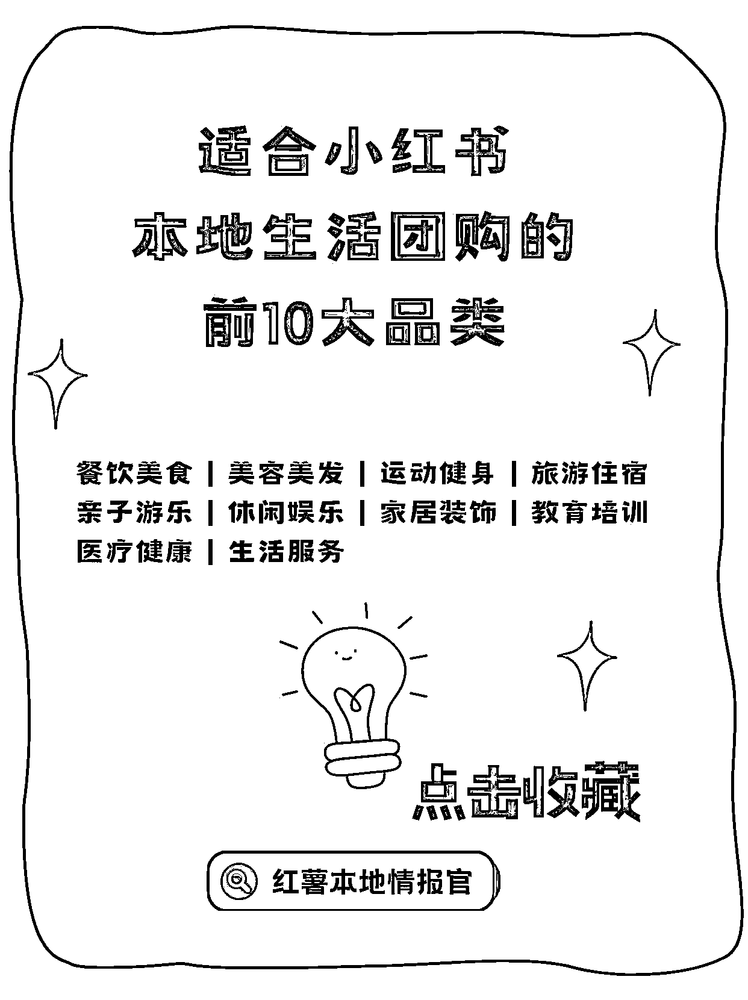
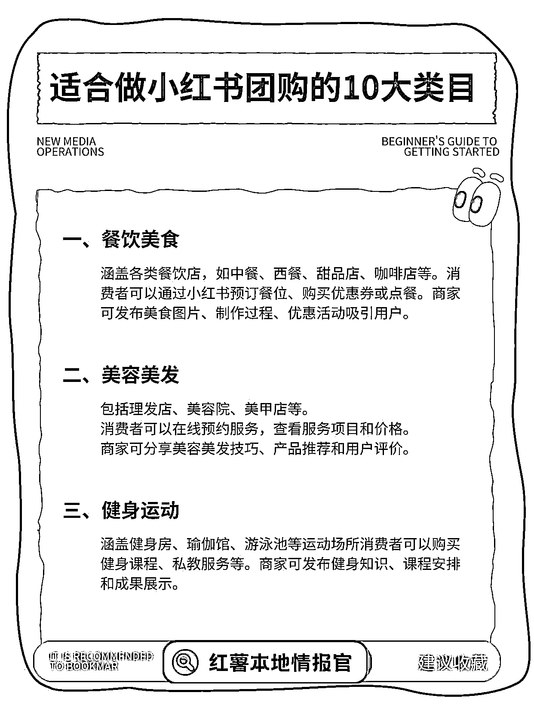
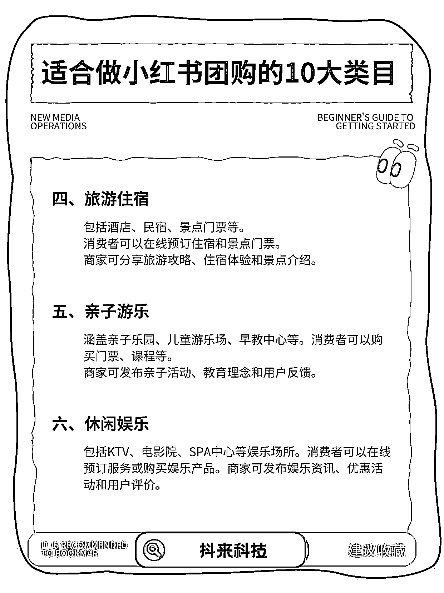
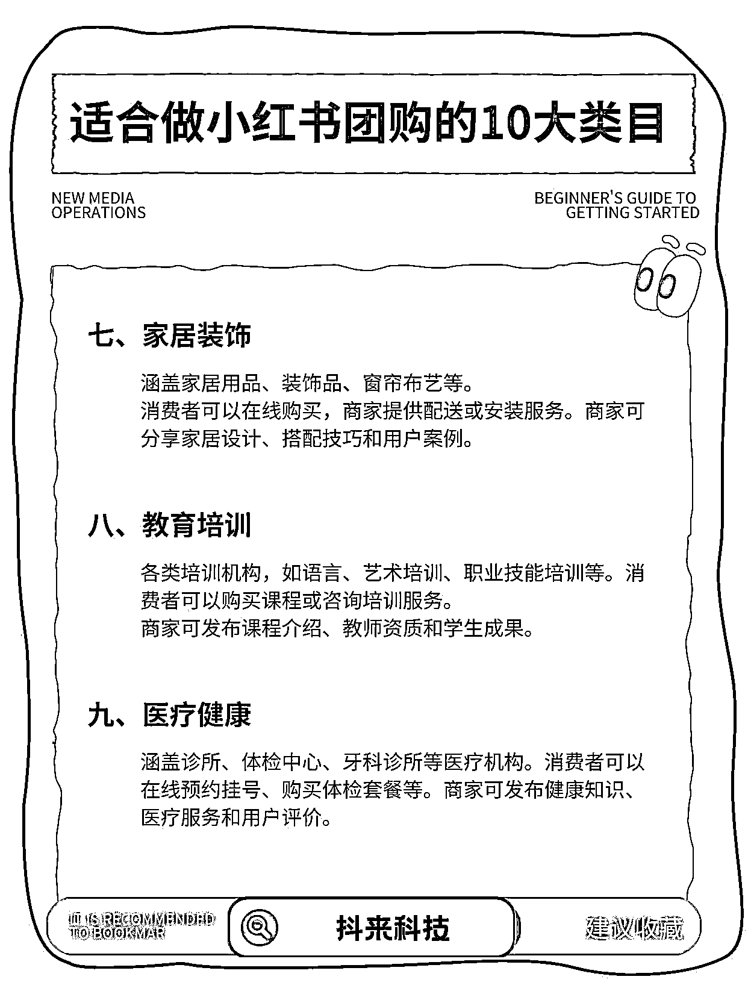
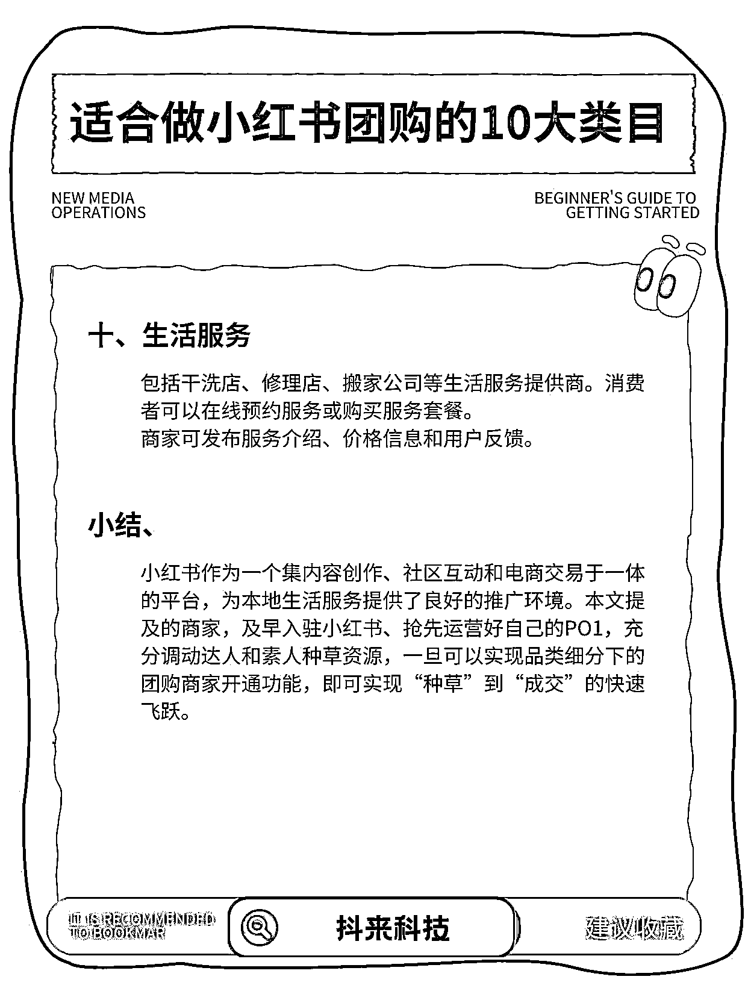

# 小红书团购功能最适合的十大类目总结

> 原文：[`www.yuque.com/for_lazy/wind/vr4c1pi57z8orqpp`](https://www.yuque.com/for_lazy/wind/vr4c1pi57z8orqpp)

作者： 飞掌柜

日期：2025-09-20

点赞数：**17**

* * *

正文：

小红书作为一个集内容创作、社区互动和电商交易于一体的平台，为本地生活服务提供了良好的推广环境。最近团购功能上线，商家及早入驻小红书、抢先运营好自己的店铺，充分调动达人和素人种草资源，一旦可以实现品类细分下的团购商家开通功能，即可实现“种草”到“成交”的快速飞跃！
为此，官方总结了最适合做的十大类目，在这块的圈友可以关注下： 一、餐饮美食
涵盖各类餐饮店，如中餐、西餐、甜品店、咖啡店等。消费者可以通过小红书预订餐位、购买优惠券或点餐。商家可发布美食图片、制作过程、优惠活动吸引用户。
二、美容美发 包括理发店、美容院、美甲店等。 消费者可以在线预约服务，查看服务项目和价格商家可分享美容美发技巧、产品推荐和用户评价。 三、健身运动
涵盖健身房、瑜伽馆、游泳池等运动场所消费者可以购买健身课程、私教服务等。商家可发布健身知识、课程安排和成果展示。 四、旅游住宿 包括酒店、民宿、景点门票等。
消费者可以在线预订住宿和景点门票。 商家可分享旅游攻略、住宿体验和景点介绍。 五、亲子游乐
涵盖亲子乐园、儿童游乐场、早教中心等。消费者可以购买门票、课程等。 商家可发布亲子活动、教育理念和用户反馈。 六、休闲娱乐
包括 KTV、电影院、SPA 中心等娱乐场所。消费者可以在线预订服务或购买娱乐产品。商家可发布娱乐资讯、优惠活动和用户评价。 七、家居装饰
涵盖家居用品、装饰品、窗帘布艺等。 消费者可以在线购买，商家提供配送或安装服务。商家可分享家居设计、搭配技巧和用户案例。 八、教育培训
各类培训机构，如语言、艺术培训、职业技能培训等。消费者可以购买课程或咨询培训服务。商家可发布课程介绍、教师资质和学生成果。 九、医疗健康
涵盖诊所、体检中心、牙科诊所等医疗机构。消费者可以在线预约挂号、购买体检套餐等。商家可发布健康知识、医疗服务和用户评价。 十、生活服务
包括干洗店、修理店、搬家公司等生活服务提供商。消费者可以在线预约服务或购买服务套餐。 商家可发布服务介绍、价格信息和用户反馈。

* * *

评论区：

亦仁 : 感谢分享，已中标

飞掌柜 : 感谢老大，继续努力💪

* * *

公众号懒人搜索，[懒人专属群分享](https://lazybook.fun/#/blog/group)