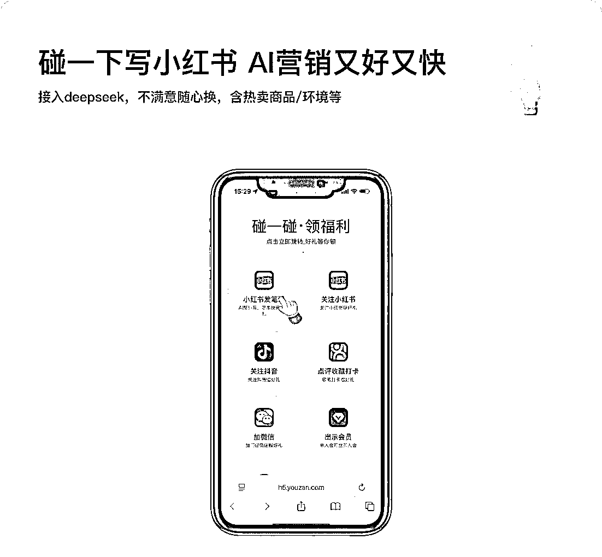

# 线下门店引流神器：手机一碰，一键发小红书抖音点评

> 原文：[`www.yuque.com/for_lazy/wind/vgw7fy46q6ehd2eo`](https://www.yuque.com/for_lazy/wind/vgw7fy46q6ehd2eo)

作者： Adam

日期：2025-09-26

点赞数：**9**

* * *

正文：

以前在外面吃饭的时候，总有人要好评，又是图片，又是文字，现在线下店有一款设备，直接手机碰一碰就可以一键发小红书，抖音，大众点评，这个图片以及文字应该是在他们数据库里面直接设置好的，感觉挺有市场的

* * *

评论区：

世界观察员婷婷子🥯 : 我在一个 AI 摆摊的摊位上见过类似产品，且已经在变现

亦仁 : 感谢分享，已中标

怪力小乔巴 : 牛啊

刘洋 : 这个怎么能弄上呢？

* * *

公众号懒人搜索，[懒人专属群分享](https://lazybook.fun/#/blog/group)