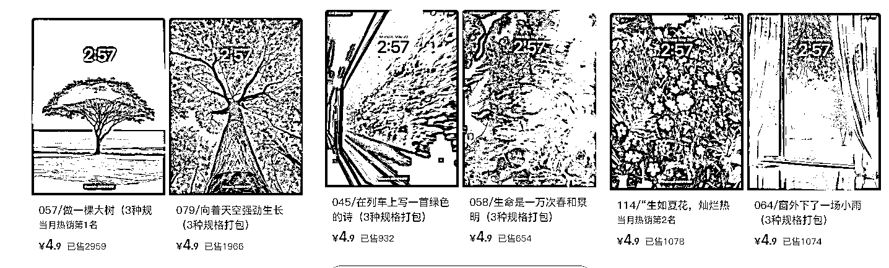

# 小红书虚拟产品：壁纸单价 4.9 元，销量 8663 份，盈利超 4.2 万

> 原文：[`www.yuque.com/for_lazy/wind/ls84i0bylsogyefr`](https://www.yuque.com/for_lazy/wind/ls84i0bylsogyefr)

作者： 林不林

日期：2025-09-19

点赞数：**49**

* * *

正文：

小红书虚拟商品-【壁纸】 很普通的壁纸，在小红书上， 也能卖出这样的价格，卖出这么多份？不可思议 单价 4.9，一共出售了 8663 份，盈利超过 4.2 万
在小红书，真的什么生意都可以做。 每日思考

* * *

评论区：

亦仁 : 感谢分享，已中标

芃然 : 感觉可以用 AI 生成金句，引发共鸣的同时，可以提高图文流量和转化。

* * *

公众号懒人搜索，[懒人专属群分享](https://lazybook.fun/#/blog/group)