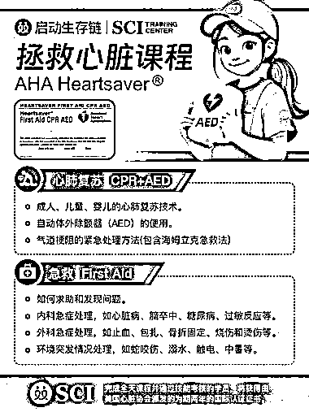
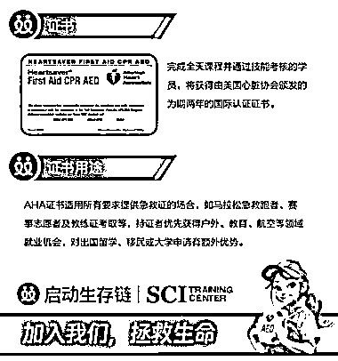
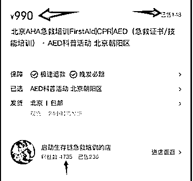

# 小红书急救培训课程：单价 990，销量 148，营业额超 14 万

> 原文：[`www.yuque.com/for_lazy/wind/kht731go9l9ym7i2`](https://www.yuque.com/for_lazy/wind/kht731go9l9ym7i2)

作者： 林不林

日期：2025-09-23

点赞数：**10**

* * *

正文：

小红书商品-【AHA 急救培训(急救证书/技能培训)】 看该商品的证书价值不错，就算不为了证书，学习这个技能，对于一些突发状况也有应急方式
单价 990，已出售 148，营业额超过 14 万 该账号粉丝量 4000 多 生财朋友圈

* * *

评论区：

亦仁 : 感谢分享，已中标

* * *

公众号懒人搜索，[懒人专属群分享](https://lazybook.fun/#/blog/group)