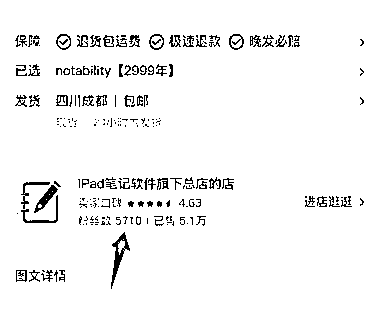

# 小红书虚拟产品：商品单价 4.8，已售 2.6 万份盈利超 12 万

> 原文：[`www.yuque.com/for_lazy/wind/rx5bq0u8a3un1qmq`](https://www.yuque.com/for_lazy/wind/rx5bq0u8a3un1qmq)

作者： 林不林

日期：2025-09-19

点赞数：**25**

* * *

正文：

小红书虚拟商品-【goodnotes6 永久订阅】【notability 永久订阅】 商品单价 4.8，已出售 2.6 万份，盈利超过 12 万。
该账号粉丝量才 5000 多，这 2 个商品应该也是满足某个人群的需求。 每日思考

* * *

评论区：

亦仁 : 感谢分享，已中标

* * *

公众号懒人搜索，[懒人专属群分享](https://lazybook.fun/#/blog/group)