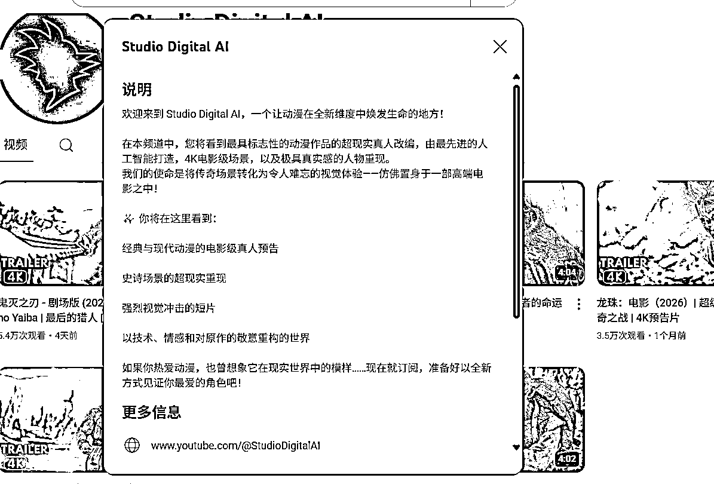
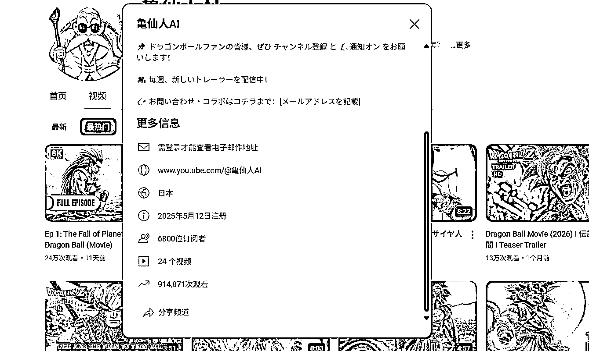
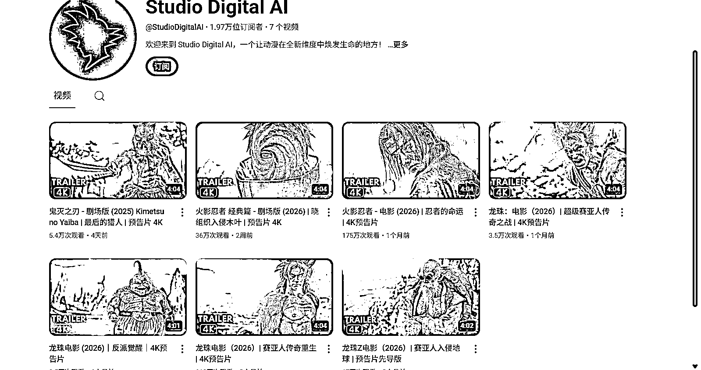
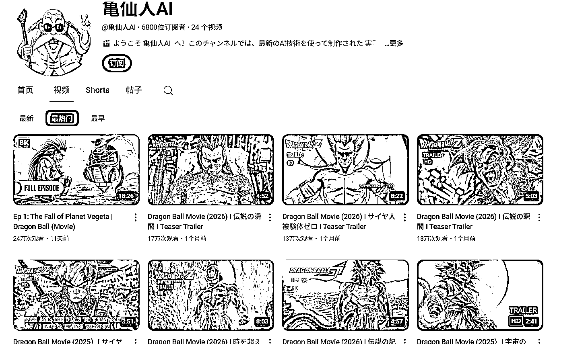

# YouTube 长视频：利用 AI 复刻经典动漫镜头

> 原文：[`www.yuque.com/for_lazy/wind/vq4ns0xk4oldtr06`](https://www.yuque.com/for_lazy/wind/vq4ns0xk4oldtr06)

作者： 九里香

日期：2025-09-24

点赞数：**30**

* * *

正文：

YouTube 长视频
龙珠系列，日漫等经典镜头，利用 ai 制作出真人类的视频，看了一些爆款主要的都是复刻一些经典的镜头，例如悟空 vs 弗利沙第一次变身超赛这一经典镜头。
分享两个账号都是最近 3 个月前刚开始注册的主要都是发长视频。

* * *

评论区：

亦仁 : 感谢分享，已中标

榴莲猫 : 版权能过吗。看上去像是收益都归到别人了

* * *

公众号懒人搜索，[懒人专属群分享](https://lazybook.fun/#/blog/group)