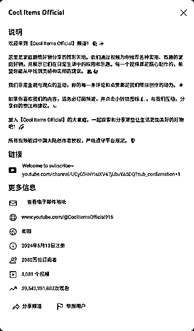
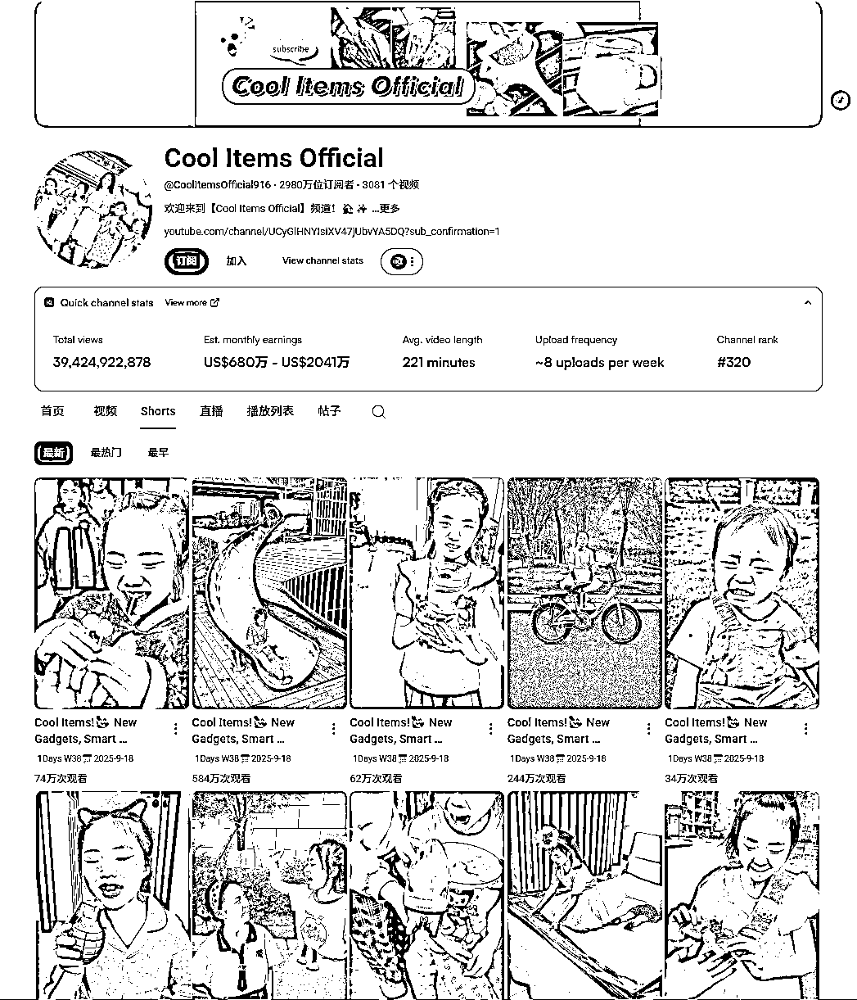
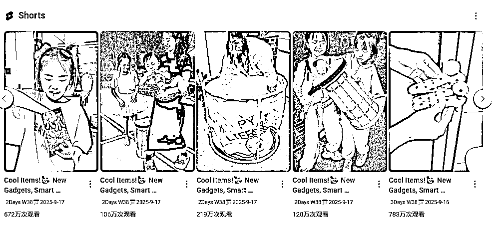
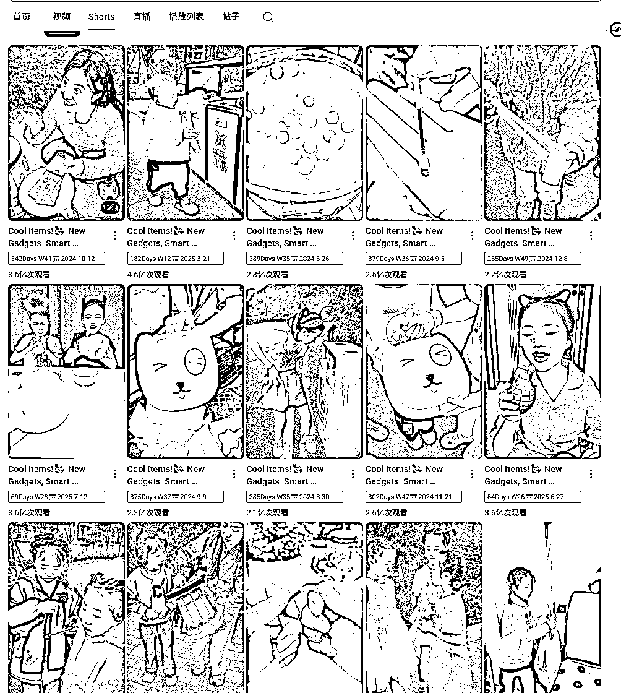

# YouTube 家庭剧集好物分享频道：1 年更新 3000 视频，2980 万订阅 390 亿播放

> 原文：[`www.yuque.com/for_lazy/wind/uac2e1hk3uur9ums`](https://www.yuque.com/for_lazy/wind/uac2e1hk3uur9ums)

作者： 清仔

日期：2025-09-19

点赞数：**31**

* * *

正文：

分享一个 YouTube 频道：家庭剧集好物分享 频道创建于 24 年，1 年多时间更新了 3000 个视频，平均一天 6 更
2980 万订阅，390 亿播放，预估收入至少 680 万美刀。
视频估计是国人创作的，有中文出境。内容主要围绕国内好物，做一些日常的搞笑视频，估计脚本都是搬运国内抖音的。很简单，所以产出很高
目前频道已经排在 YouTube 第 320 名

* * *

评论区：

亦仁 : 感谢分享，已中标

* * *

公众号懒人搜索，[懒人专属群分享](https://lazybook.fun/#/blog/group)