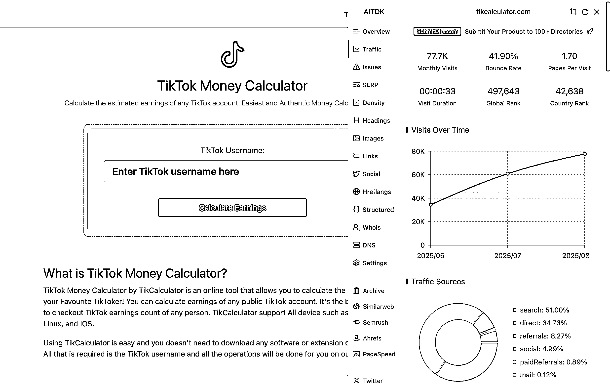
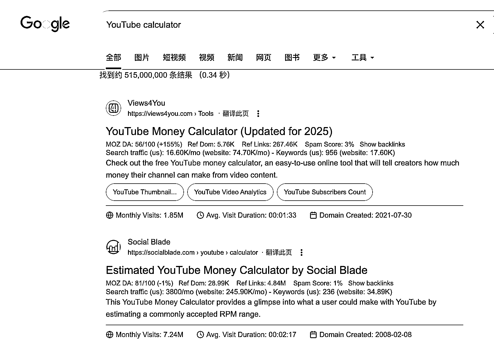
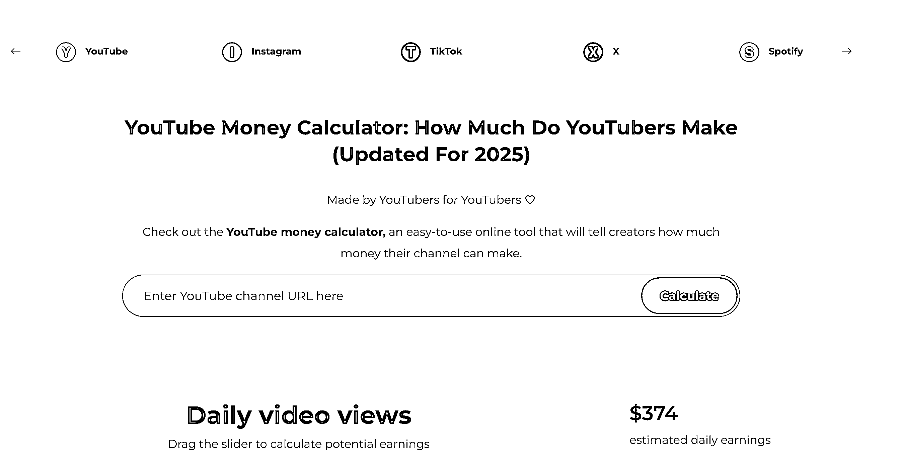
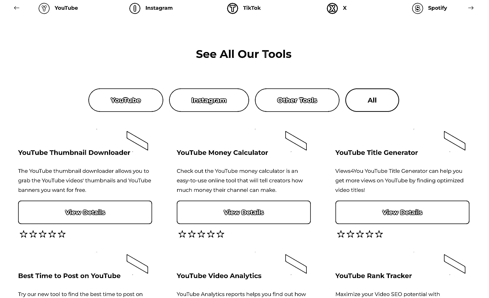

# TikTok-YouTube 计算器：月访问 77k，多平台可拓展

> 原文：[`www.yuque.com/for_lazy/wind/ld758uqhnasdg0fz`](https://www.yuque.com/for_lazy/wind/ld758uqhnasdg0fz)

作者： 🦉

日期：2025-09-19

点赞数：**21**

* * *

正文：

看到一个 tiktok calculator，挺有意思，输入用户名，即可计算该用户能赚多少钱，22 年十一月注册的域名，现在月访问量 77k
我有点怀疑这个计算器数据的真实性，不过可能也就是图个乐趣啥的？ 想到了会不会有 YouTube calculator
的计算需求，真的有，也是输入一个用户名就可以了 tiktok/YouTube
可以做类似计算器的话，其他类似的平台，也可以做，只是要注意：不要直接使用对方的名称去注册域名，可能会侵权，网站标题/文案 可以用 逛 YouTube
calculator 计算的这个网站，看到
这个界面时，感觉它列出的工具，都可以考虑做一个单独的、垂直的网站[`views4you.com/tools/`](https://views4you.com/tools/)

* * *

评论区：

亦仁 : 感谢分享，已中标

* * *

公众号懒人搜索，[懒人专属群分享](https://lazybook.fun/#/blog/group)