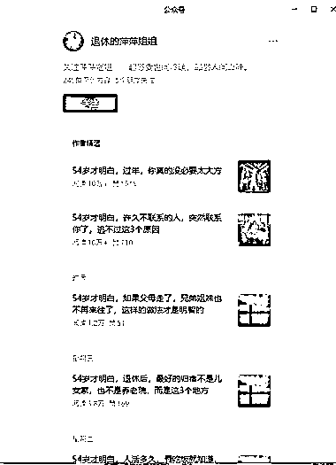
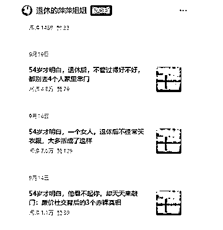

# 公众号垂直小号：AI 创作+精准玩法实现流量主变现

> 原文：[`www.yuque.com/for_lazy/wind/nscgp2ayalid59l2`](https://www.yuque.com/for_lazy/wind/nscgp2ayalid59l2)

作者： Eamon

日期：2025-09-26

点赞数：**23**

* * *

正文：

公众号垂直小号 标题：54 岁才明白开头，xxxx 封面：统一一张图 内容：纯 AI 创作 变现方式：流量主 可升级玩法： 1/对标内容创作简单，脚本化的内容创作
2/用年龄对应人群，去解决该年龄段的问题（也就是亦仁老大提到的术），也是非常具象化的场景，可进行引流私域变现 3
/年龄+场景+解决问题的方法，已经非常精准了 垂直小号

* * *

评论区：

大音希声 : 为啥纯 AI 写还有这么高的流量？

亦仁 : 感谢分享，已中标

Eamon : 谢谢亦仁老大，第一次中标，激动[咖啡][咖啡]

Eamon : 流量高，和纯 AI 没有关系，主要是内容定位

* * *

公众号懒人搜索，[懒人专属群分享](https://lazybook.fun/#/blog/group)