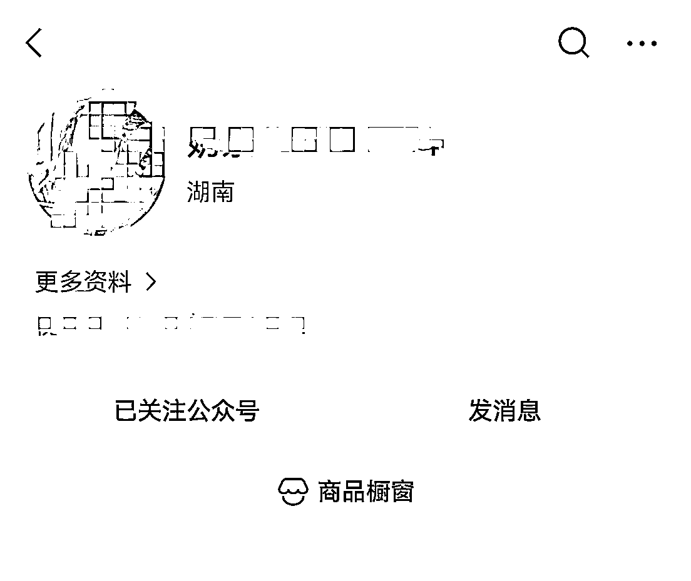
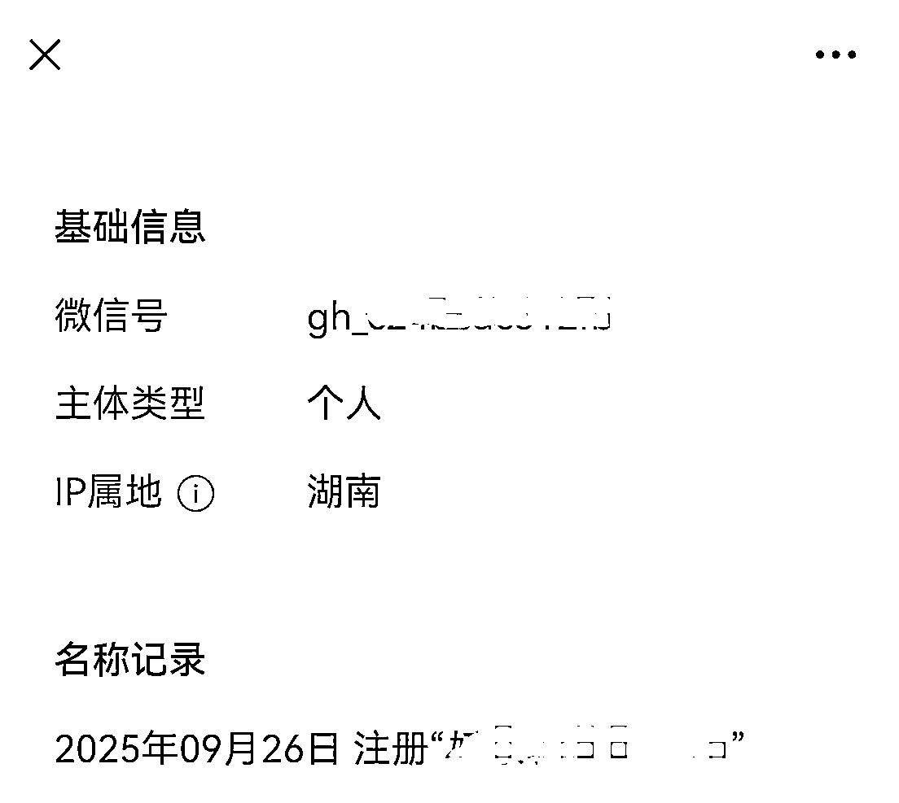
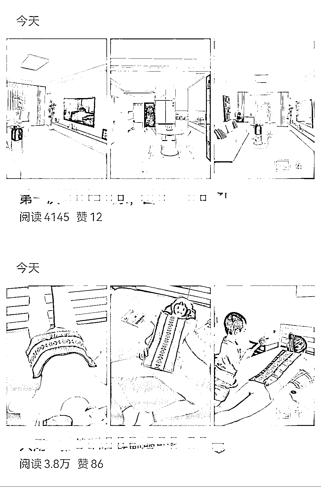
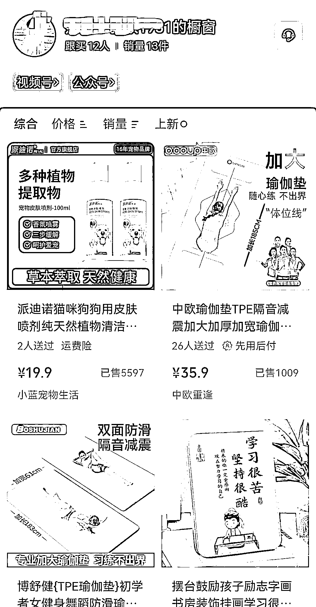

# 公众号图文带货首篇爆文 3.8 万阅读，成交 13 单

> 原文：[`www.yuque.com/for_lazy/wind/khh1s11undrbfmid`](https://www.yuque.com/for_lazy/wind/khh1s11undrbfmid)

作者： 华仔

日期：2025-09-26

点赞数：**15**

* * *

正文：

平台:腾讯公众号 项目变现:带货 项目简介:
通过注册服务号来做图文带货！这个操作起来应该不算难，拿小红书或者淘宝等电商平台的图片进行去重处理，然后用 ai 写段文字，在带上商品卡就可以了！
不过前提是公众号得先绑定橱窗！ 这个号是今天注册的，发了两篇，第一篇就爆了 3.8 万阅读，买了 13 单

* * *

评论区：

Sing : 公司主体的服务号能搞吗

华仔 : 应该也可以的

亦仁 : 感谢分享，已中标

* * *

公众号懒人搜索，[懒人专属群分享](https://lazybook.fun/#/blog/group)