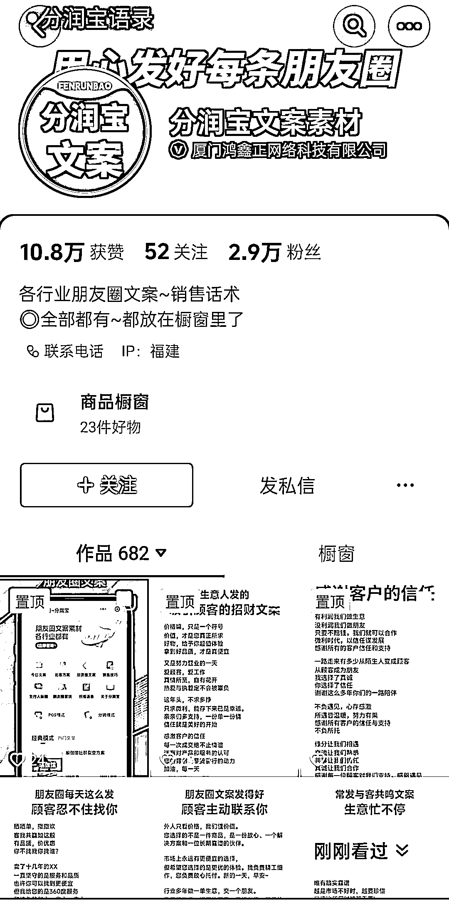
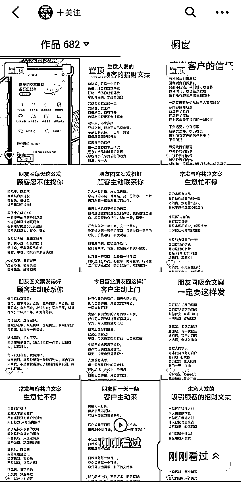
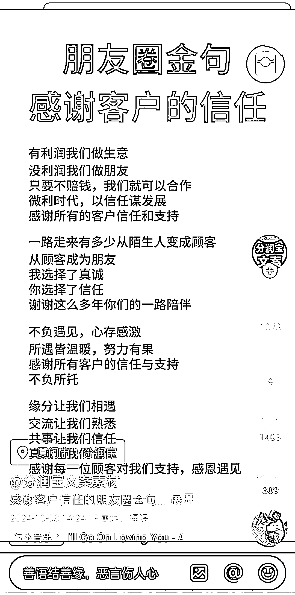
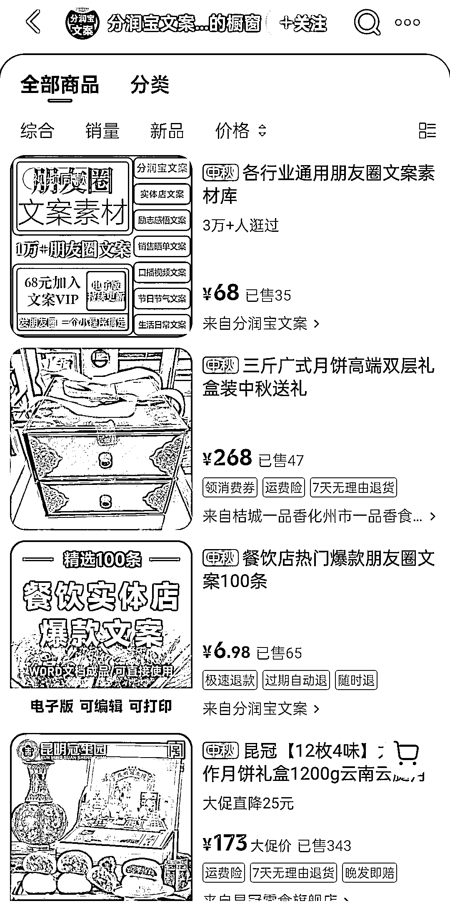

# 小红书虚拟资料产品玩法：借鉴抖音账号经验实现成交

> 原文：[`www.yuque.com/for_lazy/wind/xn3fk74ual44avdf`](https://www.yuque.com/for_lazy/wind/xn3fk74ual44avdf)

作者： 馆主

日期：2025-09-23

点赞数：**18**

* * *

正文：

流量/产品｜异常值 在抖音上看到一个账号是做虚拟资料产品的 作品是图文类型，主要是教别人怎么发朋友圈文案，而且每个作品流量都非常好
1、产品：朋友圈文案素材库（虚拟资料） 2、价格：6.68---68（包含会员） 3、作品：非常的简单就是图+文 这个账号的玩法我们完全可以用到小红书上
我们只需要解决三个点： 1、作品用 AI 重新写一次，发小红书笔记
2、产品我们买最高的 68 元，把资料库进行二创，并加入他们的会员，学习他们的成交话术，一对一的模仿
3、学习引流技术，把客户引流到微信上，然后按照他们的话术去成交你的客户

* * *

评论区：

亦仁 : 感谢分享，已中标

* * *

公众号懒人搜索，[懒人专属群分享](https://lazybook.fun/#/blog/group)